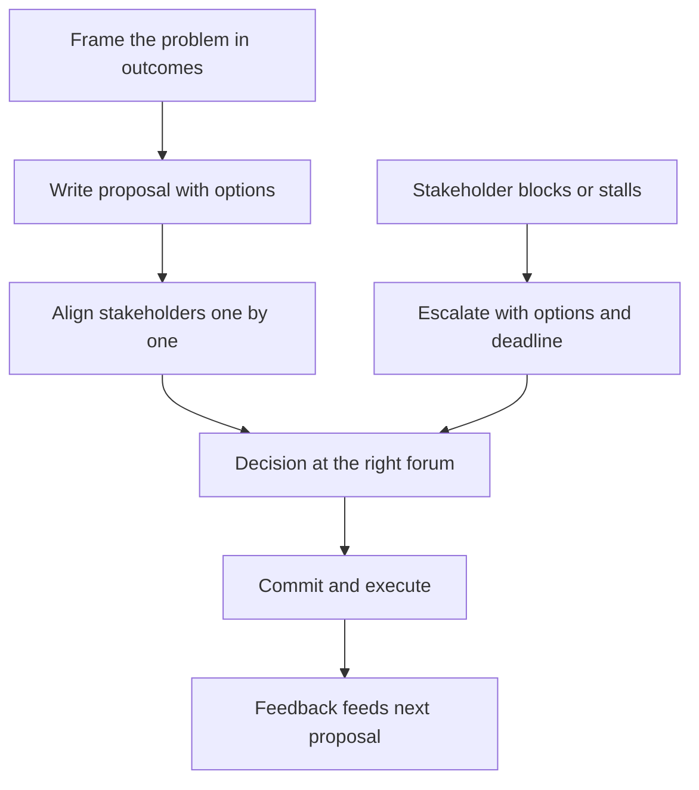

# Navigating Ambiguity and Incomplete Authority

> **Core skill:** Making progress on cross-team and platform problems when you do not control the decision — through framing, evidence, and proposal quality rather than positional power.

## Why This Matters

A large share of tech lead work happens in the spaces between teams: shared platforms, interface changes, security and reliability initiatives, architectural migrations that touch multiple owners. In those spaces your authority is incomplete by design — the decision belongs to other teams, other leads, or a committee. Progress depends on influence, and influence depends on how you frame the problem and how good your proposal is.

The senior-level skill of leading without authority becomes sharper at tech lead level for one reason: the stakes are higher. A cross-team decision you fail to align can cost a quarter of platform work or produce an integration incident. The difference between a lead who navigates this well and one who does not is rarely technical — it is how they make it easy for others to say yes.

## Where Your Authority Ends

Start from an honest map of decision rights:

| Decision space | Typical owner | Your role |
|----------------|---------------|-----------|
| Your team's architecture | You and your team | Decide |
| Interfaces you own | You and your team | Decide, with consumer input |
| Shared platform changes | Platform team or council | Propose and influence |
| Other teams' roadmaps | Their leads | Negotiate and trade |
| Company-wide standards | Architecture or standards body | Advocate with evidence |

The map matters because the failure mode differs by cell. Proposing too hard on decisions you own wastes the team's time; deciding unilaterally on decisions you do not own burns the trust your proposals depend on.

## Influence Without Authority at Lead Level

| Lever | How it works at lead level | Example |
|-------|----------------------------|---------|
| Expertise | Be the person with the deepest relevant knowledge | You are the only one who has run the migration |
| Evidence | Data beats opinion in cross-team forums | Incident counts, latency percentiles, cost figures |
| Relationships | Prior goodwill lets you skip the sales pitch | You helped their team last quarter; they listen |
| Proposal quality | A well-framed proposal decides before the meeting | Options with trade-offs and a clear recommendation |
| Persistence | Cross-team alignment decays without follow-up | Track decisions, nudge owners, close loops |
| Making others look good | Their win is your strongest currency | Credit their team in the readout |

None of these require authority. All of them require you to be visibly useful beyond your own team's boundary.

## Distributed Authority

In distributed-authority situations nobody can decide alone — the security lead, the platform lead, and you all hold pieces. The practical moves:

- Get the decision process written down: who must agree, who can block, who arbitrates
- Make the decision criteria explicit before positions harden
- Convert the conversation from preferences to evidence: what must be true for each option
- Record the outcome and the reasoning even when the decision is a compromise

A distributed decision without a recorded process will be relitigated. With one, it holds — because everyone can see how it was reached.

## Proposals That Create Alignment

The single highest-leverage artifact is the written proposal. A proposal that creates alignment has a fixed shape:

```markdown
## Proposal: [title]

### Problem
- [ ] The problem, framed in outcomes and cost
- [ ] What happens if we do nothing

### Options
- [ ] Option A: [description] | Cost: [x] | Risk: [y]
- [ ] Option B: [description] | Cost: [x] | Risk: [y]
- [ ] Option C: [description] | Cost: [x] | Risk: [y]

### Trade-offs
- [ ] What each option gains and gives up

### Recommendation
- [ ] Recommended option and why
- [ ] What we need from each stakeholder to proceed

### Decision
- [ ] Agreed by: [names] on [date]
```

Problem framing, options with trade-offs, a recommendation. Three parts, no hidden agenda, no surprises at the decision table. Stakeholders align to a document they helped shape far more readily than to a pitch.

## Escalation as a Tool

Escalation is not failure; it is a designed part of the process. The rules that keep it healthy:

| Rule | Why |
|------|-----|
| Escalate after a proposal, not before | You escalate a decision with options, not a question with no work |
| Escalate the decision, not the people | Frame is "we need a call on X," not "team Y is blocking us" |
| Escalate with a deadline | "We need this by Thursday or we slip the migration" |
| Escalate once, visibly | Secret escalations look like politics; open ones look like process |
| Escalate to the shared manager | The person above both teams, not your own manager alone |



## Practical Applications

Checklist for any cross-team initiative:

- [ ] Map who owns the decision and who can block it
- [ ] Write the proposal: problem, options with trade-offs, recommendation
- [ ] Share it with key stakeholders before any meeting — no surprises
- [ ] Get the decision process and criteria written down
- [ ] Follow up on commitments until the loop closes
- [ ] Record the outcome and reasoning for future reference
- [ ] If blocked, escalate the decision with options and a deadline

## Common Pitfalls

| Pitfall | Why It Is a Problem | Better Approach |
|---------|---------------------|-----------------|
| **Deciding unilaterally** | You own the outcome but not the decision; trust burns | Know the decision map; propose where you cannot decide |
| **Proposing too late** | Options harden before you enter the room | Write the proposal before positions form |
| **Presenting a single option** | Stakeholders have no choice to align to, only a demand | Always offer two or three options with trade-offs |
| **Escalating too early** | You outsource thinking instead of doing it | Escalate a decision with options, not a question |
| **No follow-through** | Alignment decays; the initiative stalls in the gaps | Track decisions and commitments until closed |
| **Taking rejection personally** | You stop proposing; your influence atrophies | Treat a rejected proposal as data for the next one |

## Success Indicators

- Cross-team initiatives you champion reach decisions within their planned windows
- Stakeholders describe your proposals as clear and easy to react to
- You can name the decision map for your current initiative without hesitation
- Escalations you raise get decisions, not pushback on process
- Other teams bring you into their early discussions — proof your influence is an asset

## Related Topics

- [[06_Working_With_Stakeholders]]: the same framing discipline applied to representation
- [[04_Tech_Lead_Scope_and_System_Boundaries]]: boundaries define where authority ends and influence begins
- [[career-path/02_Senior_Software_Engineer/07_Mentoring_and_Team_Leadership/07_Leading_Without_Authority|Leading Without Authority (Senior)]]: the senior-level foundation this extends
- [[03_Technical_Direction_and_Architecture/00_overview|Technical Direction and Architecture]]: most cross-team proposals are direction decisions

## Summary

Incomplete authority is the normal condition of tech lead work beyond the team boundary. The response is a discipline, not a personality: map decision rights, write proposals with options and trade-offs, align stakeholders before the meeting, and escalate decisions with deadlines when alignment fails. Authority decides by fiat; influence decides by making the right answer the easy answer.
