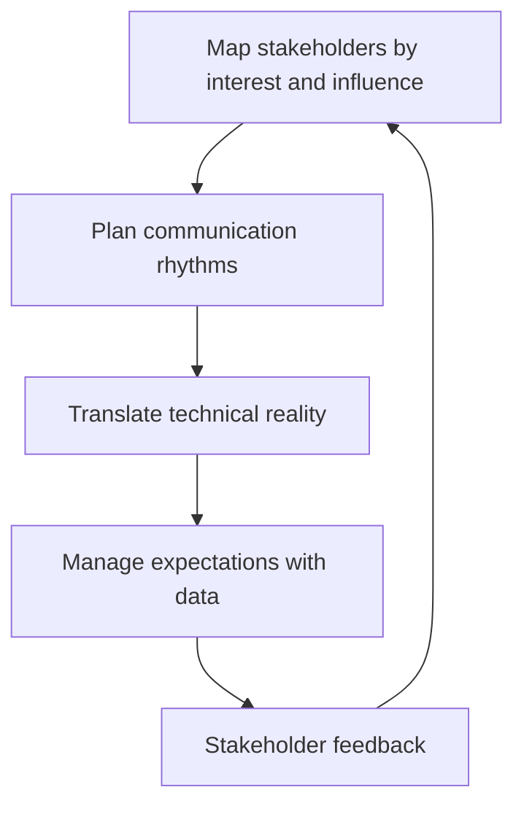

# Working With Stakeholders

> **Core skill:** Representing the team's technical reality upward and sideways so stakeholders plan against truth — capacity, timelines, risk, and trade-offs — instead of hope.

## Why This Matters

The team's work is judged by people who never see the code: product managers, executives, adjacent teams, customers. Every mismatch between what they believe and what is true — about capacity, timelines, or risk — eventually surfaces as rework, missed commitments, or a trust deficit that makes every later conversation harder.

The tech lead is the translation layer. Engineers speak in uncertainty, dependencies, and complexity; stakeholders speak in dates, scope, and cost. A lead who translates well makes the team look competent and the stakeholders look informed. A lead who translates poorly produces the classic failure: stakeholders learn about problems late, conclude the team is unreliable, and start micromanaging — which makes the problems worse.

## Who Your Stakeholders Are

| Stakeholder | What they need from you | What you need from them |
|-------------|-------------------------|-------------------------|
| Product manager | Feasible plans, honest risk, technical options | Priorities, context, decisions |
| Engineering manager | Technical status, people signals, system health | Capacity decisions, escalation support |
| Executives | Confidence, early risk signals, options | Strategic direction, resourcing |
| Adjacent teams | Interface stability, clear dependencies | Timely change notice, their roadmap |
| Customers (via support) | Reliability, honest timelines | Incident reports, usage context |

Each stakeholder is a different audience: the same message in the same language does not work for all of them.

## Mapping Interest and Influence

A simple two-axis map (interest in your system, influence over your team) tells you where to spend attention:

| Quadrant | Example | How to engage |
|----------|---------|---------------|
| High interest, high influence | The product VP whose goals your system serves | Deep, regular engagement; they are a sponsor |
| Low interest, high influence | An exec who funds platform work | Keep informed at milestones; avoid surprises |
| High interest, low influence | Support team that takes your incident calls | Serve them well; they are early warning |
| Low interest, low influence | Unrelated teams | Minimal routine engagement |

The map changes quarterly. Rebuild it when the org or the roadmap changes.

## Translating Technical Reality

| What engineers say | What stakeholders hear | What you should say |
|--------------------|------------------------|---------------------|
| "We need to refactor the billing module" | "We want to rewrite code for fun" | "The billing module costs us about two days per change and caused three incidents. Paying it down buys roughly a week per quarter." |
| "The API has 400ms p99 latency" | "The API is slow?" | "Our worst-case response time is inside the product's target, and we have headroom for the next traffic wave." |
| "This is risky" | "This might fail" | "The risk is X, it is contained to Y, and our fallback is Z. We want a decision by D." |
| "We have no capacity this quarter" | "The team is lazy" | "Capacity is fully committed to A and B. Adding C means dropping or delaying D — which do you prefer?" |

The translation rules: lead with outcomes, quantify in cost or delay, name the decision you need, and never hide the uncertainty — shape it.

## Managing Expectations

| Expectation | Technique |
|-------------|-----------|
| Capacity | Publish committed vs available capacity each planning cycle; show the math |
| Timelines | Give ranges with the assumptions that drive them; update when assumptions change |
| Risk | Maintain a short risk list with likelihood, impact, and mitigation; review it with stakeholders monthly |
| Scope | When scope grows, say what it displaces in the same breath |
| Progress | Report outcomes, not activity: what changed for users, not how many tickets closed |

The discipline is boring and reliable: the same numbers, the same cadence, no surprises. Stakeholders trust teams that never surprise them, even with bad news delivered early.

## Saying No with Alternatives

"No" without an alternative is a dead end; "no, and here is what we can do" is a decision. The formula:

1. State what you cannot do, plainly
2. Give the reason in one sentence — capacity, risk, or sequencing
3. Offer two or three alternatives with trade-offs
4. Name who decides

Example: "We cannot ship the reporting upgrade this quarter — capacity is committed to the migration. We can either delay the migration six weeks, ship reporting without the new export format, or have the platform team take the export work. Which one do you want?"

## Communication Rhythms

| Rhythm | Cadence | Content |
|--------|---------|---------|
| Demo | Every 2-4 weeks | Working software, decisions made, what is next |
| Status update | Weekly | Commitments vs progress, risks, needs |
| Planning review | Quarterly | Roadmap, capacity, debt trade-offs |
| Incident communication | As it happens | What broke, what we are doing, when we will report |
| Technical review | Per release or change | Readiness, design decisions, rollback plans |

Each rhythm has one owner, one format, and one audience. Rhythms you run reliably matter more than any single brilliant presentation.



## Practical Applications

```markdown
## Stakeholder Map — [date]

| Stakeholder | Interest | Influence | Engagement | Rhythm |
|-------------|----------|-----------|-------------|--------|
| [name/role] | [high/med/low] | [high/med/low] | [sponsor/inform/serve] | [weekly/monthly/quarterly] |

## Standing Commitments
- [ ] Demo: [date] — [what will be shown]
- [ ] Status update: [day] — [owner]
- [ ] Risk review: [monthly date]
- [ ] Incident comms plan: [who informs whom]

## Expectation Watch
- [ ] Assumption that changed this week: [what] -> [who told]
- [ ] Commitment at risk: [which] -> [informed by: date]
```

Checklist before any stakeholder conversation:

- [ ] What decision or belief do I need to change?
- [ ] What is the outcome-based framing?
- [ ] What are the numbers — cost, delay, risk?
- [ ] What alternatives am I offering?
- [ ] Who decides, and by when?

## Common Pitfalls

| Pitfall | Why It Is a Problem | Better Approach |
|---------|---------------------|-----------------|
| **Speaking engineer** | Stakeholders hear jargon, not decisions they can act on | Translate to outcomes, cost, and choice |
| **Hiding bad news** | Late surprises destroy trust faster than the problem itself | Report early, with the plan to recover |
| **No alternatives** | A bare no invites escalation over your head | Always pair a no with options |
| **Inconsistent rhythms** | Stakeholders fill the vacuum with their own assumptions | Run the same cadence even when nothing is urgent |
| **Overpromising capacity** | Every yes compounds into a missed quarter | Show the displacement math every time |
| **One audience only** | Executives and product get different questions; one message fails one of them | Tailor format and detail per stakeholder |

## Success Indicators

- Stakeholders can describe the team's commitments and risks in their own words
- No commitment has ever been a surprise to stakeholders — including the misses
- Product decisions get made with the team's real constraints on the table
- The demo and status rhythms have run without gaps for two quarters
- Stakeholders come to you with problems early, because they trust the channel

## Related Topics

- [[05_Navigating_Ambiguity_and_Incomplete_Authority]]: the same framing discipline applied to influence
- [[01_The_Tech_Lead_Mandate]]: stakeholder representation is part of the mandate
- [[07_First_90_Days_as_Tech_Lead]]: stakeholder mapping is a first-30-days activity
- [[04_Team_Delivery_and_Execution_Leadership/00_overview|Delivery and Execution Leadership]]: commitments and risk are the content of stakeholder work

## Summary

Working with stakeholders is a translation and rhythm discipline: map who needs what, run reliable communication cadences, translate technical reality into outcomes and options, and manage expectations with numbers instead of hope. The reward is the rarest asset a team can hold — stakeholders who trust the team's word, even when the word is bad news delivered early.
