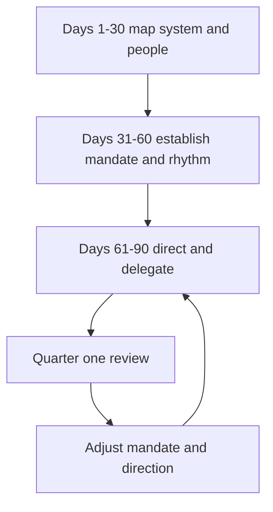

# First 90 Days as Tech Lead

> **Core skill:** Transitioning into the tech lead role deliberately — mapping before directing, establishing before expanding, and earning the right to set direction.

## Why This Matters

The first 90 days set the trajectory of your whole tenure. Early decisions — what you fix, what you tolerate, how you run the first review, what you promise stakeholders — become the baseline everyone measures later work against. A lead who starts by directing before understanding pays for it in credibility for months. A lead who maps first, then establishes a few reliable structures, then directs, compounds that early patience into trust.

The transition is also a shift of identity: from being evaluated on your own output to being evaluated on the team's. That shift feels like a demotion in the first month — your hands-on output drops while your responsibility rises. Planning the transition in phases makes the shift survivable and legible to everyone around you.

## The 30-60-90 Model

| Phase | Focus | Outputs |
|-------|-------|---------|
| Days 1-30 | Listen and map | System map, people map, stakeholder map, debt inventory |
| Days 31-60 | Establish | Mandate agreement, operating rhythm, quick wins delivered |
| Days 61-90 | Direct | First direction decisions, delegation structure, stakeholder cadence |

The phases overlap — you never stop listening — but each has a dominant verb: map, establish, direct.

## Days 1-30: Listen and Map

| What to map | What you are looking for | How |
|-------------|--------------------------|-----|
| The system | Architecture, data flows, failure points, recent incidents | Read code, read runbooks, sit in incident reviews |
| The people | Skills, interests, who holds critical knowledge | 1:1s with every engineer, no agenda beyond listening |
| The process | How work enters, how reviews run, what actually gates shipping | Observe ceremonies, read the board, ask why |
| The stakeholders | Who cares, who decides, what they believe about the team | The stakeholder map from the stakeholder skill |
| The debt | What is decaying, what is risky, what nobody owns | Incident history, dependency list, monitoring gaps |

The output of the month is not a report to management — it is your own map, and a short private list of the three to five things you believe need to change.

## Days 31-60: Establish

The second month is about a small number of durable structures:

- **Mandate agreement**: the written mandate, agreed with the EM and manager
- **Operating rhythm**: the cadences you will run — planning, review, sync, demo
- **Quick wins**: two or three small, visible improvements that prove the team can change
- **Boundaries**: what you will and will not decide, published to the team

Quick wins matter disproportionately. They should be cheap, unambiguous, and chosen with the team — fixing a painful runbook, closing a monitoring gap, unblocking a stuck decision. They are not about ego; they are evidence that your leadership produces change.

## Days 61-90: Direct

With the map and the structures in place, direction becomes legitimate:

- Make the first consequential direction decisions, with reasoning recorded (ADRs)
- Establish the delegation structure: who owns what subsystem or domain
- Set the stakeholder cadence and deliver the first honest status reviews
- Publish the first version of the technical direction — one page, not a thesis

The first direction decisions should be the ones the map says are cheapest and most certain, so the team sees direction working before the hard calls arrive.

## Inherited Team vs New Team

| Dimension | Inherited team | New team |
|-----------|----------------|----------|
| Your context | Everyone knows the history except you | Nobody has history; you define it |
| Quick wins | Easy to find, delicate to choose — respect prior work | Nothing to break; everything is new |
| Trust baseline | Earned against the previous lead's shadow | Earned from zero, faster if you are decisive |
| Risk | Preexisting debt and politics you inherit | Underdefined expectations and missing practice |
| Pace | Slower; change must be negotiated | Faster; change is the default |

Neither is easier. The inherited team rewards listening and patience; the new team rewards early structure and clear direction.

## Common Early Mistakes

| Mistake | Why it hurts | Better approach |
|---------|--------------|-----------------|
| Directing in week one | You lack the map; decisions will be wrong and resented | Listen for a month before any consequential call |
| Inheriting the previous lead's posture | You import their battles and their blind spots | Build your own map; question inherited assumptions openly |
| Promising stakeholder fixes too early | You commit capacity you do not understand yet | Promise process, not outcomes, in month one |
| Changing everything at once | The team experiences churn, not leadership | Change three things well in the first quarter |
| Skipping the mandate | Role ambiguity compounds while you focus on code | Negotiate the mandate in the first month, even roughly |
| Staying a senior engineer | You keep doing the old job and never build the new one | Track time against the new job from day one |



## Practical Applications

First-90-days checklist:

```markdown
## Days 1-30: Map
- [ ] 1:1 with every engineer (listen, no agenda)
- [ ] Read the architecture, runbooks, and last five incident reports
- [ ] Map stakeholders: interest, influence, current beliefs
- [ ] Inventory debt: top ten decay and risk items
- [ ] Observe every ceremony once before changing any

## Days 31-60: Establish
- [ ] Mandate written and agreed with EM and manager
- [ ] Operating rhythm named and calendared
- [ ] Two to three quick wins delivered with the team
- [ ] Decision boundaries published to the team
- [ ] TL-EM sync running weekly

## Days 61-90: Direct
- [ ] First direction decisions recorded as ADRs
- [ ] Delegation structure named: subsystem owners
- [ ] Stakeholder cadence running: demo, status, risk review
- [ ] One-page technical direction published
- [ ] Quarter one review scheduled with EM and manager
```

## Common Pitfalls

| Pitfall | Why It Is a Problem | Better Approach |
|---------|---------------------|-----------------|
| **Analysis paralysis** | Mapping becomes an excuse to never direct | Set a date for the first direction decision in week one |
| **Quick wins for ego** | Fixes nobody asked for burn goodwill | Choose quick wins with the team, on their pain |
| **Shadow of the predecessor** | You copy a posture that fit different circumstances | Build your own map and your own call |
| **Silent mandate** | You assume the role is understood; it is not | Write and publish the mandate in month one |
| **All listening, no structure** | Thirty days of empathy with nothing established | Month two must produce calendared rhythm and wins |
| **Solo heroics** | You fix the system personally; the team watches | Every fix you do in the first quarter, do with someone |

## Success Indicators

- By day 90 you can explain the system, the people, and the politics without notes
- The team can name the mandate and the operating rhythm
- Two to three quick wins are visible and credited to the team
- The first direction decisions hold up in review — no reversals
- Stakeholders describe the team's status in the same terms you use

## Related Topics

- [[01_The_Tech_Lead_Mandate]]: negotiating the mandate is the first-30-days milestone
- [[02_The_Tech_Lead_Engineering_Manager_Partnership]]: the EM partnership starts in month one
- [[04_Tech_Lead_Scope_and_System_Boundaries]]: the scope audit belongs in the mapping phase
- [[06_Working_With_Stakeholders]]: the stakeholder map is a day-1 artifact
- [[career-path/02_Senior_Software_Engineer/04_Delivery_and_Execution/00_overview|Delivery and Execution (Senior)]]: the delivery discipline the new role builds on

## Summary

The first 90 days are a three-phase transition: map (listen to system, people, and stakeholders), establish (mandate, rhythm, quick wins), then direct (first decisions, delegation, cadence). The discipline is sequencing — no consequential direction before a credible map, no structure without listening, no delegation before direction. Leads who honor the sequence earn trust that carries through the hard quarters that follow.
