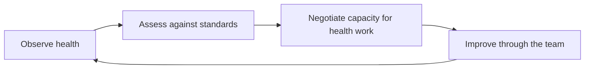

# System Ownership and Production Responsibility

> **Core capability:** The tech lead is the guardian of the system the team runs — its health, its dependencies, its debt, and its readiness for what the team ships into it.

## Why This Matters

A senior engineer owns their subsystem personally. A tech lead owns a **shared** system through the team. The shift is from "I keep this healthy" to "the team keeps this healthy, and I make sure that keeps happening."

Systems decay by default: dependencies age, debt accumulates, monitoring rots, knowledge concentrates in one head. Without an owner with a leadership view, decay is invisible until it becomes an incident. The tech lead makes system health a **visible, negotiated, ongoing** concern rather than background maintenance nobody schedules.

## Topics in This Capability Area

| Topic | Core Skill | When It Matters |
|-------|------------|-----------------|
| [[01_Team_System_Ownership]] | Establishing collective ownership of a system | Team formation, inherited systems, ownership disputes |
| [[02_Production_Readiness_Leadership]] | Driving readiness reviews for what the team ships | Before every meaningful release |
| [[03_Technical_Debt_Leadership]] | Making debt visible and negotiating payoff | Roadmap planning, quality erosion |
| [[04_Dependency_and_Integration_Management]] | Managing what the system relies on and serves | Upstream changes, integration projects, version upgrades |
| [[05_System_Health_Monitoring]] | Leading the observability posture of the system | Dashboard design, alert review, health baselines |
| [[06_Production_Support_Models]] | Designing how production is supported | On-call design, escalation paths, support tiers |
| [[07_Operational_Reviews]] | Running a cadence of system health checks | Quarterly reviews, architecture health checks |

## The System Health Loop

The loop runs continuously. The tech lead owns the loop — the team owns the work inside it.

## Ownership Levels

| Level | Senior engineer | Tech lead |
|-------|-----------------|-----------|
| Scope | A subsystem or service they build | The system the team runs, end to end |
| Mechanism | Personal diligence | Standards, reviews, and cadences the team follows |
| Debt | Pays down debt in their area | Maintains a team-wide debt register and payoff strategy |
| Dependencies | Handles dependencies of their work | Owns the dependency map and its risk posture |
| Knowledge | Deep in their area | Ensures no critical knowledge lives in one head |

## Practical Applications

### System Ownership Checklist

- [ ] An ownership charter names the services, data, and interfaces the team owns
- [ ] Sub-ownership within the team is assigned — no orphaned components
- [ ] A debt register exists with cost, risk, and payoff estimate per item
- [ ] Upstream and downstream dependencies are mapped with contact owners
- [ ] Dashboards answer "is the system healthy?" without interpretation
- [ ] Alerts were reviewed this quarter; every page is actionable
- [ ] The production support model is designed, not accidental
- [ ] An operational review ran in the last quarter and produced planned work

## Common Pitfalls

| Pitfall | Why It Is a Problem | Better Approach |
|---------|---------------------|-----------------|
| **Owning it solo** | You become the bus factor you were meant to eliminate | Distribute ownership; keep the meta-view |
| **Invisible debt** | Interest compounds silently until delivery stalls | Maintain a public debt register with costs |
| **Monitoring as decoration** | Dashboards nobody reads, alerts nobody tunes | Review observability like code — regularly |
| **Ad-hoc production support** | Heroics and luck instead of a model | Design the support model explicitly |

## Success Indicators

- The system's health is legible to outsiders in one dashboard
- Debt payoff appears in the plan, not only in retrospectives
- Dependency changes never surprise the team
- Any engineer on the team can describe how production is supported

## Related Capabilities

- [[07_Incident_Leadership_and_Production_Excellence/00_overview|Incident Leadership and Production Excellence]]: when health efforts fail, this is the response
- [[03_Technical_Direction_and_Architecture/00_overview|Technical Direction and Architecture]]: debt and health decisions feed the direction
- [[career-path/02_Senior_Software_Engineer/01_Technical_Ownership/00_overview|Technical Ownership (Senior)]]: the personal-ownership foundation this extends to a team

## Summary

System ownership at the tech-lead level is a leadership act: making health visible, negotiating capacity to protect it, and designing the support structures — reviews, registers, dashboards, models — that outlast any individual. The system should be able to lose you for a month and stay healthy.
