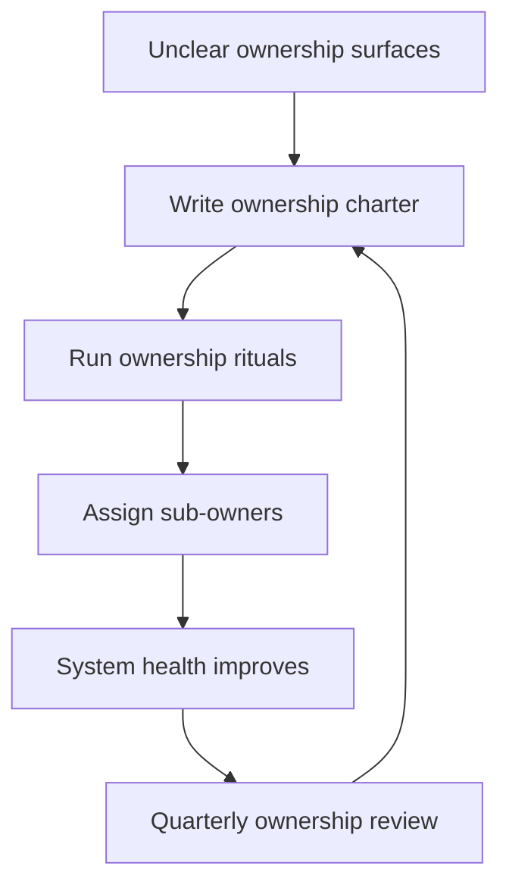

# Team System Ownership

> **Core skill:** Establishing collective ownership of the system so no critical knowledge, accountability, or decision power lives in one head — including yours.

## Why This Matters

A senior engineer owns a subsystem personally. A tech lead owns a system through the team. The shift sounds small and changes everything: the question stops being "do I know this system?" and becomes "does the team know this system, and can it keep knowing it as people change?"

Individual ownership scales to about one person's attention. Collective ownership scales to a team's, and it survives holidays, departures, and reorgs. Without it, the system acquires a bus factor of one, knowledge concentrates in whoever has been there longest, and every decision quietly routes through that person. The tech lead's job is to make ownership a team property: charter, rituals, and sub-ownership that distribute the load while keeping accountability whole.

## Collective vs Individual Ownership

| Dimension | Individual ownership | Collective ownership |
|-----------|----------------------|----------------------|
| Knowledge | One deep expert; everyone else shallow | Depth spread across the team, rotating |
| Decisions | Route through the expert | Made by owners within agreed boundaries |
| Resilience | Departure creates a crisis | Departure costs a handoff, not an emergency |
| Depth | Deep in one area | Deep enough everywhere, expert somewhere |
| Accountability | Personal diligence | Charter, rituals, and reviews the team runs |

Collective ownership does not mean everyone owns everything equally — it means the ownership is a team asset with structure, not a personal possession with good intentions.

## The Ownership Charter

The charter answers four questions in writing:

| Question | What the charter says | Example |
|----------|-----------------------|---------|
| What do we own? | Services, data, interfaces, jobs | Payment service, ledger data, payout API |
| Who sub-owns what? | Named owners per component | Alice owns ledger; Ben owns payouts |
| How is ownership exercised? | Rituals: reviews, health checks, on-call | Monthly health check per service |
| What happens at the edges? | Gray-zone resolution, interface change policy | Escalate disputes to the lead within a week |

A charter without rituals is decoration. The rituals are where ownership becomes visible and habitual.

## Ownership Rituals

| Ritual | Cadence | What it produces |
|--------|---------|------------------|
| Service health check | Monthly per service | A current health statement, issues logged |
| Ownership review | Quarterly | Charter updated; owners rotated or confirmed |
| Readiness review | Per release | The system is operatable before it ships |
| Incident retrospective | Per incident | Ownership gaps converted into charter changes |
| On-call handoff | Per shift | Current state transferred without loss |

Rituals are cheap, short, and relentless. Their purpose is not ceremony — it is that the system's state is never more than one meeting away from any team member.

## Sub-Ownership Assignment

Collective ownership works through deliberate sub-ownership:

| Sub-ownership model | How it works | Best for |
|---------------------|--------------|----------|
| Service owner | One engineer owns one service end to end | Stable, distinct services |
| Domain owner | One engineer owns a domain across services | Cohesive business domains |
| Concern owner | One engineer owns cross-cutting concerns: observability, security, data | Cross-cutting quality concerns |
| Rotating owner | Ownership rotates on a fixed schedule | Spreading depth, avoiding entrenchment |

Every sub-owner is an owner, not a delegate: they can decide within their boundary, they answer for their component, and their name is public. The tech lead keeps the meta-view — the charter, the interfaces, the health of the whole — and the right to overrule, exercised rarely and visibly.

## When Ownership Is Unclear

| Symptom | Root cause | Fix |
|---------|------------|-----|
| Orphaned services | Nobody chartered them; they exist in the gaps | Name an owner or explicitly decommission |
| Disputed boundaries | Two teams both claim or both deny a component | Resolve via charter; escalate if needed |
| Knowledge concentrated in one head | Ownership was personal, never collective | Pair the expert with a successor; rotate rituals |
| Ownership drift after departures | Charter was never updated | Quarterly ownership review, tied to headcount changes |
| Nobody can say who decides | Decision rights were never written | Add a decision-rights table to the charter |

Unclear ownership is not neutral. Every unowned component is a future incident, and every disputed boundary is a future political fight. Both are cheaper to fix by charter than by crisis.



## Practical Applications

```markdown
## Ownership Charter — [Team name]

### What we own
- [ ] Services: [list]
- [ ] Data and stores: [list]
- [ ] Interfaces and contracts: [list]
- [ ] Jobs and scheduled work: [list]

### Sub-owners
| Component | Owner | Decision rights | Review date |
|-----------|-------|-----------------|-------------|
| [service] | [name] | [scope of decisions] | [date] |

### Rituals
- [ ] Service health check: [cadence and owner]
- [ ] Readiness review: [per release]
- [ ] Incident retro ownership: [process]

### Gray zones
| Zone | Resolution |
|------|------------|
| [component] | [owner or escalation path] |

### Review
- [ ] Next charter review: [date]
```

Checklist:

- [ ] Every component has a named sub-owner with written decision rights
- [ ] Every ritual has a cadence and an owner
- [ ] The charter is visible to the team and adjacent teams
- [ ] Bus factor per critical component is two or more

## Common Pitfalls

| Pitfall | Why It Is a Problem | Better Approach |
|---------|---------------------|-----------------|
| **Owning it solo** | You become the bus factor you were meant to eliminate | Distribute sub-ownership; keep the meta-view only |
| **Charter without rituals** | The document exists; nothing changes | Bind every charter line to a recurring ritual |
| **Ritual rot** | Health checks get cancelled until the next incident | Protect the calendar slots; missing twice is an incident |
| **Sub-owners without rights** | Owners are blamed for things they cannot decide | Write decision rights next to every owner's name |
| **Static charter** | Ownership survives only as long as the document does | Review quarterly and after every departure |
| **Escalation as default** | Everything reaches you; sub-ownership is theater | Refuse escalations inside an owner's rights |

## Success Indicators

- Any engineer can describe what the team owns and who owns each piece
- Critical components have two or more people who can operate them
- Health checks and reviews run on cadence without your presence
- Ownership disputes resolve through the charter, not through escalation
- The system survives a month of your absence without losing health

## Related Topics

- [[02_Production_Readiness_Leadership]]: readiness reviews are the ritual that gates shipping
- [[07_Operational_Reviews]]: the quarterly review audits ownership itself
- [[career-path/02_Senior_Software_Engineer/01_Technical_Ownership/00_overview|Technical Ownership (Senior)]]: the personal ownership this extends to a team
- [[01_The_Tech_Lead_Role_and_Operating_Model/00_overview|The Tech Lead Role and Operating Model]]: the mandate this ownership serves

## Summary

Team system ownership converts personal diligence into a team property: a written charter, named sub-owners with real decision rights, and rituals that keep the system's state legible to everyone. The tech lead's job is to own the ownership — the charter, the boundaries, the health of the whole — while every component, concern, and decision belongs to someone on the team. A system that can lose you for a month and stay healthy is the deliverable.
