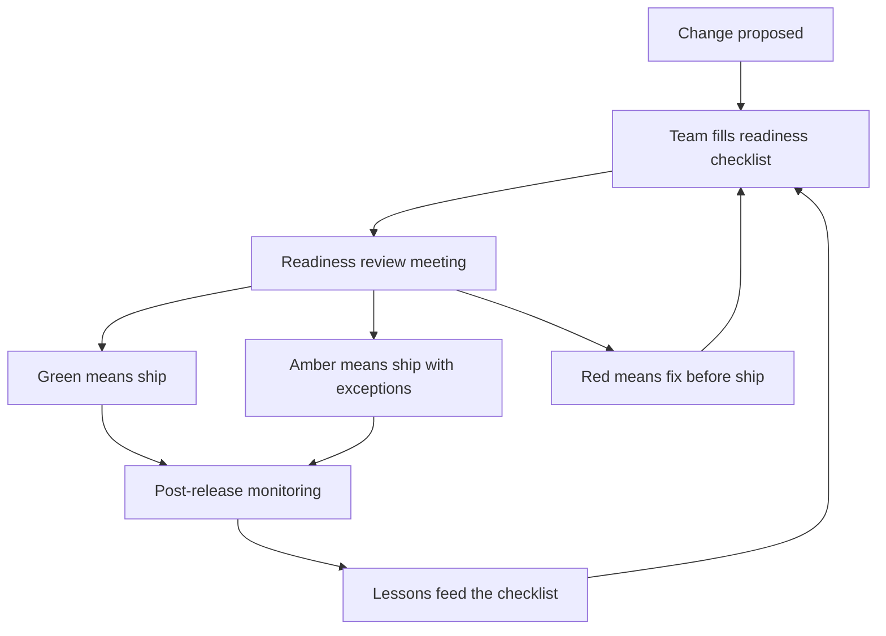

# Production Readiness Leadership

> **Core skill:** Driving readiness reviews so the team ships things that can be operated — not just built — and gating releases on readiness rather than hope.

## Why This Matters

Every release is a bet: the new code will run, degrade gracefully, be observable, and roll back if it does not. Teams that lose that bet pay in incidents, wake-ups, and the slow erosion of stakeholder trust. The difference between teams that ship safely and teams that ship dangerously is rarely the code — it is whether readiness is checked by a process or assumed by optimism.

A senior engineer checks readiness for their own work personally. A tech lead makes readiness a team gate: a checklist that is part of the release definition, a review that happens before production, and visibility that lets stakeholders see what is safe to ship and what is not. The gate is not bureaucracy — it is the difference between discovering problems in staging and discovering them at 3 AM.

## From Personal Practice to Team Gate

| Level | How readiness works |
|-------|---------------------|
| Senior engineer | Personal checklist, personal judgment, personal risk |
| Tech lead | Written checklist, review forum, release gate enforced for the whole team |
| Organization | Standardized readiness across teams, shared tooling |

The tech lead's move is to make the personal checklist a team artifact: written down, reviewed together, and binding. Once the gate exists, it also teaches — every engineer learns what readiness means by watching the gate applied.

## The Team Readiness Checklist

| Area | What to check | Minimum bar |
|------|---------------|-------------|
| Security | Secrets, dependencies, authz on new endpoints | No secrets in code; critical dependencies current |
| Observability | Dashboards, logs, metrics, alerts for the new behavior | Every new failure mode has a signal |
| Rollback | The release can be reverted or forward-fixed | Rollback path tested, not assumed |
| Load | Capacity, scaling, limits under expected traffic | Known headroom and a load test where risk warrants |
| Data migration | Schema and data changes reversible and safe | Migration tested against real data shape |
| Runbooks | Operators can respond without the author | Runbook exists for new operational tasks |
| Support | On-call knows what changed and how to page | Handoff notes shipped with the release |

The checklist lives in the repo next to the release process, not in a slide deck. It is the same list every time, so the review gets faster and the team gets better at filling it.

## Gating Releases on Readiness

| Gate level | What it allows | When used |
|------------|----------------|-----------|
| Green | Ship freely, normal review | Routine changes, full checklist pass |
| Amber | Ship with named exceptions and an owner for each | Small risk, exceptions tracked and closed |
| Red | Do not ship until items clear | Critical gaps: no rollback, no observability |
| Emergency | Ship-then-review, documented after | Production is down and the change fixes it |

The gate is a conversation, not a checkbox farm. A red gate that the lead overrides for politics is a gate that dies; a green gate that ignores real risk is a gate that lies. The lead's job is to keep the gate honest and to make the exceptions visible — an exception list is the team's honest risk register.

## Making Readiness Visible to Stakeholders

Stakeholders should be able to see readiness without asking: a board or dashboard showing each planned release, its readiness status, and its exceptions. When readiness is visible, two good things happen: stakeholders stop asking "is it safe?" and start asking "what would make it green?" — which is the question that funds readiness work.

## Readiness Review Meeting Format

```markdown
## Readiness Review — [release]

### What is shipping
- [ ] Scope summary and owner
- [ ] Linked design or change record

### Checklist status
- [ ] Security: [status] | [evidence]
- [ ] Observability: [status] | [evidence]
- [ ] Rollback: [status] | [evidence]
- [ ] Load: [status] | [evidence]
- [ ] Data migration: [status] | [evidence]
- [ ] Runbooks: [status] | [evidence]
- [ ] Support handoff: [status] | [evidence]

### Decision
- [ ] Gate: [green / amber / red]
- [ ] Exceptions: [item, owner, closure date]
- [ ] Ship window: [date and time, rollback trigger]

### After release
- [ ] Review post-release signals at the next health check
```

Keep the meeting to 30 minutes. The meeting does not do the readiness work — it verifies and decides. If the meeting is doing the work, the checklist has failed, not the meeting.



## Practical Applications

Checklist for establishing the readiness gate:

- [ ] Write the team checklist into the release process, versioned
- [ ] Schedule a 30-minute readiness review for every meaningful release
- [ ] Make the gate levels explicit: green, amber, red, emergency
- [ ] Publish release readiness where stakeholders can see it
- [ ] Track exceptions to closure; review the list monthly
- [ ] After each incident, ask what the checklist missed and update it

## Common Pitfalls

| Pitfall | Why It Is a Problem | Better Approach |
|---------|---------------------|-----------------|
| **Checklist theater** | Boxes ticked without evidence; the gate looks safe and is not | Require evidence per item, not a tick |
| **Gate by charisma** | The lead overrides red gates; the team learns gates are optional | Override only via the documented exception path |
| **Readiness in the author's head** | The person who built it is the only one who can judge it | Review with a second reader who did not build it |
| **Meeting as the work** | The review does the checking, so it balloons to hours | The checklist is filled before the meeting; the meeting verifies |
| **Emergency abuse** | Everything ships as an emergency; the gate is dead | Emergency path requires documentation within 24 hours |
| **Readiness after the fact** | The review happens post-deploy as a formality | Gate before the ship window; no exceptions to the order |

## Success Indicators

- Every meaningful release passes a readiness review with evidence
- Red gates hold, and exceptions are rare and tracked to closure
- New engineers can run the checklist without help
- Post-release issues drop as a share of total releases
- Stakeholders see readiness status and adjust plans against it

## Related Topics

- [[01_Team_System_Ownership]]: readiness is the ritual that gates what the team ships
- [[05_System_Health_Monitoring]]: the observability leg of the checklist
- [[06_Production_Support_Models]]: runbooks and handoff are readiness items
- [[07_Incident_Leadership_and_Production_Excellence/00_overview|Incident Leadership and Production Excellence]]: what happens when the gate fails
- [[career-path/02_Senior_Software_Engineer/05_Quality_Reliability_Security/04_Incident_Response|Incident Response (Senior)]]: the personal practice this builds on

## Summary

Production readiness leadership turns a personal discipline into a team gate: a written checklist with evidence, a short review meeting that verifies rather than works, explicit gate levels, and visible status for stakeholders. The gate's purpose is not to slow shipping but to move failure detection earlier — from 3 AM production to the staging review, where it costs a day instead of an incident.
