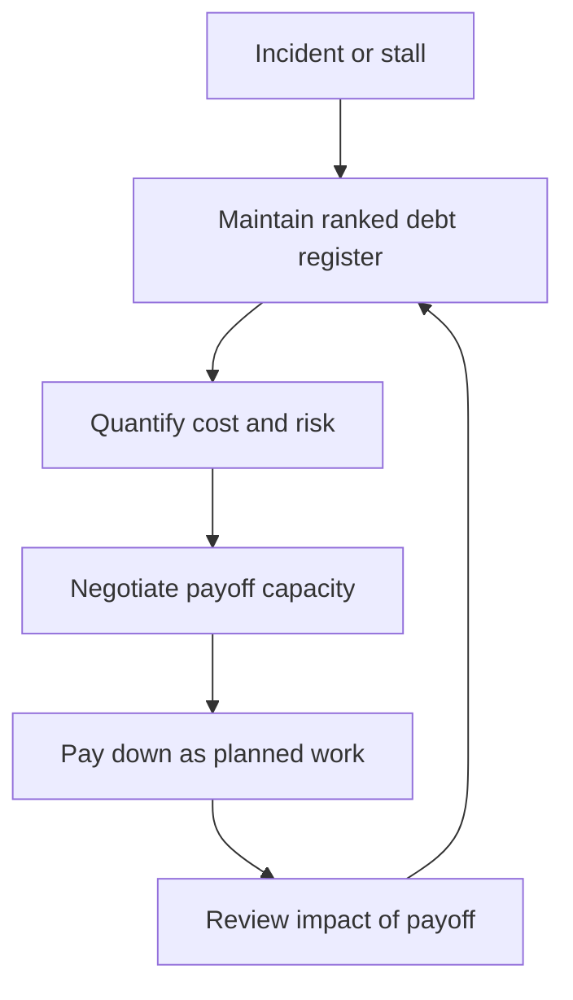

# Technical Debt Leadership

> **Core skill:** Making technical debt visible and negotiated — a register with costs, a payoff strategy with capacity, and a language that lets non-engineers make informed trade-offs.

## Why This Matters

Every system accumulates debt: code that was right for its moment and wrong for now, shortcuts taken under deadline, components nobody owns anymore. Debt is not the problem — invisible debt is. Invisible debt compounds silently until delivery stalls, incidents cluster in the same rotten areas, and every estimate carries a hidden surcharge the team has stopped noticing.

A senior engineer pays down debt in their own area. A tech lead manages debt as a portfolio: registered, quantified, negotiated for capacity, and communicated in terms stakeholders can act on. The register is the artifact that makes debt a planning input instead of a retrospective confession.

## From Personal Debt to Team Register

| Level | How debt is handled |
|-------|---------------------|
| Senior engineer | Personal list, personal judgment, pay down when possible |
| Tech lead | Public register, quantified costs, negotiated payoff capacity |
| Organization | Debt investment in planning, shared language across teams |

The register changes the conversation. A personal list is a wish; a public register is a proposal — items with costs and risks that compete for capacity like any other work.

## The Debt Register

| Field | What it captures | Example |
|-------|------------------|---------|
| Item | What the debt is, where it lives | Legacy billing flow, no tests |
| Cost | What it costs now, per unit of time or change | Two days per billing change |
| Risk | What failure it enables | Payment incidents, compliance exposure |
| Payoff estimate | Effort and approach to remove | Four days: extract module, add tests |
| Owner | Who tracks it | Alice |
| Status | Open, planned, in progress, paid | Open |

Keep the register short — the top ten to twenty items, ranked. A register of two hundred items is a museum; a register of fifteen ranked items is a working document.

## Quantifying Debt Impact

| Evidence type | How to measure | Why it convinces |
|---------------|----------------|------------------|
| Velocity drag | Time per change in the debt area vs a healthy area | Shows the tax in the currency of delivery |
| Incident correlation | Incidents mapped to debt areas over a year | Shows the risk in the currency of trust |
| Change friction | Failed deploys, rollbacks, long reviews in one area | Shows operational cost |
| Headcount cost | How many people the area needs vs should need | Shows the opportunity cost |

Numbers are the language of payoff negotiation. "This module is painful" is a complaint; "this module costs two days per change and produced three incidents last year" is an investment case.

## Negotiating Payoff Capacity with the PM

| Model | How it works | Best for |
|-------|--------------|----------|
| Fixed percentage | 10-20% of capacity reserved for debt each cycle | Sustained, predictable payoff |
| Debt sprint | A dedicated sprint or cycle for a named debt item | Big items with clear scope |
| Risk-based case | Debt items compete as risk investments: cost of incident vs cost of fix | Items with incident history |
| Bundled with features | Debt payoff rides along with feature work in the same area | Touching-up as you go |

The negotiation rule: debt is work like any other work. It needs an owner, a scope, an estimate, and a review — and it should win capacity on the same evidence basis as features, not on guilt.

## Debt vs Deliberate Pragmatism

| Shortcut | Is it debt? | Why |
|----------|-------------|-----|
| Hardcoded value that will change | Yes | Guaranteed rework with no plan |
| Prototype shipped without tests | Yes, unless explicitly timeboxed | Risk grows with every change |
| One-off script for a one-off task | No | No ongoing cost, no rework expected |
| Deliberate simplification with a written decision | No | A decision, recorded, with a revisit date |
| Skipped abstraction you will never need | No | You avoided speculative complexity |

Not every shortcut is debt. The distinction is whether the cost is paid once or forever. What makes pragmatism legitimate is the written decision — the ADR or note that says what was chosen, why, and when to revisit. What makes a shortcut debt is silence.

## Communicating Debt to Non-Engineers

| Engineer language | Stakeholder language |
|-------------------|----------------------|
| "The monolith is tightly coupled" | "Changes in one feature keep breaking others" |
| "We have no test coverage there" | "Every change to this area carries regression risk" |
| "The queue library is end-of-life" | "We are running on a component the vendor no longer supports" |
| "Payoff takes four days" | "Four days of capacity buys us roughly a week per quarter" |

The translation rule: debt is a maintenance cost on the product's future. Stakeholders understand maintenance budgets; what they do not understand is jargon.



## Practical Applications

```markdown
## Debt Register — [team]

| Rank | Item | Cost | Risk | Payoff | Owner | Status |
|------|------|------|------|--------|-------|--------|
| 1 | [module] | [days per change] | [failure mode] | [days] | [name] | [open] |

## Payoff Negotiation — [quarter]
- [ ] Capacity model chosen: [fixed percent / debt sprint / risk case]
- [ ] Items funded this quarter: [list]
- [ ] Items deferred, with the reason: [list]

## Translation Notes
- [ ] One-line stakeholder summary of the top three items
```

Checklist:

- [ ] Register exists, ranked, with costs and owners
- [ ] Debt appears in planning as funded work
- [ ] Every pragmatic shortcut has a written decision with a revisit date
- [ ] Stakeholders can name the top three debt items in their own words

## Common Pitfalls

| Pitfall | Why It Is a Problem | Better Approach |
|---------|---------------------|-----------------|
| **Invisible debt** | Interest compounds silently until delivery stalls | Maintain a public, ranked register |
| **Register as museum** | Two hundred items nobody ranks or funds | Cap it at the top items; rank by cost and risk |
| **Debt by guilt** | Payoff requests without evidence lose to features | Quantify cost and risk; compete on evidence |
| **All shortcuts are debt** | Every pragmatic decision becomes a confession | Record deliberate simplification as a decision, not a sin |
| **Jargon to stakeholders** | Nobody outside the team can judge the trade-off | Translate to maintenance cost and risk |
| **Payoff without review** | You fund debt but never check it was worth it | Review impact after payoff; feed the register |

## Success Indicators

- The register is ranked and reviewed at every planning cycle
- Debt items are funded in the plan, not only in retrospectives
- The team can name the top three debt items and their costs
- Stakeholders approve payoff capacity on evidence, not trust
- Incident clusters in debt areas decline quarter over quarter

## Related Topics

- [[01_Team_System_Ownership]]: the register is part of the ownership charter
- [[07_Operational_Reviews]]: the quarterly review audits the register against reality
- [[06_Balancing_Speed_and_Design]]: deliberate pragmatism is where new debt is born
- [[career-path/02_Senior_Software_Engineer/01_Technical_Ownership/00_overview|Technical Ownership (Senior)]]: the personal debt discipline this leads with

## Summary

Technical debt leadership is portfolio management: a short ranked register with quantified costs, payoff capacity negotiated on evidence, and a translation layer that lets stakeholders judge trade-offs in their own terms. The register makes debt a planning input; the negotiation makes it funded work; and the deliberate-pragmatism distinction keeps honest shortcuts from becoming guilty secrets. Debt is not the enemy — invisibility is.
