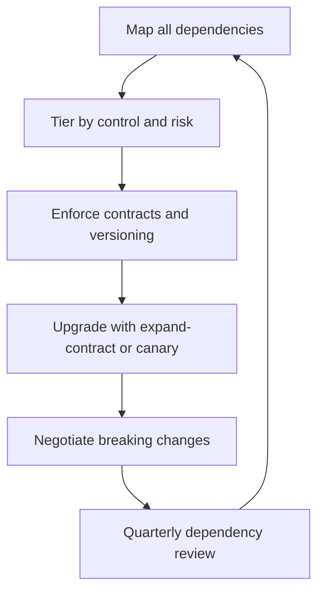

# Dependency and Integration Management

> **Core skill:** Managing what the system relies on and serves — a mapped, tiered, versioned dependency landscape where changes never surprise the team.

## Why This Matters

Modern systems are assemblies of other systems: upstream platforms, downstream consumers, third-party vendors, shared libraries. The team's own code may be excellent while the system around it is fragile — because a dependency changed without notice, a contract drifted silently, or a vendor's roadmap diverged from the team's needs.

Dependency problems share one shape: they arrive as surprises. The upstream team redeploys with a breaking change; the data feed changes shape overnight; the library the system depends on goes end-of-life. The tech lead's job is to convert dependency risk from surprise into inventory: mapped, tiered, and managed with the same rigor as owned code.

## The Dependency Map

| Direction | What to track | Example |
|-----------|---------------|---------|
| Upstream | What the system consumes and who provides it | Auth platform, payment gateway, data feeds |
| Downstream | Who consumes the system's outputs | Consumer teams, analytics, partner integrations |
| Shared | What multiple teams use and co-evolve | Internal libraries, message schemas, platform APIs |
| External | Vendors and open source with their own roadmaps | Cloud services, SDKs, licensed components |

A dependency map is only alive if it is maintained. The register records, per dependency: provider, version, contract, risk posture, and next review date.

## Dependency Tiers

| Tier | Examples | Risk posture | Management |
|------|----------|--------------|------------|
| Owned | Your services, your libraries | Full control | Change freely within your own versioning rules |
| Shared | Internal platforms, message buses | Co-evolution; contract discipline | Versioned contracts, change notification, contract tests |
| External | Vendors, open source, cloud services | No control; roadmap divergence | TCO and health monitoring, exit awareness, pinning |

The tier decides the strategy. Owned dependencies are engineering; shared dependencies are negotiation; external dependencies are risk management. Treating a vendor like a shared platform — or a shared platform like a vendor — produces the wrong moves every time.

## Interface Contracts and Versioning

| Practice | What it prevents | How |
|----------|------------------|-----|
| Semantic versioning | Silent breaking changes | Major version for breaking changes, changelog enforced |
| Contract tests | Drift between producer and consumer | Tests run against the contract in both directions |
| Additive-first policy | Breaking consumers by accident | New fields and endpoints first; removal is a major version |
| Change notification | Consumers surprised by intent | A change channel: announce before you break |
| Deprecation timeline | Forced migrations | Fixed windows: announce, deprecate, remove, with dates |

A contract is not a document; it is a set of enforced behaviors. The team's interface policy should say how contracts change, who may change them, and how long consumers get to adapt.

## Upgrade Strategies

| Strategy | How it works | Best for |
|----------|--------------|----------|
| Expand-contract | Add the new shape alongside the old, migrate, then remove | Data and API shape changes |
| Canary | New version serves a fraction of traffic, then expands | Runtime and behavior changes |
| Parallel run | Both versions run and are compared | High-risk migrations with verification needs |
| Feature-flag rollover | New path behind a flag, flipped progressively | Behavior changes with quick rollback needs |

The common thread: never replace a contract in one atomic cutover unless the cost of two versions exceeds the risk of one. Every strategy is a way of paying the transition cost in controlled increments.

## Breaking-Change Negotiation

When the team must break a dependency (or absorb one):

1. Map every affected consumer and its tolerance
2. Announce early through the change channel, with dates
3. Offer a migration path — shims, adapters, or a parallel window
4. Negotiate the window, not the change itself
5. Keep the old contract alive only as long as the cost justifies it

The same discipline applies inbound: when an upstream team plans a breaking change, the team's defense is the contract tests and the deprecation timeline — which only work if they were established before the crisis.

## Third-Party and Vendor Risk

| Signal | What to watch | Response |
|--------|---------------|----------|
| Release cadence | Stalls or erratically accelerates | Assess maintenance health; plan a fork or alternative |
| Governance | Security and license posture unclear | Vendor security review; pin versions; monitor advisories |
| Roadmap fit | Vendor direction diverges from your needs | Track divergence; build exit awareness |
| Support quality | Response times degrade | Document the degradation; escalate; plan alternatives |
| Pricing changes | Cost structure shifts after adoption | Contract review; exit cost estimate updated |

External dependencies are the only tier where the team cannot negotiate from strength. The mitigation is awareness: a health watch per critical vendor, an exit-cost estimate maintained alongside the adoption decision.



## Practical Applications

```markdown
## Dependency Register — [team]

| Dependency | Tier | Version | Contract | Risk | Next review |
|------------|------|---------|----------|------|-------------|
| [platform] | [shared] | [v2.3] | [API v2] | [medium] | [date] |

## Interface Policy
- [ ] Semantic versioning enforced: [where]
- [ ] Contract tests running: [in which pipelines]
- [ ] Change channel: [who announces, where]
- [ ] Deprecation timeline: [announce-remove window]

## Vendor Watch
| Vendor | Health signal | Exit cost | Next check |
|--------|---------------|-----------|------------|
| [name] | [release cadence, support] | [effort] | [date] |
```

Checklist:

- [ ] Every dependency has a tier and a next review date
- [ ] Contract tests fail the pipeline on drift
- [ ] Breaking changes are announced with dates and a migration path
- [ ] Critical vendors have a maintained exit-cost estimate

## Common Pitfalls

| Pitfall | Why It Is a Problem | Better Approach |
|---------|---------------------|-----------------|
| **Unmapped dependencies** | Surprises arrive from systems the team forgot it uses | Maintain the register; review quarterly |
| **Tier confusion** | Vendor treated as controllable, platform treated as fixed | Tier each dependency and pick the matching strategy |
| **Contracts in prose** | Documents drift; enforcement does not | Enforce contracts in tests and pipelines |
| **Atomic cutovers** | One change takes down every consumer at once | Expand-contract, canary, or parallel run |
| **Vendor complacency** | Adoption without exit awareness becomes captivity | Maintain the exit-cost estimate from day one |
| **Breaking-change ambush** | The team breaks others without a window and burns trust | Announce early, offer a migration path, negotiate the window |

## Success Indicators

- Dependency changes never surprise the team — upstream or downstream
- Contract tests fail loudly on drift within a day
- The register is current at every quarterly review
- Breaking changes move through announced windows, not ambushes
- Critical vendors have a health watch and an exit-cost estimate on file

## Related Topics

- [[01_Team_System_Ownership]]: the dependency map is part of the ownership charter
- [[05_Evaluation_and_Selection]]: new dependencies enter through the evaluation process
- [[07_Operational_Reviews]]: the quarterly review audits dependency risk
- [[career-path/07_SRE_and_Platform_Engineer/00_overview|SRE and Platform Engineer]]: the neighboring discipline of platform reliability

## Summary

Dependency and integration management converts a web of external commitments into a managed inventory: mapped, tiered by control, protected by versioned contracts and contract tests, and upgraded through expand-contract and canary strategies instead of atomic cutovers. Third-party dependencies get a health watch and a maintained exit cost. The goal is a system whose dependencies are assets with owners — not ambushes waiting to happen.
