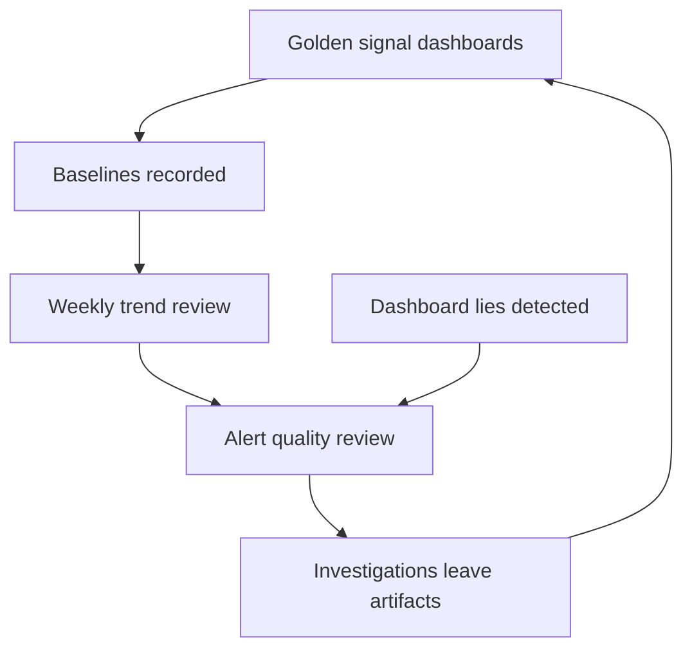

# System Health Monitoring

> **Core skill:** Leading the observability posture — golden-signal dashboards, actionable alerts, and health baselines — so the team sees the system's real state, not decoration.

## Why This Matters

Every system has a true health state; the question is whether the team can see it. Monitoring that has rotted — dashboards nobody reads, alerts nobody can act on, baselines nobody knows — is worse than no monitoring, because it manufactures false confidence. Teams with false confidence are the ones surprised by incidents that were visible for weeks.

A senior engineer builds good dashboards for their own area. A tech lead owns the team's observability posture: what the team watches, what pages it, how alerts are reviewed, and how investigations leave permanent instrumentation behind. The posture is a leadership artifact — reviewed like code, tuned like a product, and legible to anyone on the team.

## From Dashboards to Posture

| Level | Observability |
|-------|---------------|
| Senior engineer | Personal dashboards, personal alert rules, personal knowledge |
| Tech lead | Team dashboards, reviewed alerts, shared baselines, instrumentation discipline |
| Organization | Shared standards, central tooling, cross-team SLOs |

The posture has three parts: the dashboard (what the team sees), the alerts (what wakes the team), and the baseline (what normal looks like). All three must be maintained together — a dashboard without a baseline is a picture without a reference point.

## Golden Signals Dashboards

The team dashboard should answer four questions in one glance:

| Signal | What it shows | Typical view |
|--------|---------------|--------------|
| Latency | How fast the system responds | Percentiles p50, p95, p99 over time |
| Traffic | How much demand there is | Requests per second, by endpoint |
| Errors | How often requests fail | Error rate, by type and endpoint |
| Saturation | How close to capacity the system is | CPU, memory, queue depth, connections |

One dashboard per service, four signals, plus the business-level health the team is accountable for. If a new engineer can read the team's health in thirty seconds, the dashboard works.

## Alert Quality Review

An alert is a contract with a future human: it promises that when it fires, action is possible and warranted. Alerts are reviewed on a cadence, and each one earns its place:

| Criterion | Good alert | Bad alert |
|-----------|------------|-----------|
| Actionable | Tells the responder what to do | Just says something is wrong |
| Correlated with harm | Fires when users are affected | Fires on noise: brief blips, cosmetic metrics |
| Has a runbook | Response is written down | Responder improvises at 3 AM |
| Right severity | Page for pages, log for logs | Everything pages, so nothing pages |
| Owned | A named owner reviews it | Nobody knows who wrote it or why |

The review ritual: monthly, walk the alert list, delete or fix anything that has not earned its existence. Alert counts are a metric of the posture — the goal is fewer, better alerts.

## Health Baselines and Trend Review

A baseline is the answer to "is this normal?" recorded when things are healthy:

| Baseline element | Example |
|------------------|---------|
| Latency envelope | p99 under 400 ms at current traffic |
| Capacity headroom | 60% CPU at peak, scales at 80% |
| Error budget | Under 0.1% errors per day |
| Dependency posture | Vendor X p95 under 50 ms |

Trends matter more than snapshots: a slowly rising p99 or a creeping error rate is how most incidents actually start. The weekly health review reads the trends against baselines, and any drift gets a question: is this a change in demand, a regression, or the new normal?

## From Ad-Hoc Debugging to Permanent Instrumentation

The rule that separates healthy teams from lucky ones: every investigation leaves an artifact.

| Investigation outcome | Permanent artifact |
|-----------------------|--------------------|
| You queried the same data three times | A dashboard panel for it |
| You noticed a pattern by eye | An alert or trend view for it |
| You dug through logs to find one thing | A log search saved as a view |
| You fixed a recurring issue | A check or test that would have caught it |
| You answered a stakeholder question | The answer rendered as a metric or note |

Each artifact is small; the compounding is not. Teams that follow the rule find that the next investigation is a fraction of the last one.

## When Dashboards Lie

| Failure mode | Example | Fix |
|--------------|---------|-----|
| Vanity metrics | Uptime shown as 99.99% while p99 latency tripled | Show the metrics that correlate with user harm |
| Averages hiding tails | Average latency fine, p99 terrible | Percentiles, not averages, for latency |
| Happy-path dashboards | Success-path metrics, failure paths unmonitored | Monitor failure modes: retries, fallbacks, degraded paths |
| Frozen dashboards | The dashboard reflects last year's system | Review dashboards on the same cadence as code |
| Alert fatigue | 200 alerts a night, all ignored | Enforce the actionability review monthly |

The discipline: every metric on the dashboard must answer a question a human actually asks. If no decision changes based on a panel, the panel is decoration.



## Practical Applications

Observability review checklist — run monthly:

```markdown
## Observability Review — [month]

### Dashboards
- [ ] Every panel answers a real question: [list decisions it feeds]
- [ ] Golden signals present per service
- [ ] Stale panels removed or updated

### Alerts
- [ ] Every alert has an owner and a runbook
- [ ] Alerts fired this month: [count] | Actionable: [count]
- [ ] Alerts that did not lead to action: [list] -> fix or delete

### Baselines
- [ ] Baselines recorded and current
- [ ] Trends reviewed against baselines this week

### Artifacts
- [ ] Investigations this month: [count]
- [ ] Permanent instrumentation added: [list]
```

## Common Pitfalls

| Pitfall | Why It Is a Problem | Better Approach |
|---------|---------------------|-----------------|
| **Monitoring as decoration** | Dashboards nobody reads, alerts nobody tunes | Review observability like code, monthly |
| **Averages over percentiles** | Tail latency hides behind the mean | Use percentiles for latency and queueing |
| **Alert fatigue** | Everything pages, so nothing pages | Page only for actionable, harm-correlated conditions |
| **No baselines** | The team cannot tell drift from normal | Record baselines when healthy; review trends weekly |
| **Ad-hoc debugging forever** | Every incident starts from zero | Leave an artifact from every investigation |
| **Vanity dashboards** | Metrics that flatter but do not inform | Delete any panel no decision depends on |

## Success Indicators

- Any engineer can read the team's health in thirty seconds
- Alerts are few, owned, and each has a runbook
- The team can state the current baseline and spot drift from it
- Investigations get faster quarter over quarter — instrumentation compounds
- No incident in the last two quarters was visible-but-unnoticed beforehand

## Related Topics

- [[02_Production_Readiness_Leadership]]: observability is the readiness checklist's evidence base
- [[07_Operational_Reviews]]: trends and baselines feed the quarterly review
- [[06_Production_Support_Models]]: alerts feed the support model's escalation path
- [[career-path/07_SRE_and_Platform_Engineer/00_overview|SRE and Platform Engineer]]: the deeper discipline this leads toward

## Summary

System health monitoring at the tech-lead level is an owned posture, not a pile of dashboards: golden signals per service, baselines that define normal, a monthly alert review that keeps every page actionable, and an instrumentation discipline that turns every investigation into permanent visibility. The test of the posture is simple — the team should never again discover that a problem was visible for weeks before it became an incident.
