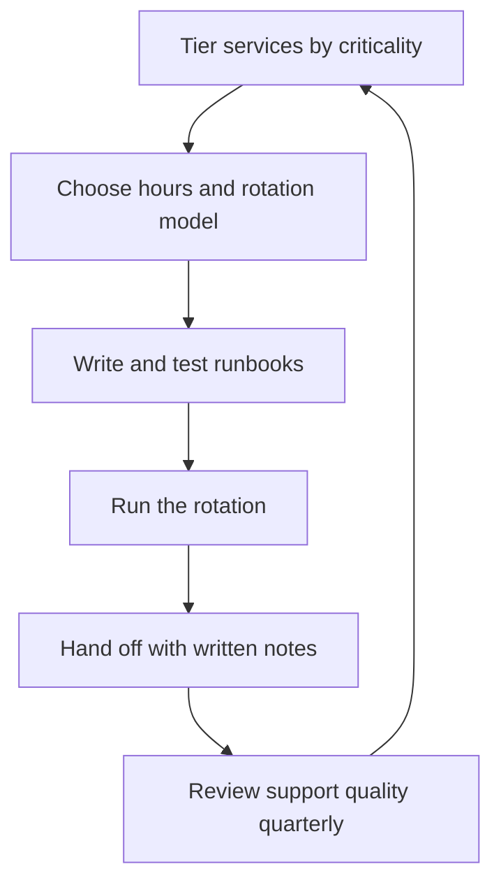

# Production Support Models

> **Core skill:** Designing how production is supported — tiers, escalation paths, runbooks, and rotations — so support is humane, predictable, and never dependent on heroics.

## Why This Matters

Every system that runs in production gets supported somehow. The choice is whether support is designed or improvised. Improvised support is the quiet killer of teams: the same two people get paged because they know the system, knowledge never spreads, burnout builds, and the support burden quietly becomes the reason engineers leave.

A support model is a design artifact with the same rigor as the system itself: who is on call, when, for what, with what tools, escalating to whom, and how shifts hand over. The tech lead owns the design; the team owns the rotation. A good model makes support a normal part of the job; a bad model makes it the job's punishment.

## What a Support Model Decides

| Design question | Options | The trade-off |
|-----------------|---------|---------------|
| Hours | Business hours only vs 24/7 | Cost and fatigue vs coverage |
| Tiers | Primary, secondary, tertiary | Speed vs who carries the load |
| Rotation | Weekly shifts, day rotations, follow-the-sun | Continuity vs load balance |
| Escalation | Named paths per failure class | Certainty vs flexibility |
| Handoff | Written, timed, overlapping | Friction vs information loss |
| Compensation | Time-off-in-lieu, pay, rotation relief | Cost vs sustainability |

Every option is a trade-off; the design is making the trade-offs explicit and choosing deliberately.

## On-Call Tiers

| Tier | Who | Role |
|------|-----|------|
| Primary | One engineer per shift | First response: triage, mitigate, page if needed |
| Secondary | A second engineer, often the lead | Backup and escalation for hard cases |
| Tertiary | The owning team, then the org | Deep expertise and incident command |

The two-tier model (primary plus secondary) is the common default: the primary handles the routine, the secondary absorbs the hard cases and the primary's gaps. The tiers must be explicit in the roster, not implicit in "someone will figure it out."

## Business Hours vs 24/7

| Model | Fits when | Requirements |
|-------|-----------|--------------|
| Business hours only | Internal tools, low criticality, no overnight users | Clear overnight protocol: batch, report in the morning |
| Extended hours | Regional users, moderate criticality | Follow-the-sun or stretched shifts, rotation design |
| 24/7 | Customer-facing revenue systems, SLAs | Full rotation, alert hygiene, runbooks, fatigue controls |

The criticality of the service should drive the model, not tradition or fear. A 24/7 rotation on a system that does not need it burns the team for nothing; a business-hours model on a revenue system loses trust.

## Escalation Paths

Escalation is designed, not discovered. Every alert and every failure class has a named path:

| Failure class | Escalation path |
|---------------|-----------------|
| Service degraded, no user impact | Primary handles within the shift; log and review |
| User impact, mitigation known | Primary mitigates; secondary on standby |
| User impact, mitigation unknown | Page secondary immediately; lead joins |
| Major incident | Incident commander assigned; org escalation per protocol |

The rule: escalation decisions are made by the responder, not by the calendar. If a responder pages at 3 AM, the page is the system working, not a failure of judgment.

## Service Tiering

Not all services deserve the same support depth. Tier them by criticality and design per tier:

| Tier | Criticality | Support design |
|------|-------------|----------------|
| Tier 1 | Revenue-critical, SLA-bound | 24/7, full runbooks, secondary always |
| Tier 2 | Important, tolerant of brief outages | Extended or business hours, solid runbooks |
| Tier 3 | Internal, best effort | Business hours, minimal runbooks, batch reporting |

Tiering is what makes support humane: the team's energy concentrates where outages actually hurt. Every service's tier is written in its ownership charter and reviewed quarterly.

## Runbook Requirements

A runbook is the support model's memory. Minimum content:

| Section | What it must contain |
|---------|----------------------|
| Symptom | What the alert looks like and what it means |
| Triage | First checks and quick diagnosis steps |
| Mitigation | Actions that reduce impact fast |
| Resolution | The proper fix, or the path to the right team |
| Escalation | Who to page next and when |
| Verification | How to confirm the problem is gone |

A runbook that requires the author to interpret it is a note, not a runbook. Test runbooks by having someone who never saw the incident follow them.

## Handoff Practices

| Practice | What it prevents |
|----------|------------------|
| Written handoff note: active issues, recent changes, open pages | Starting the shift from zero |
| Overlapping handoff time | Losing context in the last hour |
| Handoff review of the alert list | Inherited silent alarms |
| Rotating handoff day-of-week | Same person always carrying the worst day |

The handoff is the seam where knowledge is lost. Treat it like a deploy: a defined procedure, not a shrug.

## Humane Support Design

| Design element | Why it matters |
|----------------|----------------|
| Load balancing | The same person should not inherit every hard shift |
| Rotation relief | No one on call forever; named relief paths |
| Compensation | Time-off-in-lieu or pay, agreed in advance |
| Fatigue controls | Maximum consecutive shifts; immediate relief after major incidents |
| Learning loop | Every page is a chance to improve alerts and runbooks |

Support is sustainable when it is fair. Unfair rotations are the fastest way to lose the engineers who are best at production.



## Practical Applications

```markdown
## Support Model — [team]

### Services and tiers
| Service | Tier | Hours | Rotation |
|---------|------|-------|----------|
| [name] | [1/2/3] | [24-7 / business] | [weekly] |

### Rotation
- [ ] Roster published: [who covers which week]
- [ ] Primary and secondary named per shift
- [ ] Relief path: [who covers for absence]

### Escalation
- [ ] Alert-to-escalation paths documented per failure class
- [ ] Major incident protocol: [commander, channels]

### Runbooks
- [ ] Every Tier 1 and Tier 2 alert has a runbook
- [ ] Runbooks tested by a non-author

### Handoff
- [ ] Written handoff template: [link]
- [ ] Overlap window: [minutes]

### Sustainability
- [ ] Compensation model: [agreed with EM]
- [ ] Fatigue rules: [max shifts, relief after incidents]
```

Checklist:

- [ ] Every service has a tier and a support design to match
- [ ] Every page has a runbook and an escalation path
- [ ] The rotation is fair and published in advance
- [ ] Support burden appears in the quarterly review

## Common Pitfalls

| Pitfall | Why It Is a Problem | Better Approach |
|---------|---------------------|-----------------|
| **Heroic support** | The same two people carry production until they burn out | Rotation, runbooks, and escalation spread the load |
| **One tier for everything** | Tier 3 services get Tier 1 scrutiny; energy misallocated | Tier services by criticality; design per tier |
| **Runbooks as prose** | Notes only the author can follow | Test runbooks with non-authors |
| **Handoff as shrug** | The new shift starts from zero every week | Written handoff with overlap and alert review |
| **Uncompensated burden** | Support feels like punishment; retention suffers | Agree compensation and fatigue rules in advance |
| **Static model** | The system grew but the support design did not | Review the model quarterly against reality |

## Success Indicators

- Any engineer can describe the support model: tiers, rotation, escalation
- Pages have runbooks, and runbooks are followed by people who never saw the incident
- The rotation is fair by anyone's inspection and published in advance
- Handoffs are written and never skipped
- Support burden is a quarterly review item, and it trends down as runbooks and alerts improve

## Related Topics

- [[02_Production_Readiness_Leadership]]: readiness defines what the support model must absorb
- [[05_System_Health_Monitoring]]: alert quality determines what support actually pages
- [[07_Incident_Leadership_and_Production_Excellence/00_overview|Incident Leadership and Production Excellence]]: the escalation path's destination
- [[career-path/02_Senior_Software_Engineer/05_Quality_Reliability_Security/04_Incident_Response|Incident Response (Senior)]]: the personal response discipline this scales

## Summary

A production support model is a deliberate design: services tiered by criticality, hours and rotations matched to need, escalation paths named per failure class, runbooks tested by non-authors, and handoffs that never lose context. The humane constraints — fair rotation, compensation, fatigue rules — are part of the design, not afterthoughts. Support stops being heroics and becomes a normal, sustainable part of running the system.
