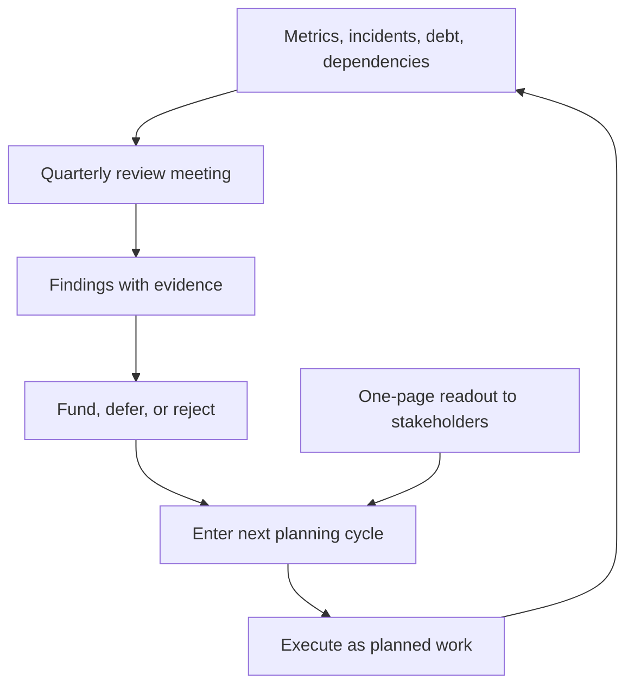

# Operational Reviews

> **Core skill:** Running a quarterly cadence that turns system health evidence — trends, incidents, debt, dependencies — into planned work with owners.

## Why This Matters

Systems decay by default, and the decay is invisible in weekly increments. A slightly slower endpoint here, a small debt item there, a dependency quietly aging — none of it is worth a meeting on its own. But accumulated, it becomes the quarter where everything stalls and the incidents cluster.

The quarterly operational review is the counter-move: a scheduled moment where the team steps back from delivery and reads the system's health as a whole. It turns scattered signals — metrics, incident history, the debt register, dependency changes — into a short list of planned improvements. Without it, health work happens only when a fire forces it; with it, health work competes for capacity like any other work.

## Why Quarterly

| Cadence | What it catches | What it misses |
|---------|-----------------|----------------|
| Weekly | Recent drift, alert noise | Slow trends, structural decay |
| Monthly | Slower trends, debt movement | Cross-quarter patterns, architecture rot |
| Quarterly | Structural trends, architecture health | Nothing that matters at this level |
| Yearly | Long-term trajectory | Problems that compound for a year first |

Quarterly is the sweet spot: slow enough to see structure, fast enough to act before the next planning cycle. It also aligns naturally with planning, so findings can enter the roadmap immediately.

## The Review Agenda

| Agenda item | What it covers | Input |
|-------------|----------------|-------|
| Health trends | Latency, errors, saturation, capacity vs baselines | Dashboards, baselines |
| Debt | Register movement: what was paid, what grew | Debt register |
| Dependencies | Tier changes, vendor health, upgrade exposure | Dependency register |
| Capacity | Team and system headroom against the roadmap | Planning data |
| Risks | Top risks, likelihood, mitigation status | Risk list |
| Architecture health | Coupling, complexity hotspots, structural drift | Architecture check |

Two hours, same agenda every quarter. The agenda's stability is the point — trends only read clearly when the questions never change.

## Architecture Health Checks

The architecture leg is the one most teams skip, and the one that catches the expensive problems:

| Check | What to look for | Signal of trouble |
|-------|------------------|-------------------|
| Coupling | Dependency direction between components | Cycles, cross-component change storms |
| Complexity hotspots | Files and modules with the most change and incident history | The same areas appear every quarter |
| Structural drift | Reality vs the documented architecture | Diagrams and code disagree |
| Knowledge spread | Who can operate each component | Bus factor creeping toward one |
| Standards erosion | Conventions weakening over time | New code diverging from standards |

The check is comparative: this quarter against last, not against perfection. The question is always "is the structure getting healthier or worse, and why?"

## Review Inputs

| Input | Where it lives | How to keep it ready |
|-------|----------------|----------------------|
| Metrics and baselines | Dashboards | Weekly trend review keeps it current |
| Incident history | Incident records | One line per incident, tagged by area |
| Debt register | The register document | Updated during planning |
| Dependency register | The dependency document | Updated on any change |
| Risk list | The risk document | Reviewed monthly |
| Architecture notes | ADRs and diagrams | Updated as decisions land |

The review meeting reads these inputs; it does not assemble them. If the team is assembling inputs in the meeting, the cadence around them has failed — which is itself a finding.

## From Findings to Planned Work

Every review ends with a decision list. The discipline:

| Column | What goes in it |
|--------|-----------------|
| Finding | One sentence, evidence-linked |
| Recommendation | The change that addresses it |
| Owner | One name |
| Effort | Rough size: days or weeks |
| Decision | Funded this quarter, deferred, or rejected with reason |

Three to five funded items per quarter is a strong outcome. The review's success is not the number of findings — it is that the funded items appear in the next plan and are done.

## Making Review Findings Visible

The review's conclusions should be visible to the team and stakeholders: a one-page summary — health verdict per area, funded items, deferred items — shared with the EM and PM, and a short version for the team. Visibility is what turns the review from an internal ritual into a commitment that others can hold the team to.



## Practical Applications

```markdown
## Operational Review — [quarter]

### Health trends
- [ ] Golden signals vs baselines: [verdict per service]
- [ ] Notable drifts: [list with evidence]

### Debt
- [ ] Paid this quarter: [items]
- [ ] Grew this quarter: [items and why]

### Dependencies
- [ ] Tier changes: [list]
- [ ] Vendor health: [verdicts]

### Capacity
- [ ] Team capacity vs roadmap demand: [verdict]
- [ ] System headroom: [verdict]

### Risks
- [ ] Top risks and mitigation status: [list]

### Architecture health
- [ ] Coupling and hotspots: [verdict vs last quarter]
- [ ] Drift between design and reality: [findings]

### Decisions
| Finding | Recommendation | Owner | Effort | Decision |
|---------|----------------|-------|--------|----------|
| [text] | [text] | [name] | [size] | [fund/defer/reject] |

### Readout
- [ ] One-page summary shared with EM and PM: [date]
```

## Common Pitfalls

| Pitfall | Why It Is a Problem | Better Approach |
|---------|---------------------|-----------------|
| **Review without inputs** | The meeting assembles evidence from scratch and runs long | Maintain the inputs on cadence; the meeting reads them |
| **No decisions** | A discussion that produces goodwill and nothing else | End every review with funded, owned items |
| **Finding museum** | Deferred items reappear forever with no decision | Defer with a reason and a revisit condition |
| **Architecture skipped** | Only metrics get reviewed; structure rots invisibly | Keep the architecture check on the fixed agenda |
| **Review as blame** | Findings feel like accusations; the team goes defensive | Frame as system evidence, never as individual fault |
| **No visibility** | Findings vanish into the team; stakeholders are surprised later | Publish the one-page readout every quarter |

## Success Indicators

- The review runs on its scheduled date with inputs ready
- Three to five funded items enter the plan each quarter and get done
- Health verdicts trend: the same problems stop appearing quarter after quarter
- Architecture findings have produced at least one structural change in the last year
- Stakeholders know the team's health verdict in their own language

## Related Topics

- [[01_Team_System_Ownership]]: the review audits how ownership is working
- [[03_Technical_Debt_Leadership]]: the register is the review's debt input
- [[05_System_Health_Monitoring]]: baselines and trends are the review's evidence
- [[03_Technical_Direction_and_Architecture/00_overview|Technical Direction and Architecture]]: structural findings feed the direction

## Summary

Operational reviews are the cadence that makes system health a planning input: a fixed two-hour agenda reading maintained inputs — trends, incidents, debt, dependencies, capacity, risks, architecture health — and ending in funded, owned work. The review's value is not the meeting but the loop: evidence enters, decisions exit, and the next quarter's review measures whether the decisions worked. Teams that run it find that the fires of the past become the trends of the present.
