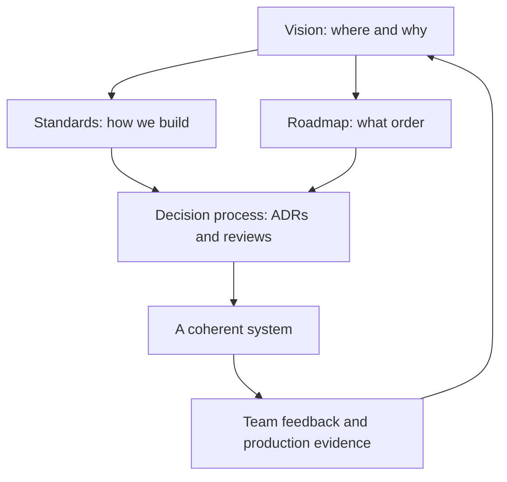

# Technical Direction and Architecture

> **Core capability:** The tech lead points the team's technical work at a destination — a vision, a set of standards, and a decision process that keeps the system coherent without making every decision personally.

## Why This Matters

Without direction, every engineer optimizes locally. The result is not chaos — it is **coherent-looking divergence**: five clean implementations of the same concern, three logging patterns, two half-adopted frameworks, and no one able to say which way the system is going.

Direction-setting is the tech lead's most leveraged activity. One clear vision prevents dozens of redundant decisions; one standards document prevents hundreds of inconsistent ones. But direction is not dictatorship — it works when the team can trace decisions to reasoning, and challenge that reasoning safely.

## Topics in This Capability Area

| Topic | Core Skill | When It Matters |
|-------|------------|-----------------|
| [[01_Setting_Team_Technical_Vision]] | Articulating where the system is going and why | Team formation, strategy shifts, growth transitions |
| [[02_Architecture_Decision_Process]] | Running a team ADR process that people actually use | Every consequential decision |
| [[03_Design_Review_Leadership]] | Facilitating design reviews that improve designs | Significant features, risky changes, new components |
| [[04_Technical_Standards_and_Conventions]] | Codifying how the team builds | Onboarding, consistency, review load |
| [[05_Evaluation_and_Selection]] | Leading build/buy/adopt decisions | New frameworks, libraries, platforms, vendors |
| [[06_Balancing_Speed_and_Design]] | Choosing when to go fast and when to go solid | Deadline pressure, prototypes, foundations |
| [[07_Technical_Roadmapping]] | Sequencing technical investment alongside product work | Quarterly planning, platform investment cases |

## How Direction Flows

Direction is a loop: the system and the team push back, and the vision adjusts.

## Direction Artifacts

| Artifact | Purpose | Audience | Lifetime |
|----------|---------|----------|----------|
| Technical vision | Align on destination and rationale | Team, stakeholders | Quarters to years |
| Standards and conventions | Make the default the right choice | Team, new joiners | Evolves slowly |
| ADRs | Record consequential decisions and their reasoning | Team, future leads | Permanent |
| Technical roadmap | Sequence investment against product demand | Team, PM, management | Quarters |
| Design review record | Improve and archive significant designs | Team | Permanent |

## Practical Applications

### Direction Checklist

- [ ] A one-page technical vision exists, is readable, and names non-goals
- [ ] Standards cover structure, naming, logging, errors, and testing — each with a why
- [ ] Consequential decisions produce ADRs; the team can find them
- [ ] Design reviews run on a known cadence with written designs read beforehand
- [ ] Selection decisions follow an evaluation matrix others can audit
- [ ] The technical roadmap is coupled to the product roadmap, not parallel to it
- [ ] Every direction artifact has a revisit date

## Common Pitfalls

| Pitfall | Why It Is a Problem | Better Approach |
|---------|---------------------|-----------------|
| **Vision in your head** | Team cannot align to, or challenge, what they cannot read | Write it; one page beats zero pages |
| **Standards by assertion** | Compliance without belief; standards rot | Explain the why; revisit when context changes |
| **Deciding everything** | Bottleneck; team stops thinking | Decide the consequential; delegate the reversible |
| **Architecture astronautics** | Direction detached from delivery reality | Tie every investment to a delivery or risk story |

## Success Indicators

- Engineers cite the vision and ADRs in day-to-day discussions unprompted
- Decisions you were not part of still land coherent with the direction
- New engineers converge on team conventions within weeks, not months
- The roadmap survives contact with product pressure — adjusted, not abandoned

## Related Capabilities

- [[01_The_Tech_Lead_Role_and_Operating_Model/00_overview|The Tech Lead Role and Operating Model]]: direction is a core part of the mandate
- [[06_Process_and_Quality_Stewardship/00_overview|Process and Quality Stewardship]]: standards become real through process
- [[career-path/02_Senior_Software_Engineer/03_Architecture_and_Design_Judgment/00_overview|Architecture and Design Judgment (Senior)]]: the personal judgment skills this area leads with
- [[career-path/06_Software_Architect/00_overview|Software Architect]]: the neighboring path where direction-setting becomes the whole role

## Summary

Technical direction is the tech lead's highest-leverage output: a written vision, living standards, a decision process that records reasoning, and a roadmap that connects investment to delivery. Done well, the system stays coherent even though most decisions are made by people other than you.
