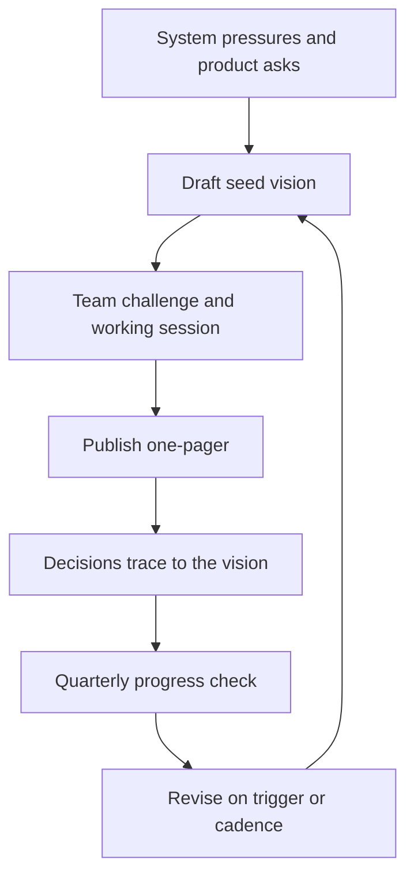

# Setting Team Technical Vision

> **Core skill:** Articulating where the system is going and why — in one page, collaboratively written, and tied to delivery — so the team aligns and challenges in the same direction.

## Why This Matters

Without a vision, every engineer optimizes locally: five clean implementations of the same concern, three logging patterns, two half-adopted frameworks. The system does not collapse — it diverges, and divergence is expensive to reverse. A vision is the antidote: a shared answer to "where is this system going, and why?" that makes dozens of small decisions consistent without anyone coordinating them.

The vision is also the tech lead's most leveraged communication. One page of vision prevents a hundred redundant conversations, and it gives the team something to challenge — which is exactly what keeps it honest. A vision nobody can argue with is a vision nobody read.

## What a Vision Contains

| Element | What it is | Example |
|---------|------------|---------|
| Destination | Where the system will be in 12-24 months | Billing unified on one platform |
| Principles | The values decisions must respect | Simplicity over cleverness; data is owned by one team |
| Non-goals | What the vision is explicitly not | No multi-region expansion this horizon |
| Evolution path | How the destination will be reached | Phased migration, strangler approach |

The destination is the anchor; the principles are the decision filter; the non-goals are the guardrails; the evolution path is the credibility — a vision without a path is a dream.

## The Horizon

| Horizon | What it can hold | Common failure |
|---------|------------------|----------------|
| 3-6 months | A plan, not a vision | The vision reads as a project plan |
| 12-24 months | A direction with assumptions | Assumptions age; the vision needs revisiting |
| 5+ years | Philosophy | Untestable; nobody can hold it accountable |

Twelve to twenty-four months is the practical horizon for a team vision: far enough to shape major decisions, near enough that the team can see whether it is coming true. The vision should state its assumptions — about product direction, scale, team size — because those are the things that invalidate it.

## Writing It Collaboratively

The vision is written with the team, not for them:

1. Draft a seed version from the system's real pressures — incidents, debt, product asks
2. Circulate it and collect challenge: what is wrong, what is missing, what is unfair
3. Run a working session to resolve disagreements — the arguments are the value
4. Publish the result, crediting the team's input
5. Revisit at the quarterly planning cycle

The collaboration is not democracy — the lead owns the final call. But a vision the team fought over is owned by the team; a vision handed down is a memo.

## The One-Pager Format

```markdown
# Technical Vision — [team] — [horizon: 2027]

## Destination
- [ ] Where the system will be in 12-24 months: [statement]
- [ ] What users will experience differently: [statement]

## Principles
- [ ] [principle 1]: [one-line meaning]
- [ ] [principle 2]: [one-line meaning]
- [ ] [principle 3]: [one-line meaning]

## Non-goals
- [ ] [what we are explicitly not doing this horizon]

## Evolution path
- [ ] Phase 1: [what, by when]
- [ ] Phase 2: [what, by when]
- [ ] Phase 3: [what, by when]

## Assumptions
- [ ] [product direction, scale, team size assumptions]

## Review
- [ ] Next review: [date] | Trigger for early review: [condition]
```

One page. If it needs two, the destination is unclear.

## When and How to Revise

| Trigger | What changes |
|---------|--------------|
| Product direction shift | Destination and evolution path |
| Major scale event | Destination, principles may stay |
| Repeated principle violations | The principles are wrong, or the team is not aligned |
| New team composition | Re-commit the team to the vision |
| Quarterly planning | Refresh assumptions, check progress |

The vision should change rarely and deliberately. A vision that changes every quarter is a plan; a vision that never changes while the world does is a monument.

## Vision Anti-Patterns

| Anti-pattern | What it looks like | Fix |
|--------------|--------------------|-----|
| Technology wish-list | "We will use Kubernetes and event-driven everything" | Start from outcomes and pressures, not tool names |
| Marketing copy | "World-class, best-in-class, seamless" | Write testable claims: what will be true, measurably |
| Three visions in one | Destination, principles, and roadmap tangled | Separate the elements; one page per element |
| Roadmap disguised as vision | A list of projects with dates | The vision is the why; the roadmap is the what-order |
| Vision by committee | Every opinion included, no edge left | The lead owns the final call after the challenge |



## Practical Applications

Checklist for setting or refreshing the vision:

- [ ] Gathered the system's real pressures: incidents, debt, product asks
- [ ] Drafted a one-page seed: destination, principles, non-goals, path, assumptions
- [ ] Circulated it and collected written challenge
- [ ] Ran a working session; resolved disagreements with the lead's call
- [ ] Published it where the team and stakeholders can find it
- [ ] Linked it from planning: every roadmap item traces to the vision
- [ ] Set the quarterly review date and the early-review triggers

## Common Pitfalls

| Pitfall | Why It Is a Problem | Better Approach |
|---------|---------------------|-----------------|
| **Vision in your head** | The team cannot align to, or challenge, what they cannot read | Write it; one page beats zero pages |
| **Vision as memo** | Handed down, never owned; compliance without belief | Write it with the team; resolve disagreement openly |
| **Tool list vision** | Names frameworks instead of outcomes; goes stale with fashion | Anchor to outcomes and pressures |
| **Unmeasurable vision** | No way to tell if it is coming true | Make claims testable; check progress quarterly |
| **Never revised** | The world moved; the vision is a monument | Review on cadence and on named triggers |
| **Vision without a path** | Inspiring and useless; nobody knows how to start | Include the evolution path and phases |

## Success Indicators

- Engineers cite the vision in day-to-day decisions unprompted
- The team can state the destination and one principle in their own words
- New engineers absorb the direction in days, not months
- Roadmap items trace visibly to the vision
- The vision changed deliberately at least once in the last year — it is alive

## Related Topics

- [[02_Architecture_Decision_Process]]: decisions record the reasoning the vision supplies
- [[07_Technical_Roadmapping]]: the roadmap sequences what the vision directs
- [[04_Technical_Standards_and_Conventions]]: standards make the vision's principles operational
- [[career-path/02_Senior_Software_Engineer/03_Architecture_and_Design_Judgment/00_overview|Architecture and Design Judgment (Senior)]]: the personal judgment this vision amplifies
- [[career-path/06_Software_Architect/00_overview|Software Architect]]: the neighboring path where vision becomes the whole role

## Summary

A team technical vision is a one-page, collaboratively written statement of destination, principles, non-goals, evolution path, and assumptions, aimed 12-24 months out. Written with the team, revised on a cadence, and traced by decisions and roadmap items, it turns divergent local optimization into coherent shared direction. The test is not how inspiring the page is — it is whether decisions the lead was not part of still land in the same direction.
