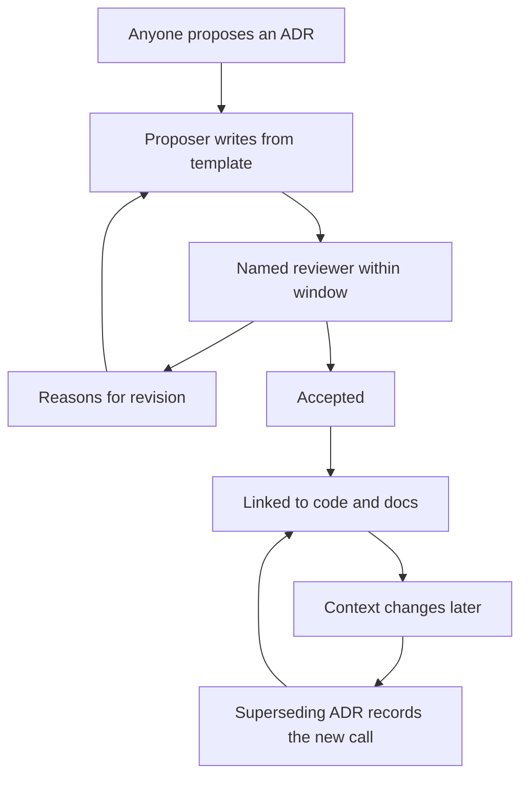

# Architecture Decision Process

> **Core skill:** Running a lightweight ADR process that records consequential decisions and their reasoning — so decisions are challengeable, traceable, and never made twice.

## Why This Matters

Every architecture decision is made twice if it is not recorded: once when it happens, and again — differently, by people who were not there — when the context comes back around. Unrecorded decisions also hide their reasoning: the new engineer asks why the system is shaped this way, and the answer is "ask the person who left."

An Architecture Decision Record (ADR) is the antidote: a short document that captures what was decided, why, and what was rejected. The tech lead's job is not to make every decision — it is to run the process that records them. A good process is lightweight enough that engineers use it without being chased, and rigorous enough that the records are worth reading.

## What an ADR Is For

| ADR records | ADR does not do |
|-------------|-----------------|
| The decision and its context | Make the decision |
| The options considered | Replace design reviews |
| The reasoning and trade-offs | Freeze the decision forever |
| What was rejected and why | Excuse the team from thinking |

This role clarity is the whole design. The process fails in one of two directions: the lead decides and the ADR is theater, or the ADR decides and the process becomes bureaucracy. The record documents; the people decide.

## The Proposal Template

```markdown
# ADR-[number]: [title]

## Status
[proposed | accepted | deprecated | superseded]

## Context
- [ ] The problem and forces that demand a decision
- [ ] What happens if no decision is made

## Decision
- [ ] What we decided, in one or two sentences

## Options Considered
| Option | Pros | Cons | Verdict |
|--------|------|------|---------|
| [A] | [list] | [list] | [rejected/shortlisted] |

## Consequences
- [ ] What becomes easier
- [ ] What becomes harder
- [ ] What we are explicitly accepting

## References
- [ ] Related ADRs, designs, code
```

Four minutes to write, two minutes to read. If a template takes longer than the decision, the template is wrong.

## Decision States

| State | Meaning | Transition |
|-------|---------|------------|
| Proposed | A decision under review | Reviewed by the team or a named reviewer |
| Accepted | The decision stands | Superseded by a newer ADR |
| Deprecated | No longer recommended | Replaced by a superseding record |
| Superseded | Replaced by a newer decision | The new ADR links back to this one |

The states exist so the record stays honest. A decision that was right in 2025 and wrong in 2026 is not erased — it is superseded, and both records survive. That history is the team's institutional memory.

## The Lightweight Workflow

1. Anyone proposes an ADR for a consequential decision
2. The proposer writes the record from the template
3. A named reviewer (often the lead) reviews within a stated window
4. The team or the lead accepts, or sends it back with reasons
5. The accepted ADR is linked from the code or the docs it touches

The workflow's rules are few and explicit:

| Rule | Why it exists |
|------|---------------|
| Anyone can propose | Decisions are distributed; records are not |
| Review window is short | Decisions move faster than the records |
| Acceptance is named | Someone is accountable for the call |
| Rejection gives reasons | The process teaches, not just gates |

## When an ADR Is Needed vs Overkill

| Needs an ADR | Skip the ADR |
|--------------|--------------|
| New component or service | Routine bug fixes |
| Framework or library adoption | Small refactors within a pattern |
| Interface or data model changes | Cosmetic changes |
| Reversals of past decisions | Choices with an obvious default |
| Decisions with real trade-offs | Decisions with no real alternatives |

The test: if the decision will be regretted differently by different people, or if someone in a year will ask why — record it. If the change is a local expression of an existing pattern, the pattern is the record.

## Linking ADRs to Each Other and to Code

| Link | How |
|------|-----|
| ADR to ADR | A superseded field pointing to the replacement |
| ADR to code | A comment or doc reference in the affected module |
| ADR to design | The design review references its decision numbers |
| ADR to standards | Standards cite the ADRs that shaped them |

The links are what make the records findable. An ADR nobody can find is a decision made twice.



## Practical Applications

Checklist for standing up the process:

- [ ] Template lives in the repo with the convention file
- [ ] Numbering and location agreed: `docs/adr/ADR-001-title.md`
- [ ] Review window and named reviewer defined
- [ ] Accepted ADRs are linked from the code they touch
- [ ] The process is mentioned in the design review checklist
- [ ] One retrospective per quarter: is the process being used, or chased?

## Common Pitfalls

| Pitfall | Why It Is a Problem | Better Approach |
|---------|---------------------|-----------------|
| **ADR as rubber stamp** | The lead decided; the record is theater | The record is written before the decision is final |
| **Process heavier than the decision** | Engineers stop proposing; decisions go unrecorded | Keep the template short and the window tight |
| **Undecided records** | Proposed ADRs pile up with no reviewer | Name the reviewer and the window explicitly |
| **Graveyard of decisions** | Accepted ADRs never linked to anything | Link every accepted ADR to code or docs |
| **Rewriting history** | Old records edited instead of superseded | Supersede, never rewrite; keep both records |
| **No rejection reasons** | Proposals die silently; the process stops teaching | Rejections always carry reasons |

## Success Indicators

- Consequential decisions routinely arrive as ADRs, proposed by engineers
- Accepted ADRs are linked from the code they affect
- New engineers read ADRs to understand the system's shape
- Decisions you were not part of are traceable to recorded reasoning
- Superseded ADRs exist — proof the process survives change

## Related Topics

- [[01_Setting_Team_Technical_Vision]]: the vision supplies the reasoning ADRs record
- [[03_Design_Review_Leadership]]: designs become decisions; decisions become ADRs
- [[04_Technical_Standards_and_Conventions]]: standards cite the ADRs that shaped them
- [[06_Balancing_Speed_and_Design]]: when speed wins, the ADR records the deliberate choice

## Summary

The architecture decision process is a lightweight record-keeping discipline: anyone proposes, a named reviewer accepts or returns with reasons, and every accepted record is linked to the code and context it affects. ADRs record decisions; they do not make them, and they never freeze them — supersession keeps the history honest. The measure of the process is not the count of records but that no consequential decision is ever made twice.
