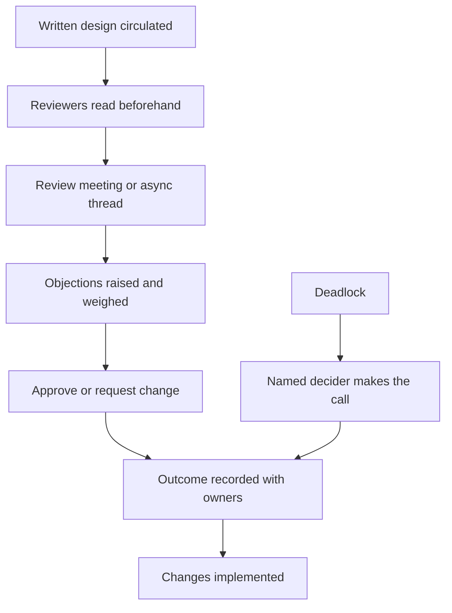

# Design Review Leadership

> **Core skill:** Facilitating design reviews that improve designs — without dominating them, rubber-stamping them, or letting them become free-for-alls.

## Why This Matters

Design reviews are where the team's best judgment meets the system's future. Done well, they catch expensive mistakes early, spread knowledge, and teach the whole team the standards of good design. Done badly, they are either a bottleneck — every design waits for the lead's blessing — or a theater — designs pass because nobody read them.

The tech lead's role in the review is the hardest in the room: facilitator, not author; questioner, not lecturer. A review the lead dominates produces designs that are the lead's, and a team that stops thinking. A review the lead facilitates produces designs that are the team's, and a team that designs better each time.

## The Facilitator's Job

| Role | Who plays it | What they do |
|------|--------------|--------------|
| Author | The engineer(s) who wrote the design | Present, defend, collect feedback |
| Facilitator | The tech lead, usually | Run the process, keep focus, ensure decisions land |
| Reviewer | Invited engineers, adjacent owners | Challenge, question, contribute |
| Decider | The lead or a named owner | Make the call when consensus is not reached |

The facilitator is not the decider by default. The distinction is what lets the lead both participate and stay above the fray.

## Pre-Review Requirements

A design review without preparation is a lecture; with preparation, it is a decision. Two requirements:

| Requirement | What it looks like | What it prevents |
|-------------|--------------------|------------------|
| A written design | A short document: context, options, chosen approach, open questions | Meetings where nobody shares the same premise |
| Read before the meeting | Reviewers have read the design; the meeting discusses, not presents | Presentation theater and first-glance objections |

The practical rule: the design document is circulated at least a day ahead; the meeting opens with "questions and objections," not with the author presenting the document aloud.

## Review Dimensions

| Dimension | Questions to ask |
|-----------|------------------|
| Correctness | Does it satisfy the requirements? Are the edge cases handled? |
| Operability | Can it be run, observed, and supported? Are runbooks implied? |
| Evolvability | Can it grow without being rebuilt? What does the next change look like? |
| Security | What are the attack surfaces? Are trust boundaries explicit? |
| Cost | What does it cost to build, run, and maintain? |
| Fit | Does it follow the vision, standards, and past decisions? |

The dimensions are a shared checklist, not a rubric for scoring. The review's job is to surface the questions in each dimension before the code makes the answers expensive.

## Handling Disagreement and Deadlock

| Situation | The move |
|-----------|----------|
| Two valid approaches | Decide by evidence: what is known, what is assumed, what can be tested |
| Disagreement on facts | Resolve with data — a spike, a measurement, a reference |
| Disagreement on values | Escalate to the vision and principles; that is what they are for |
| Deadlock with a deadline | The decider makes the call, records it, and timeboxes revisiting |
| Repeated same-area conflicts | A standards or ADR discussion, not another review |

Deadlock is not failure — it is the review finding a real disagreement. The failure would be resolving it by exhaustion or by the loudest voice. The design review's outcome must include the decision and its reasoning, whether consensus or not.

## Recording Outcomes

Every review produces a record, however short:

```markdown
## Design Review — [design title] — [date]

### Decision
- [ ] Approved / Approved with changes / Not approved

### Required changes
- [ ] [change, owner, deadline]

### Open questions
- [ ] [question, owner, by when]

### Notes
- [ ] Key objections and how they were resolved
- [ ] ADR reference if a decision record is needed
```

The record is what makes the review matter: required changes are tracked, open questions have owners, and the reasoning survives the meeting.

## Async vs Sync Reviews

| Dimension | Async | Sync |
|-----------|-------|------|
| Best for | Small designs, routine changes, distributed teams | Big designs, contested decisions |
| Speed | Fast to start, slow to converge | Converges fast, costs calendar |
| Depth | Deep if reviewers read properly | Variable; dominated by talkers |
| Records | Written by default | Must be written after |

The pragmatic pattern: async first, sync only when async stalls. A sync review called too early wastes eight people's hour on what three comments would have resolved.



## Practical Applications

Checklist for the lead before any design review:

- [ ] Design circulated at least a day ahead
- [ ] Reviewers named and confirmed to have read it
- [ ] The agenda is questions, not presentation
- [ ] Dimensions are in view: correctness, operability, evolvability, security, cost, fit
- [ ] A decider is named for the deadlock case
- [ ] The outcome record template is ready

Checklist for after:

- [ ] Outcome recorded: decision, required changes, open questions
- [ ] Required changes tracked to closure
- [ ] ADR created if the decision is consequential
- [ ] The author got feedback on the feedback: what was useful

## Common Pitfalls

| Pitfall | Why It Is a Problem | Better Approach |
|---------|---------------------|-----------------|
| **Lead dominates** | Designs become the lead's; the team stops thinking | Facilitate; speak last; ask, do not instruct |
| **Rubber stamp** | Nobody read the design; the review blesses anything | Require read-before-review and written questions |
| **Unprepared reviews** | The meeting discovers the design in real time | Enforce circulation and reading as a hard rule |
| **Deadlock by stamina** | The loudest or longest-winded wins | Name the decider in advance; timebox the debate |
| **No record** | Decisions evaporate; the same debate recurs next quarter | Record every outcome with owners |
| **Sync for everything** | Calendar waste on what three comments would settle | Async first; sync only when async stalls |

## Success Indicators

- Designs improve measurably between first draft and review
- Authors seek reviews early — the review is a tool, not a gate
- Reviews start and end on time, with decisions recorded
- Disagreements resolve by evidence or by named decision, not by volume
- Engineers run reviews without the lead present and keep the quality

## Related Topics

- [[02_Architecture_Decision_Process]]: consequential review outcomes become ADRs
- [[04_Technical_Standards_and_Conventions]]: standards answer the recurring review questions
- [[06_Balancing_Speed_and_Design]]: the review is where speed and design meet
- [[career-path/02_Senior_Software_Engineer/03_Architecture_and_Design_Judgment/00_overview|Architecture and Design Judgment (Senior)]]: the judgment this facilitation channels

## Summary

Design review leadership is facilitation: written designs read beforehand, reviews that discuss rather than present, a shared set of dimensions, a named decider for deadlock, and a recorded outcome with owners. The lead's discipline is to improve designs without owning them — to ask the questions that make the team's designs better, and to let the team take credit for the answers. A review the lead never had to attend is the quiet sign of success.
