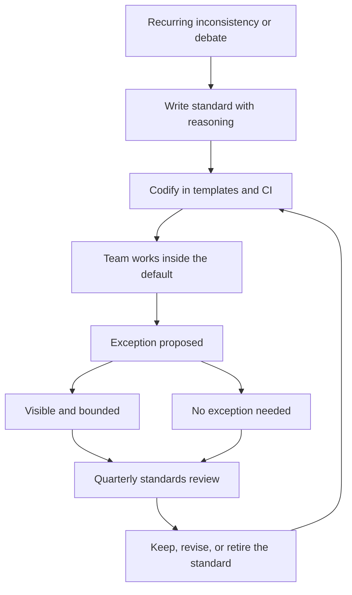

# Technical Standards and Conventions

> **Core skill:** Codifying how the team builds — so the default choice is the right choice, and the team converges without being policed.

## Why This Matters

Every team pays a tax for inconsistency: review debates about naming, three logging patterns, two error-handling styles, tests that are written differently by every author. The tax compounds with every new engineer and every new module. Standards are the capital that pays the tax down — but only if they are written as defaults, not laws, and enforced by tooling, not by nagging.

The tech lead's role is to decide what deserves a standard, write it so it explains itself, and codify it so the right thing is the easy thing. A standard that lives only in a document is advice; a standard enforced by a linter, a template, or a CI check is engineering infrastructure.

## What to Standardize vs Leave Free

| Standardize | Leave free |
|-------------|------------|
| Structure: module layout, file organization | Internal implementation style within a module |
| Naming: domains, services, concepts | Local variable names, helper naming |
| Logging: format, levels, correlation IDs | Log message wording |
| Errors: error types, error contracts, handling | Exception messages |
| Testing: test layout, naming, coverage expectations | Test data choice, assertion style |
| Interfaces: versioning, change policy | Method signatures within a service |
| Operations: deploy, rollback, runbook shape | Routine operational choices |

The test for whether to standardize: does the inconsistency cost more than the standard? If reviewers argue about it twice a month, or a tool cannot handle both styles, standardize. If the choice is invisible outside one file, leave it free.

## Standards as Defaults Not Laws

| Enforcement level | What it means | Example |
|-------------------|---------------|---------|
| Default | The right path is the path of least resistance | Scaffolding generates the standard layout |
| Guarded | Deviation is possible but visible | Linter warnings, review flags |
| Gated | Deviation requires a named exception | CI blocks, exception log required |

The philosophy matters: a standard is a default that explains itself, not a law that demands obedience. When the standard is challenged, the response is the reasoning — and if the reasoning is outdated, the standard changes. Standards that cannot be questioned become the next generation's debt.

## Codifying in Templates, Linters, and CI

The principle: make the right thing the easy thing.

| Tool | What it enforces | Why it beats documents |
|------|------------------|------------------------|
| Project templates | Structure, layout, boilerplate | New work starts inside the standard |
| Linters and formatters | Style, patterns, banned constructs | The machine argues, not the reviewers |
| CI checks | Contracts, coverage floors, dependency rules | The pipeline gates, not the lead |
| Code generation | Repetitive patterns done right once | The standard is executed, not copied |
| Example repos | A reference implementation of the standard | New engineers see the standard working |

Every standard should name its enforcement mechanism. A standard with no mechanism is a hope.

## The Exception Process

Exceptions are a feature, not a loophole — but only when they are visible and bounded:

| Element | Rule |
|---------|------|
| Visibility | Exceptions are written where the team can see them |
| Reasoning | The exception states why the standard does not fit |
| Owner | One person owns the exception |
| Expiry | The exception has a review date or a condition |

An exception log is the standard's feedback channel: exceptions that recur are evidence the standard is wrong.

## Standards Review Cadence

| Cadence | What happens |
|---------|--------------|
| Onboarding | New engineers read the standards as part of their first week |
| Quarterly | The team reviews the exception log and open challenges |
| Yearly | Each standard is judged: does it still pay its tax? |
| On trigger | A repeated exception or a new pattern triggers an early review |

The review answers one question per standard: is this still the right default? Standards that survive review get stronger; standards that die get a tombstone note explaining why — so the next generation does not reinvent them.

## Onboarding Value

| Without standards | With standards |
|-------------------|----------------|
| New engineer's first PR gets rewritten | First PR lands with minor comments |
| Weeks of review feedback to absorb | The standard answers most questions in advance |
| Team-specific knowledge in heads | Team-specific knowledge in documents and tooling |
| Inconsistent code from day one | Convergence starts with the first commit |

Standards are the cheapest mentoring the team has. They teach the team's judgment at scale, every day, without the lead in the room.



## Practical Applications

```markdown
# Standard: [name] — [status: active]

## Why this standard exists
- [ ] The cost it removes: [what inconsistency costs]

## The default
- [ ] [the one right way, concretely]

## Enforcement
- [ ] Mechanism: [template / linter / CI / example]
- [ ] Where it lives: [repo path]

## Exceptions
- [ ] Current exceptions: [list with owners and expiry]
- [ ] How to request one: [process]

## Review
- [ ] Next review: [date] | Trigger: [condition]
```

Checklist:

- [ ] Every standard names its cost and its reasoning
- [ ] Every standard has an enforcement mechanism
- [ ] Exceptions are visible, owned, and expiring
- [ ] The review cadence is calendared
- [ ] Onboarding points new engineers at the standards

## Common Pitfalls

| Pitfall | Why It Is a Problem | Better Approach |
|---------|---------------------|-----------------|
| **Standards by assertion** | Compliance without belief; standards rot | Explain the why; revisit when context changes |
| **Document-only standards** | Advice nobody follows; review debates continue | Codify in templates, linters, and CI |
| **Over-standardizing** | Every choice regulated; engineers stop thinking | Standardize only where inconsistency costs |
| **Laws not defaults** | Deviation becomes rebellion; exceptions go underground | Make exceptions visible and bounded |
| **Graveyard standards** | Old rules outlive their reasons | Review yearly; retire with a tombstone note |
| **Standards as the lead's taste** | The team complies without understanding | Write standards with the team's pain as the evidence |

## Success Indicators

- New engineers converge on conventions within weeks, not months
- Review debates shift from style to substance
- The machine catches what documents used to ask humans to catch
- The exception log is short, and its items expire
- Standards change at most a few times a year, deliberately

## Related Topics

- [[02_Architecture_Decision_Process]]: standards cite the ADRs that shaped them
- [[03_Design_Review_Leadership]]: standards answer the recurring review questions
- [[06_Process_and_Quality_Stewardship/00_overview|Process and Quality Stewardship]]: standards become real through process
- [[01_Setting_Team_Technical_Vision]]: principles become operational through standards

## Summary

Technical standards convert the team's judgment into defaults: written with their reasoning, enforced by templates, linters, and CI, and reviewed on a cadence with visible, expiring exceptions. The goal is not uniformity for its own sake but the removal of recurring cost — review debate, onboarding friction, and inconsistency tax. A standard that has to be enforced by nagging has failed; one enforced by the pipeline is infrastructure.
