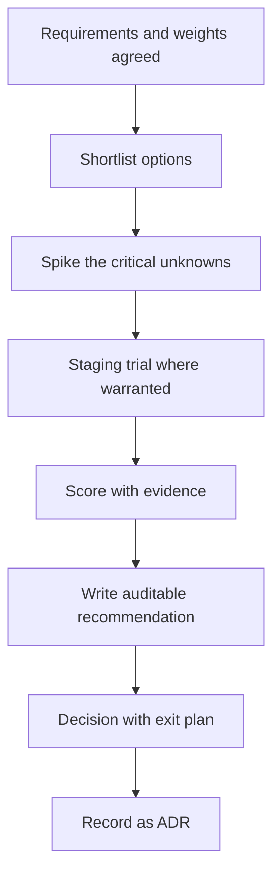

# Evaluation and Selection

> **Core skill:** Leading build/buy/adopt evaluations so technology choices follow evidence and criteria — not fashion, resumes, or inertia.

## Why This Matters

Technology selections are among the most expensive decisions a team makes — and the most commonly rushed. A framework or vendor chosen on enthusiasm gets lived with for years, through migrations nobody wants to repeat. The cost is not the license or the integration; it is the system's trajectory, which bends around the choice.

The tech lead's job is to make selection a process, not a debate: requirements first, explicit criteria, weighted scoring, spike validation, and a written recommendation anyone can audit. The process also protects the team from its own biases — the resume-driven adoption and the inertia-driven retention that quietly decide most selections in practice.

## Requirements First

| Requirement | What it is | Example |
|-------------|------------|---------|
| Functional | What the technology must do | Handle 10k messages per second |
| Non-functional | How it must behave | p99 under 50 ms, 99.95% uptime |
| Operational | How the team will run it | Deployable via the standard pipeline |
| Constraint | What is fixed | Must run on the existing cloud, budget capped |
| Preference | Nice to have, not required | Managed service preferred |

The discipline: requirements are written before any vendor or tool is shortlisted. Every requirement is testable — "fast" is not a requirement, "p99 under 50 ms under 10k rps" is. If a requirement cannot be tested, it cannot decide anything.

## The Evaluation Criteria Matrix

```markdown
# Evaluation: [technology] — [date]

## Requirements (weighted)
| Criterion | Weight | [Option A] | [Option B] | [Option C] |
|-----------|--------|------------|------------|------------|
| [functional requirement] | 30 | 4 | 3 | 5 |
| [non-functional requirement] | 25 | 3 | 4 | 4 |
| [operational fit] | 20 | 5 | 3 | 2 |
| [cost] | 15 | 2 | 4 | 3 |
| [ecosystem and support] | 10 | 3 | 5 | 4 |
| **Weighted total** | 100 | **3.6** | **3.7** | **3.9** |

## Evidence
- [ ] Where each score came from: [spike results, docs, vendor calls]

## Verdict and reasoning
- [ ] Recommended option and why
- [ ] What would change the recommendation
```

Weights are agreed before scores are collected — that is what makes the matrix an evaluation instead of a rationalization. Scores are worthless without evidence; each score cites a spike, a test, or a documented fact.

## Spike Validation and Staging Trials

| Validation level | What it tests | When |
|------------------|---------------|------|
| Document review | Claims, roadmap, governance | Always |
| Spike | The critical unknown, in the real codebase | For any consequential choice |
| Staging trial | Integration, operations, performance in a real environment | For platforms and infrastructure |
| Pilot | Production with guardrails and an exit plan | For the highest-risk choices |

A spike is timeboxed and scoped to the single biggest unknown — it answers one question and stops. A staging trial runs the candidate through the team's actual operational motions: deploy, monitor, rollback. If a candidate cannot pass the team's own operational bar in staging, the scorecard is already written.

## TCO Not License Cost

| Cost category | What it includes | How to miss it |
|---------------|------------------|----------------|
| License and fees | Purchase, subscription, support | Comparing only the headline price |
| Migration | Effort to move existing systems | Ignoring the migration entirely |
| Operations | Run cost, monitoring, on-call burden | Assuming the vendor operates it |
| Skills | Training, hiring, ramp time | Assuming the team knows it already |
| Lock-in | Exit cost if the choice fails | Planning no exit at all |
| Maintenance | Upgrades, security, deprecation churn | Ignoring the yearly upkeep |

The comparison that matters is total cost over the planning horizon, including the exit. A free tool that costs a migration a year later is not free.

## Vendor and Community Health Signals

| Signal | What to look for |
|--------|------------------|
| Release cadence | Regular, visible releases vs silence or chaos |
| Governance | Who decides direction; is it transparent |
| Maintenance | Security fixes and issue closure rates |
| Roadmap fit | Where they are going vs where you are going |
| Community | Activity, contributors, adoption beyond your team |
| Business model | How the vendor earns; is the product the business |

For open source, the same signals apply to the project's governance. For vendors, add the account-level reality: support quality and responsiveness during the evaluation is a preview of support quality after signing.

## Writing a Recommendation Others Can Audit

The recommendation's structure makes it auditable:

1. The decision requested, in one sentence
2. The requirements and weights, as agreed
3. The options considered, including build and do-nothing
4. The evidence: spikes, trials, vendor responses
5. The recommendation and its reasoning
6. The risks of the choice and the exit plan
7. What would change the recommendation

Anyone — a skeptical engineer, an executive, a future team — should be able to read the document and reconstruct the decision. If the document could not have produced the verdict, it is not an evaluation; it is a memo.

## Avoiding Resume-Driven and Inertia-Driven Selection

| Bias | What it looks like | Defense |
|------|--------------------|---------|
| Resume-driven | The choice showcases someone's favorite stack | Requirements and weights decided before names are spoken |
| Inertia-driven | "We have always used X" with no re-evaluation | Include the incumbent as an option with its own evidence |
| Fashion-driven | The hype cycle selects the tool | Every option faces the same weighted criteria |
| Spreadsheet theater | Scores fudged to match the preferred verdict | Evidence attached to every score; weights agreed first |



## Practical Applications

Checklist for any selection:

- [ ] Requirements written and testable before any shortlist
- [ ] Weights agreed before scores
- [ ] Every option scored with evidence, including the incumbent
- [ ] Spike ran against the real codebase for the biggest unknown
- [ ] TCO calculated over the horizon, including migration and exit
- [ ] Vendor or community health assessed on named signals
- [ ] Recommendation written so a skeptic can audit it
- [ ] Decision recorded as an ADR with the exit plan

## Common Pitfalls

| Pitfall | Why It Is a Problem | Better Approach |
|---------|---------------------|-----------------|
| **Requirements skipped** | The debate is about tools before the problem is agreed | Write requirements and weights first |
| **Resume-driven adoption** | The choice serves an individual's stack | Criteria before names; everyone faces the same matrix |
| **License-cost myopia** | The cheap option costs a migration later | Compare TCO over the horizon, including exit |
| **Scores without evidence** | The matrix rationalizes a verdict | Every score cites a spike, trial, or document |
| **No exit plan** | Failure becomes captivity | Plan the exit while the choice is still optional |
| **Selection as a meeting** | The loudest voice wins in one session | The process decides; the meeting reviews the document |

## Success Indicators

- Selections trace to written requirements and weighted evidence
- The incumbent survives or loses on evidence, not loyalty
- Spikes answer the critical unknown before commitment
- A skeptic can audit the recommendation and reconstruct the verdict
- The team can name the last selection and its exit plan

## Related Topics

- [[04_Dependency_and_Integration_Management]]: selections become dependencies with tiers and risk
- [[01_Setting_Team_Technical_Vision]]: the vision supplies the criteria's values
- [[02_Architecture_Decision_Process]]: selections are recorded as ADRs
- [[career-path/06_Software_Architect/00_overview|Software Architect]]: the deeper discipline of architecture-level selection

## Summary

Evaluation and selection is a process discipline: testable requirements and agreed weights before any shortlist, spike and staging validation of the critical unknowns, TCO over the horizon rather than license price, vendor and community health on named signals, and a written recommendation anyone can audit. The process is the defense against the real selection biases — resume-driven adoption, inertia, and fashion. A choice made by evidence can be defended; a choice made by enthusiasm can only be explained.
