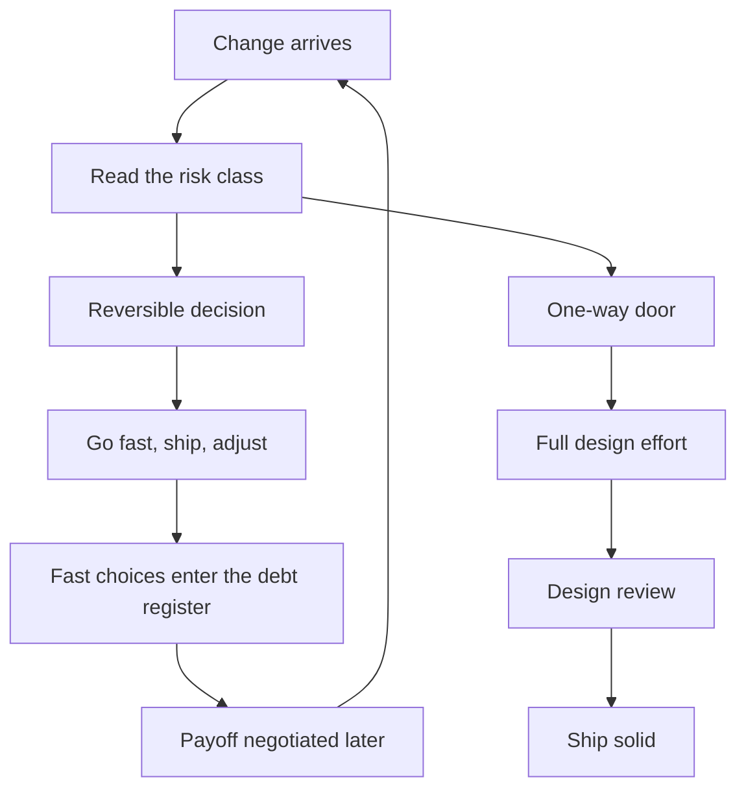

# Balancing Speed and Design

> **Core skill:** Choosing when to go fast and when to go solid — by risk, not by mood — and defending that choice to stakeholders who always want both.

## Why This Matters

The speed-versus-design tension is not a problem to solve; it is a decision to make, repeatedly and explicitly. The team that always goes solid misses deadlines and opportunities. The team that always goes fast builds a system that costs more than it saves, a quarter at a time. Both are failures of judgment, not of intent.

The tech lead's value here is the judgment itself: reading each change for what it actually risks, matching design effort to that risk, and naming the trade-off out loud. The team inherits the judgment in two ways — through the decisions they see you make, and through the decision rules you write down so they can make the same calls without you.

## The Speed-Solid Spectrum

| Context | Typical posture | Why |
|---------|-----------------|-----|
| Prototype to learn | Fast, throwaway | The goal is knowledge, not durability |
| Feature on a stable core | Solid enough | Follows existing patterns; no new risk |
| New component, reversible | Fast with a review date | Cost of being wrong is bounded |
| New component, foundational | Solid | Everything after inherits its shape |
| Data or contract change | Solid | Data mistakes are the most expensive kind |
| Hot path or critical flow | Solid | Errors here are user-facing and expensive |

The posture is per-change, not per-team. A team that is "a fast team" or "a careful team" has stopped thinking; a team that reads each change and chooses has started.

## Risk-Based Design Effort

The core question: what does being wrong cost?

| Decision class | Cost of being wrong | Design effort |
|----------------|---------------------|---------------|
| Reversible, cheap to change | Low | Minimal — ship and adjust |
| Reversible, annoying to change | Moderate | Some — isolate the change surface |
| One-way door | High | Full — the design is the product |
| One-way door, expensive to open | Very high | Full plus explicit review |

One-way doors — schema changes, public contracts, foundational abstractions, platform choices — deserve the full design treatment because they cannot be walked back cheaply. Two-way doors deserve speed: the cost of deliberating exceeds the cost of correcting.

## Throwaway Prototypes with Explicit Contracts

A prototype is a tool, not a phase:

| Element | The contract |
|---------|--------------|
| Question | The single unknown it exists to answer |
| Timebox | When it dies, in the calendar |
| Ownership | Who may write it, who may extend it |
| Reuse rule | What may be lifted into production, what may not |
| Disposal | How it is deleted or quarantined |

The classic failure is the prototype that grows production teeth — "it works, ship it." The contract prevents it: a prototype with a written timebox and a reuse rule is a prototype; one without them is an accident in progress.

## Foundations for Hot Paths

Some parts of the system are worth designing solid regardless of schedule pressure:

| Foundation | Why it must be solid |
|------------|----------------------|
| Data model and storage | Wrong here is migrated at enormous cost |
| Public interfaces | Consumers build on them; breaking is betrayal |
| Security boundaries | Mistakes here are exploitable, not just annoying |
| The team's core domain | Every feature inherits its shape |
| Deployment and rollback paths | Speed everywhere depends on safety here |

The rule of thumb: spend the design effort where the cost of being wrong compounds, and save it where the cost of being wrong is a fix.

## The Speed-Debt Feedback Loop

Fast now creates the debt you negotiate later. The loop is not avoidable — it is manageable:

| Fast choice | Debt created | Managed how |
|-------------|--------------|-------------|
| Skipped tests | Regression risk on every change | Enter the register with a payoff estimate |
| Hardcoded value | Rework when it changes | Enter the register; fix on first touch |
| Copy-paste instead of abstraction | Drift between copies | Consolidate on the third copy |
| Prototype shipped | Maintenance on unowned code | Reuse contract decides its fate |

The discipline is not avoiding fast choices — it is converting every fast choice into a visible, owned register item. Fast with a record is a strategy; fast without a record is surprise debt.

## Communicating Design Time to Stakeholders

Stakeholders experience design time as delay; the lead translates it into risk:

| Stakeholder frame | The translation |
|-------------------|-----------------|
| "Why is this taking longer?" | "The extra time buys a rollback-safe migration and a data path we will not have to redo" |
| "Can we skip the review?" | "The review is where the last three incidents were caught — we can trade it for risk, but it is a named trade" |
| "Just make it work" | "It will work; the question is what breaking it later costs" |
| "Fast is a feature" | "Fast on two-way doors, solid on one-way doors — that is the policy" |

The lead's job is to make the trade explicit and let the stakeholder choose with eyes open. Design time that is defended without explanation becomes a fight; design time that is explained becomes a decision.

## Practical Applications

Decision checklist for any change:

- [ ] What does being wrong cost — days or years?
- [ ] Is this a one-way door? What makes it reversible?
- [ ] Does a prototype need to exist, and what is its contract?
- [ ] Is this a foundation — data, interfaces, security, core domain?
- [ ] If going fast, what debt is created and who records it?
- [ ] What is the stakeholder-facing translation of the design time?

## Common Pitfalls

| Pitfall | Why It Is a Problem | Better Approach |
|---------|---------------------|-----------------|
| **Mood-based posture** | Design effort follows energy, not risk | Classify by reversibility before starting |
| **Prototype in production** | The throwaway grows teeth and haunts the team | Write the prototype contract: question, timebox, reuse rule |
| **Solid everything** | Deadlines missed on two-way doors that cost nothing | Spend design effort only where being wrong compounds |
| **Fast everything** | Debt compounds until delivery stalls | Convert every fast choice into a register item |
| **Undefended design time** | Stakeholders see delay; the team fights to justify it | Translate design time into risk language |
| **Undocumented fast calls** | The team cannot tell strategy from accident | Record the choice and the reasoning in the register or ADR |

## Success Indicators

- The team can state the current posture per change without asking
- One-way doors get full design treatment; two-way doors ship fast
- Prototypes have contracts and die on schedule
- The debt register grows deliberately, not accidentally
- Stakeholders describe design time as risk management, not delay

## Related Topics

- [[03_Design_Review_Leadership]]: the review is where solid choices are verified
- [[03_Technical_Debt_Leadership]]: fast choices enter the register this skill manages
- [[07_Technical_Roadmapping]]: foundations and debt shape the sequencing
- [[career-path/02_Senior_Software_Engineer/04_Delivery_and_Execution/00_overview|Delivery and Execution (Senior)]]: the delivery discipline this judgment protects

## Summary

Balancing speed and design is a per-change risk decision: classify by reversibility, spend design effort where being wrong compounds — data, interfaces, security, foundations — and go fast everywhere else, converting every fast choice into a visible register item. Prototypes get contracts, and design time gets translated into risk language for stakeholders. The team that reads each change and chooses deliberately ships fast where it is safe and solid where it matters.
