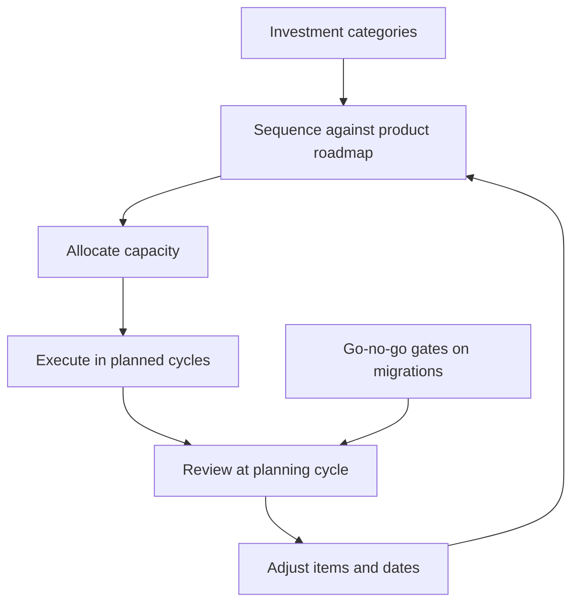

# Technical Roadmapping

> **Core skill:** Sequencing technical investment — foundations, debt, capability, migration — alongside product work, so the system improves while commitments hold.

## Why This Matters

Every team has two roadmaps competing for the same capacity: the product roadmap everyone can see, and the technical roadmap that usually exists only in the lead's head. When the technical roadmap is invisible, it loses every argument by default — product work is concrete and committed, while technical work is abstract and deferred. The system decays quietly until the decay becomes the product's problem.

A written technical roadmap changes the terms: technical investment competes for capacity on the same evidence basis as product work, sequenced against the same timeline, and visible to the same stakeholders. It is the difference between "we will fix it when we have time" — which never happens — and "this is when we pay it down, and here is what we give up to do it."

## Investment Categories

| Category | What it covers | Example |
|----------|----------------|---------|
| Foundation | Things everything else depends on | Platform upgrade, CI modernization |
| Debt payoff | Removing registered cost and risk | The top three register items |
| Capability | New technical ability that enables product | Feature flags, self-serve data access |
| Migration | Moving from one state to another | Strangler migration off the monolith |

Each category has a different audience and a different sales pitch. Foundations sell on risk; debt sells on cost; capability sells on product potential; migrations sell on the future state's advantages.

## Coupling to the Product Roadmap

| Coupling pattern | How it works | Best for |
|------------------|--------------|----------|
| Pre-work | Technical investment lands before the product wave needs it | Foundations and capabilities ahead of demand |
| Ride-along | Technical work ships with product work in the same area | Debt payoff and refactors while touching code |
| Parallel track | A technical stream runs alongside the product stream | Migrations that must not block delivery |
| Deferred | Technical work waits for a natural window | Low-risk items with no urgent driver |

The roadmap's credibility comes from the coupling: every technical item names the product context it serves. An investment with no product story is a donation; one with a story is a plan.

## Capacity Allocation Models

| Model | How it works | Best for |
|-------|--------------|----------|
| Percentage split | Fixed share of capacity per cycle, e.g. 15% | Sustained technical health |
| Dedicated cycles | Named technical sprints or platform cycles | Migrations with a defined end |
| Item-based | Technical items compete in the same prioritization as product | Small, comparable items |
| Trigger-based | Capacity released when a condition hits | Debt paying for itself after incidents |

The models can mix — a standing percentage plus occasional dedicated cycles is a common shape. What does not work is no model: technical work squeezed into whatever survives the planning meeting.

## Migration Sequencing

| Strategy | How it works | Best for |
|----------|--------------|----------|
| Strangler fig | New system grows alongside the old; traffic shifts incrementally | Replacing a system in production |
| Parallel run | Both systems run; outputs compared | High-risk transitions with verification needs |
| Vertical slice first | One thin end-to-end slice proves the path | Migrations with unknown unknowns |
| Big bang | Cut over in one move | Only when dual operation is impossible |

Migration sequencing is where roadmaps earn their reputation. Every migration is a bet on the team's ability to operate two systems at once; the sequence should minimize the overlap window while keeping the exit visible at every step.

## Communicating the Technical Roadmap to Stakeholders

| Stakeholder | The message |
|-------------|-------------|
| PM | What technical investment enables or protects for the product, and what it displaces |
| EM | Capacity and sequencing: what the team is funded to do |
| Executives | Risk reduction and capability in product terms |
| The team | The plan, the reasoning, and where their input changed it |

The communication rule: technical roadmap items are stated as outcomes — what will be true when the item lands — not as activities. "Upgrade the queue library" is an activity; "remove the risk of running on an unsupported component" is an outcome.

## Keeping It Honest

| Trap | What it looks like | Defense |
|------|--------------------|---------|
| Sunk investment | "We already spent the money, so we must continue" | Judge by forward costs only; sunk cost is spent |
| Sunk cost trap in migrations | Continuing a failing migration because of invested effort | Set go/no-go gates with exit criteria before starting |
| Roadmap inflation | Everything is urgent; the roadmap is the backlog | Rank; the roadmap is the top slice, not the list |
| Commitless planning | Items with no owner and no date | Every item has an owner and a landing quarter |
| Silent drift | The roadmap stays while the world changes | Review at every planning cycle; adjust openly |

The honest roadmap is a living document: adjusted at each planning cycle, marked when items slip, and willing to kill an item when the evidence turns. A roadmap that never changes is a monument; one that changes with reasons is a plan.



## Practical Applications

```markdown
## Technical Roadmap — [quarter to quarter]

### This quarter
| Item | Category | Outcome | Owner | Capacity |
|------|----------|---------|-------|----------|
| [item] | [foundation/debt/capability/migration] | [what will be true] | [name] | [share] |

### Next quarter
- [ ] [item, category, outcome, owner]

### Deferred, with reasons
- [ ] [item] — [why deferred, revisit condition]

### Gates
| Migration | Gate | Exit criteria | Date |
|-----------|------|---------------|------|
| [name] | [go/no-go] | [criteria] | [date] |
```

Checklist:

- [ ] Every item names a category and a product context
- [ ] Every item has an owner and a landing quarter
- [ ] Capacity allocation is explicit and agreed with PM and EM
- [ ] Migrations have gates with exit criteria
- [ ] The roadmap is reviewed and adjusted at every planning cycle

## Common Pitfalls

| Pitfall | Why It Is a Problem | Better Approach |
|---------|---------------------|-----------------|
| **Roadmap in the lead's head** | Technical work loses every capacity argument by default | Write it; let it compete visibly |
| **Investment without product story** | Technical items look like donations, not plans | Couple every item to product context |
| **Sunk cost thinking** | Past spend keeps failing work alive | Judge forward costs; kill items on evidence |
| **Roadmap equals backlog** | Everything is on it; nothing is sequenced | The roadmap is the ranked top slice |
| **No owners or dates** | Planning without commitment | Every item names an owner and a quarter |
| **Never revisited** | The roadmap drifts from reality | Review at every planning cycle; adjust openly |

## Success Indicators

- The technical roadmap is visible, dated, and agreed with PM and EM
- Technical items land in their planned quarters, or move with published reasons
- Migrations pass their gates or are killed before they waste more
- Stakeholders can name the current technical priorities in outcome terms
- The system's health metrics improve on the roadmap's schedule, not incidentally

## Related Topics

- [[01_Setting_Team_Technical_Vision]]: the roadmap sequences what the vision directs
- [[02_Architecture_Decision_Process]]: the decisions the roadmap is built from
- [[03_Technical_Debt_Leadership]]: debt items are a roadmap category with costs
- [[career-path/12_Technical_Program_Manager/00_overview|Technical Program Manager]]: the neighboring discipline of program-level sequencing

## Summary

Technical roadmapping is the discipline of making technical investment visible, sequenced, and honest: categorized items coupled to product context, explicit capacity allocation agreed with PM and EM, migrations run through gates with exit criteria, and the whole plan reviewed at every planning cycle. The roadmap turns "we will fix it when we have time" into a dated commitment with owners — and turns sunk-cost drift into evidence-based kills. A system that improves on a schedule is a system whose health was planned.
