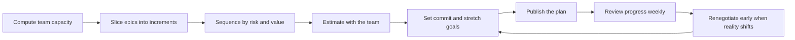

# Delivery Planning Leadership

> **Core skill:** Shaping plans the team can actually deliver — capacity-based, sliced into shippable increments, sequenced deliberately, and renegotiated early when reality shifts.

## Why This Matters

Plans are promises. When the tech lead shapes a plan with the team — from real capacity and real uncertainty — the team gets a runnable agreement with itself and with stakeholders. When plans are invented in a meeting and handed down, they become fiction that everyone pretends to believe until the cycle review reveals otherwise.

The lead's planning job is not to produce a schedule. It is to produce a plan that survives contact with reality: one that knows how much the team can actually do, where the riskiest parts are, and what happens when the mid-cycle surprise arrives — because it always does. Teams that plan this way protect their credibility, and credibility is the currency that buys the team scope, time, and trust later.

## Capacity-Based Planning

Capacity is what the team can actually deliver in a period, not what it could deliver if everything went perfectly. The lead computes capacity from evidence and constraints, and refuses to plan from hope.

| Input | How to capture it | Why it matters |
|-------|-------------------|----------------|
| Known velocity | Average delivered points or throughput over the last 4-8 completed cycles | A measured baseline beats any guess about how fast the team is |
| Focus factor | Share of time actually available for committed work after meetings, support, reviews, and context switching | Teams routinely overestimate focus by 20-30 percent |
| Leave and holidays | Planned time off, public holidays, conference weeks, onboarding of new members | A two-week vacation on a six-week cycle cuts capacity by a third |
| Ceremonies and overhead | Planning, demos, retro, plus recurring cross-team meetings | Fixed overhead is not optional work |
| Unplanned demand | Historical share of the cycle consumed by incidents, urgent requests, and fixes | If last quarter took 25 percent, budget 25 percent again |

A simple capacity model: available engineer-days times focus factor, minus known leave, converted to points or story count using the team's own historical ratios. The number that comes out is the commitment ceiling; anything above it is a stretch candidate, not a promise.

## Breaking Epics Into Deliverable Increments

An epic is not a work item until it is sliced into increments that can be delivered, reviewed, and released on their own. The lead runs the slicing conversation and holds the line on the slice criteria.

| Criterion | Why it matters | Test question |
|-----------|----------------|---------------|
| Vertical | Each slice crosses all layers so it is demonstrable end to end | Can someone use this increment through the UI or API? |
| Independent | Slices can be built in any order without blocking each other | Could another engineer start this slice today? |
| Valuable | Each slice delivers observable value or learning | What changes for a user or for our knowledge when this ships? |
| Testable | Each slice has a clear acceptance path | How will we know this slice is done? |
| Sized right | The slice fits the team's planning granularity | Can this land within one or two cycles? |

Increments that cannot be sliced further stay as spikes or experiments: a spike is time-boxed research whose output is a decision or a design, not a feature. The lead names spikes explicitly so that research is not quietly relabeled as building.

## Sequencing: Risk First vs Value First

Sequencing decides what the team builds first. Two defensible orders exist, and the lead chooses deliberately instead of defaulting to whatever was written first in the epic.

| Approach | When to use it | Strength | Cost |
|----------|----------------|----------|------|
| **Risk first** | Unknowns dominate: new integrations, unproven performance, uncertain platform behavior | Surprises land early while the schedule still has slack; the plan's uncertainty shrinks fast | Value arrives later; stakeholders see unglamorous work first |
| **Value first** | Domain and technology are well understood and this shape of work has been done before | Early wins build stakeholder trust and fund later risk work | The risky unknown lurks until the end, where delays hurt most |

The lead's default is risk first, because delivery risk is what breaks plans. Value-first sequencing is right when the team has hard evidence the risk is low — not when it hopes so. A hybrid works well: one risky slice early to calibrate, then value-dense work, with remaining risk items interleaved at a rate the team can absorb.

## Commit Goals and Stretch Goals

Every plan carries two tiers of promise. Confusing them is how teams overcommit and then underdeliver.

| Type | Definition | If it slips | Who decides |
|------|------------|-------------|-------------|
| **Commit goal** | Work the team is willing to be held accountable for, backed by capacity math | It is a miss; triggers renegotiation and a retro discussion | The team, with the lead's honest capacity input |
| **Stretch goal** | Work attempted after commits are protected; nice to have | No one is surprised or held accountable | The lead and team together, clearly labeled at planning |

Stretch goals earn their keep only when they are labeled loudly and tracked separately. A stretch goal that silently migrates into the commit column mid-cycle is an overcommit in disguise. The lead restates the distinction at every planning close: these items are the promise, those are the bonus.

## Renegotiating Plans Mid-Cycle

Reality changes; plans must too. The difference between a healthy team and an overcommitted one is not whether plans change — it is whether the change is announced early and renegotiated, or discovered late and absorbed silently.

| Trigger | What it means | Lead's response |
|---------|---------------|-----------------|
| Scope request arrives mid-cycle | New demand on fixed capacity | Triage within 24 hours: trade for something, defer, or refuse — never just add |
| Discovery shows a slice was wrong | The estimate was built on bad assumptions | Re-slice and re-estimate the affected increment; adjust the plan openly |
| Dependency slips | Another team's delivery shifts the sequence | Re-sequence around the slip; inform stakeholders who planned on the original date |
| Illness or unexpected leave | Capacity drops mid-cycle | Re-prioritize with the team; protect the highest-value commits, renegotiate the rest |

The renegotiation move always has the same shape: state the fact, show the impact on the plan, present two or three concrete options — trade scope, shift dates, add help — and let the stakeholder choose. Renegotiation is a feature of an honest plan, not a failure of planning.

## The Planning Meeting the Lead Runs



A planning session the lead runs has a fixed shape, with preparation done before the room gathers.

| Phase | Time | What happens |
|-------|------|--------------|
| Pre-work | Before the meeting | The lead prepares the sliced increment list and capacity model; engineers review candidate increments in advance |
| Capacity review | 10 minutes | The team sees the capacity math and agrees or corrects it |
| Increment walkthrough | 30-45 minutes | Engineers present the increments they will own; questions target assumptions and risks |
| Estimation | 20-30 minutes | Silent estimates first, then discussion of divergence |
| Commitment | 10 minutes | The team names commit and stretch goals out loud; the lead writes them down |
| Risk call-out | 10 minutes | Each engineer names the one thing that could break their increment; risks get owners and dates |

The meeting produces one artifact: a published plan — commits, stretches, owners, risks — that lives in the team's tracker and is the single source of truth for the cycle. If the plan is not written down and shared, the meeting did not happen.

## Practical Applications

**Run the next planning cycle with this checklist:**

- [ ] Compute capacity from the last 4-8 cycles of data, not from optimism
- [ ] Subtract focus factor, leave, ceremonies, and unplanned demand explicitly
- [ ] Slice every epic into vertical, testable increments before the session
- [ ] Sequence deliberately: risk first by default, value first only on evidence
- [ ] Label commit goals and stretch goals separately in the tracker
- [ ] Assign an owner and a review date to every named risk
- [ ] Publish the plan where everyone, including stakeholders, can see it
- [ ] Book the mid-cycle review before the cycle starts

**Renegotiation message template:**

```markdown
Status: [Red / Amber / Green] for [increment name]

What changed: [one sentence: scope added, dependency slipped, capacity dropped]
Impact on the plan: [which commits are affected and by how much]

Options:
1. [Trade scope: drop X so that Y lands on time]
2. [Shift the date for Y by N days]
3. [Bring in help or reduce the scope of X]

We recommend: [option] because [reason]
Decision needed by: [date and time]
```

## Common Pitfalls

| Pitfall | Why It Is a Problem | Better Approach |
|---------|---------------------|-----------------|
| Planning from last cycle's committed numbers | Velocity drift and team changes make old numbers fiction | Recompute capacity every cycle from the recent baseline |
| Adding work without removing work | Capacity is fixed; every addition silently borrows from later commits | Every new item enters through a trade: something leaves |
| Handing the plan down after leadership alignment | The team did not make the plan, so it will not own the plan | The team builds the plan; the lead shapes and protects it |
| Slicing by layer instead of vertically | Backend finishes early, frontend waits, nothing ships for months | Slice so each increment is demonstrable end to end |
| Stretch goals that look like commits | Stakeholders read the stretch column as the promise | Label stretches loudly and track them separately |
| Renegotiating only at the cycle review | Silent absorption turns a two-day slip into a two-week surprise | The moment a trigger fires, start the renegotiation |

## Success Indicators

- Commit goals are met or formally renegotiated early in at least 9 of 10 cycles
- The plan survives the cycle with at most one significant re-sequence
- Stakeholders quote the team's own plan when they discuss scope
- Every epic in the backlog is sliced into testable increments before planning
- Renegotiations happen within a day of the trigger, not at the review
- The team can state its capacity math without the lead's help

## Related Topics

- [[02_Estimation_and_Forecasting_for_Teams]]: the estimation practice that feeds the plan
- [[04_Delivery_Risk_Management]]: risks named at planning get tracked through the cycle
- [[03_Unblocking_and_Escalation]]: what keeps the plan moving after planning ends
- [[06_Process_and_Quality_Stewardship/00_overview|Process and Quality Stewardship]]: the ceremonies the planning rhythm runs on
- [[career-path/02_Senior_Software_Engineer/04_Delivery_and_Execution/00_overview|Delivery and Execution (Senior)]]: the personal planning skills this area scales to a team

## Summary

Delivery planning leadership is capacity honesty plus deliberate structure: compute what the team can really do, slice work until it is shippable, sequence risk before value, keep commit and stretch goals separate, and renegotiate the moment reality shifts. The plan that results is an agreement the team owns — and the lead's job is to keep that agreement true.
