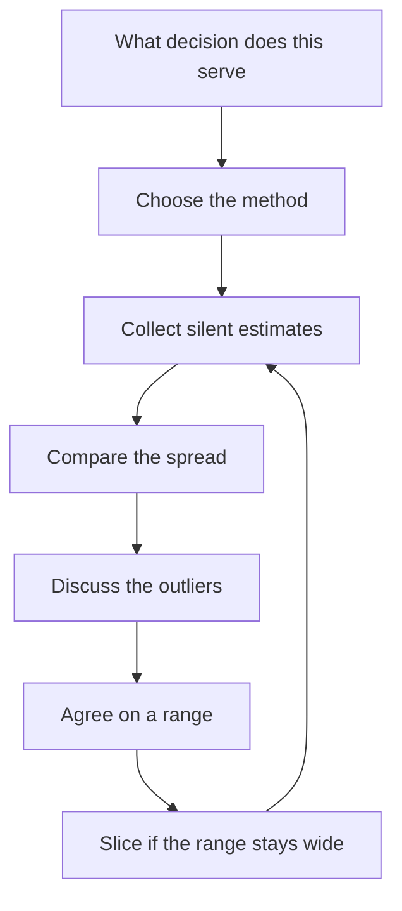

# Estimation and Forecasting for Teams

> **Core skill:** Leading honest team estimation — methods chosen to fit the question, divergence treated as signal, and uncertainty communicated as ranges.

## Why This Matters

An estimate is a statement about the future made under uncertainty. Teams that estimate badly do not just miss dates — they lose the trust that makes every later negotiation possible. The tech lead's job is to make estimation a team discipline rather than a series of guesses.

The lead also owns the boundary between estimate and promise. Engineers estimate; the plan converts estimates into commitments, and the lead is the one who keeps that conversion honest. When the team can estimate reliably and communicate ranges, stakeholders stop bracing for surprises — they start planning around the team's numbers.

## Choosing an Estimation Method

The right method depends on the question being asked. The lead matches method to purpose instead of ritual.

| Method | What it produces | Best for | Cost |
|--------|------------------|----------|------|
| **Story points** | Relative size of work items | Cycle-level planning where teams track velocity | Medium: needs calibration time and discipline |
| **T-shirt sizing** | Coarse size bands, S through XL | Early backlog triage and epic-level ordering | Low: fast, but coarse |
| **Reference-class forecasting** | Forecasts from historical data on similar past work | Quarter and program-level forecasts where history exists | Medium: requires recorded historical data |
| **Time-based estimates** | Hours or days per item | Small, well-understood tasks and fixed-date windows | Low: misleading for anything novel |
| **Monte Carlo simulation** | Probability distribution over completion dates | Forecasting from throughput history at scale | Medium: needs tooling and data hygiene |

The lead's rule: relative estimates (points or t-shirts) for work of unknown shape, time-based for mechanical work, and reference-class or simulation-based forecasts whenever stakeholders need a date with confidence attached. Mixed methods are fine — what is not fine is using one method everywhere because it is familiar.

## Estimation at Scale: Story to Epic to Quarter

Estimates serve different decisions at different horizons. The lead keeps the hierarchy connected so that numbers roll up without pretending to precision.

| Level | Unit | Granularity | Decision it serves | Honesty rule |
|-------|------|-------------|--------------------|--------------|
| Story | Points or hours | Days | Cycle commitments | Estimate once, by the team, with silent first bids |
| Epic | T-shirt or points | Weeks | Sequencing and capacity planning | Size from slices, not from the epic title |
| Quarter | Reference-class or simulation | Months | Stakeholder forecasts and resourcing | Report a range and a confidence, never a single date |

Rolling up is legitimate only when each level is produced from the one below it. An epic sized from its stories, and a quarter forecast built from epics against measured throughput, is a forecast. An epic sized by vibes multiplied up is a number that will come back to haunt the team.

## The Estimation Conversation

Divergence between estimates is not noise — it is the most valuable output of the conversation. When two engineers estimate the same story at 3 and 13 points, the gap is telling the team that the scope is not understood the same way by both of them.

| Divergence pattern | What it usually signals | Lead's move |
|--------------------|-------------------------|-------------|
| One outlier high | That engineer sees a risk or a complexity others missed | Ask the outlier to explain first; the detail is usually real |
| One outlier low | That engineer is optimistic or missed a known complexity | Ask them to walk through their assumptions against the team's |
| Two camps | Genuinely different interpretations of scope | Re-read the story together; slice it if it stays ambiguous |
| Everything agrees fast | Either trivially simple work or groupthink | Ask one deliberate challenge question before moving on |

The conversation ends when the team can state the estimate and the main assumption behind it. An estimate without its assumptions is a number with no memory.

## Avoiding Anchor Bias

Estimation is vulnerable to anchoring: the first number spoken pulls every later number toward it. The lead designs the process to protect independent judgment.

| Technique | How it works | When to use |
|-----------|--------------|-------------|
| **Silent estimates** | Everyone writes their number before anyone speaks | Every estimation session |
| **Planning poker** | Cards revealed simultaneously; outliers explain | Stories with expected divergence |
| **Estimate by reference** | Compare the new item to a known, previously delivered item | When the team shares a calibration baseline |
| **No-lead-first rule** | The lead speaks last or not at all in the first round | Always — the lead's number is the strongest anchor |

The lead's own estimate is the most dangerous anchor in the room because it carries authority. A lead who speaks first has already decided half the conversation. Silent first rounds and revealed-together cards are cheap mechanisms that protect the team's judgment.

## Communicating Uncertainty Ranges

Stakeholders want a date; the team has a probability distribution. The lead translates between the two without pretending the distribution does not exist.

| Stakeholder need | Honest answer format | Example |
|------------------|----------------------|---------|
| A planning date | Range with a confidence statement | Mid-to-late October, roughly 70 percent confident |
| A deadline question | Best case, expected case, worst case with drivers | Best 3 weeks, expected 5, worst 8 if the integration slips |
| A go or no-go decision | Probability and the top risk that moves it | 70 percent likely to land before the freeze, assuming the API contract holds |
| A comparison between options | Relative ranges, not absolute dates | Option A lands weeks 6-8, Option B weeks 9-12 |

Ranges are not waffling. A single number quietly promises certainty the team does not have; a range with its assumptions gives the stakeholder a real decision. The lead's discipline is to refuse to collapse a range into a point under pressure — and to give the stakeholder the drivers so they know what would move the number.

## When to Stop Estimating and Start Slicing

Estimation has diminishing returns. When the team cannot converge, the answer is almost never more estimation.

| Signal | Meaning | Better move than estimating harder |
|--------|---------|------------------------------------|
| Estimates keep diverging after two rounds | The item is too big or too ambiguous | Slice it into smaller items and estimate those |
| One story consumes the whole session | Its uncertainty is disproportionate to its size | Time-box the discussion; spike the unknown |
| The estimate is large and smooth | Nobody has actually thought about the parts | Decompose it; people can estimate parts honestly |
| The number barely matters | The decision does not change within a wide range | Stop estimating; the question is sequencing, not size |

Estimation exists to support decisions. When more precision changes nothing, the team should stop estimating and start slicing — the slices will produce better numbers anyway.

## The Estimation Flow



## Practical Applications

**Run the next estimation session with this checklist:**

- [ ] State the decision the estimate will feed before anyone bids
- [ ] Choose the method from the decision, not from habit
- [ ] Collect first bids silently; the lead bids last or not at all
- [ ] Discuss outliers first, asking the outlier to explain before the majority
- [ ] Write down the range and the key assumption for every item
- [ ] Roll up epics and quarters from the items below them
- [ ] Never hand a stakeholder a single date without a confidence statement
- [ ] Log actuals against estimates to feed reference-class forecasting later

**Forecast communication template:**

```markdown
Forecast: [Feature or program]
Confidence: [percent] likelihood of landing by [date]
Range: [best case] to [worst case], expected [most likely]

What the forecast assumes:
- [assumption 1, e.g. the integration contract holds]
- [assumption 2, e.g. no more than N incidents per week]

The top drivers that would move this number:
1. [driver and its effect]
2. [driver and its effect]

Next update: [date]
```

## Common Pitfalls

| Pitfall | Why It Is a Problem | Better Approach |
|---------|---------------------|-----------------|
| The lead's number spoken first | Authority anchors the whole team's estimates | Silent first round; the lead bids last or not at all |
| Points used as hours | The unit drifts; velocity becomes meaningless | Keep points relative and calibrate against delivered history |
| One estimate for all horizons | Story precision is quoted as a quarter date | Roll up through levels and widen the range at each step |
| Divergence smoothed over | The gap is the signal; hiding it hides the risk | Discuss outliers openly until the assumption is named |
| Estimating the same thing twice | The item is too ambiguous to converge | Stop, slice, and estimate the parts |
| Presenting a single date | It overpromises certainty and fails when reality lands | Always a range plus confidence plus drivers |

## Success Indicators

- The team converges on most items in one silent round plus one discussion
- Estimates carry a named assumption that the team can recall weeks later
- Stakeholders quote the team's ranges, not invented single dates
- Historical actuals line up with the team's mid-range forecasts
- The team voluntarily stops estimating when a slice is needed
- New team members calibrate to the team's point scale within two cycles

## Related Topics

- [[01_Delivery_Planning_Leadership]]: estimates become commitments through capacity-based planning
- [[07_Delivery_Metrics_and_Health]]: actuals against estimates are the fuel for better forecasting
- [[04_Delivery_Risk_Management]]: wide uncertainty is itself a risk to track
- [[career-path/02_Senior_Software_Engineer/04_Delivery_and_Execution/00_overview|Delivery and Execution (Senior)]]: the personal estimation skills this area leads at team scale
- [[career-path/12_Technical_Program_Manager/00_overview|Technical Program Manager]]: the neighboring path specialized in program-level forecasting

## Summary

Team estimation is a designed conversation, not a calendar exercise. Choose the method for the decision, protect independent bids from anchors, read divergence as scope signal, communicate ranges with confidence and drivers, and slice when estimation stops converging. The lead who runs this discipline turns guesses into a forecasting capability stakeholders can plan around.
