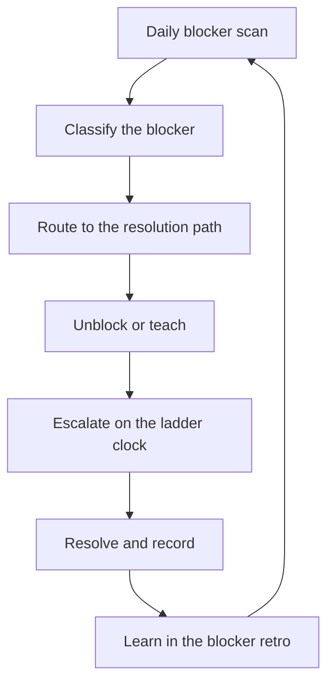

# Unblocking and Escalation

> **Core skill:** Clearing blockers fast and teaching the team to clear its own — with an escalation ladder that treats escalation as information flow, not failure.

## Why This Matters

Blocked work does not wait politely. Every day a blocker sits unresolved, it compounds: the engineer switches context, the plan drifts, and the slip becomes someone else's problem next cycle. The tech lead's unblocking system decides whether the team spends its energy building or waiting.

The lead cannot be the only unblocker. A team that routes every blocker through the lead creates a single point of failure and a queue that never drains. The mature pattern is a system: blockers are surfaced early, classified, routed to the right resolution path, and escalated on a clock — with the lead teaching the skill of unblocking as she clears them.

## The Daily Blocker Scan

Blockers are found by looking, not by waiting for complaints. The lead runs a lightweight daily scan so nothing sits hidden for more than a day.

| Scan point | Cadence | What to look for |
|------------|---------|------------------|
| Standup call-out | Daily | Named blockers stated out loud; the lead notes them for follow-up |
| Tracker board | Daily | Items stuck in the same column for more than a day or two |
| Merge queue | Daily | Reviews waiting, CI red, branches open longer than the team norm |
| Async channel | Daily | Questions unanswered for hours, threads that died without a decision |
| Dependency check | Weekly | External promises that are quiet; counterpart teams that went silent |

The scan is quick and mechanical — ten minutes, one pass, no meeting required. Its output is a short list: what is blocked, who is blocked, and which resolution path applies.

## The Blocker Taxonomy

Different blockers need different muscles. Classifying the blocker first prevents wasted effort and wrong escalations.

| Type | Definition | Typical example | Resolution path |
|------|------------|-----------------|-----------------|
| **Decision** | A choice must be made before work can continue | Which API shape, which vendor, which trade-off | Name the decision, the options, and the deadline; take it to the person empowered to decide |
| **Dependency** | Work waits on another team, vendor, or platform | Contract not delivered, environment not provisioned | Contact the counterpart lead directly; agree a date; escalate on a clock if it slips |
| **Knowledge** | The team lacks information or context to proceed | Unfamiliar domain, undocumented system, absent owner | Pair with the knowledge holder; read the code; time-box the research |
| **Environment** | Tooling or infrastructure is in the way | Broken build, missing credentials, flaky test suite | Fix the environment as its own work item; the fix is often worth more than the blocked story |
| **Priority** | The work itself is questionable, not stuck | Feature of unclear value, duplicated effort | Re-open the priority conversation with the product owner; the blocker is the question, not the task |

The lead keeps the taxonomy visible in the team's docs so that anyone can classify a blocker without asking. Classification should take seconds — the skill is in matching the type to the path, not in debating categories.

## Unblock vs Teach

Every blocker is also a lesson. The lead decides deliberately how much to do versus how much to hand back, and the decision depends on the person and the pattern.

| Situation | Lead's move | Why |
|-----------|-------------|-----|
| Engineer is stuck and has already tried the obvious paths | Unblock directly, then debrief the approach | Speed matters now; the debrief carries the learning |
| Same engineer hits the same blocker type repeatedly | Teach: walk through the resolution path, let them execute | Fixing the condition once is cheap; fixing the person's capability is compounding |
| Blocker type is new to the whole team | Pair on the resolution, then write it down | The write-up turns the lesson into team knowledge |
| The blocker is urgent and the engineer is overloaded | Clear it yourself and reassign the follow-up | Protect the delivery while still building someone's capability |

The lead's tell: if you have unblocked the same engineer on the same type of blocker three times, you are not unblocking — you are maintaining the dependency. The unblock-versus-teach decision is recorded in the blocker retro so patterns become visible.

## The Escalation Ladder

Escalation is a clock, not a feeling. Each level has an owner and a time threshold, so that a blocker never dies from silence.

| Level | Owner | Time threshold | What happens |
|-------|-------|----------------|--------------|
| 1 Self | The blocked engineer | Hours | Attempt the obvious paths; ask the team; state the blocker in standup |
| 2 Lead | The tech lead | 1 day | Classify, route to the resolution path, apply unblock or teach |
| 3 Engineering manager or counterpart lead | The tech lead | 2-3 days | Decision or dependency lives outside the team; negotiate scope, date, or priority |
| 4 Management | The tech lead with the EM | 1 week | Cross-org trade-offs, resource questions, or re-planning the commitment |

Thresholds are defaults, not straightjackets. A production incident or a missed contract date escalates immediately; a minor question can wait a day. What matters is that the ladder exists, everyone knows it, and the lead actually moves blockers up it instead of absorbing them silently.

## Escalation Is Information Flow, Not Failure

The biggest blocker to escalation is shame. Engineers — and leads — treat escalating as admitting defeat, so they wait, and the blocker grows.

Escalation reframed is a gift: it tells the person above you that their information is incomplete and their decision is needed. Escalated early, it arrives with options and time. Escalated late, it arrives as a crisis with no options. The lead models the reframe by escalating her own blockers promptly and by never punishing a team member who escalated early with a good-faith attempt behind it. The question asked in review is never why did you escalate, but why did this take as long as it did to surface.

## Blameless Blocker Retrospectives

Blockers recur in patterns. A short, blameless retro — once a month, or after a wave of blockers — converts the pattern into prevention.

- Count blockers by type from the tracker; the taxonomy makes this a five-minute job
- Pick the top type and ask what condition created it, not who was stuck
- Agree one structural change: a decision template, a dependency tracker, a fixed environment
- Check the same change at the next retro and record whether the blocker rate moved

The output of a blocker retro is not a scolding — it is one improvement to the system that produces blockers. Over a few quarters, the team's blocker count drops because the conditions that create them have been dismantled.

## The Unblocking Flow



## Practical Applications

**Run the unblocking system with this checklist:**

- [ ] Run the daily scan: standup call-outs, board, merge queue, async threads
- [ ] Classify every blocker into one of the five types before acting
- [ ] Decide unblock versus teach per blocker and per engineer
- [ ] Escalate on the clock: 1 day to the lead, 2-3 days to the EM or counterpart lead
- [ ] Reframe escalation in language: it is information flow, not failure
- [ ] Log every blocker with its type so the retro has data
- [ ] Run the blocker retro monthly and implement one structural change

**Escalation message template:**

```markdown
Blocker: [one-line description]
Type: [decision / dependency / knowledge / environment / priority]
Blocking: [work item and its planned date]
Blocked since: [date]

What we tried: [paths already attempted]
What we need: [the decision, the contract, the environment, or the priority call]

Options if it cannot be resolved by [date]:
1. [fallback option]
2. [fallback option]

Decision needed by: [date and time]
```

## Common Pitfalls

| Pitfall | Why It Is a Problem | Better Approach |
|---------|---------------------|-----------------|
| Heroic unblocking | The lead becomes the blocker-processor; nothing moves without her | Unblock the condition, teach the engineer, write the path down |
| Blockers hidden until the review | A three-day slip becomes a three-week surprise | Daily scan and a stated expectation that blockers surface in hours |
| Escalation as failure | People wait, shame grows, and the blocker compounds | Reframe escalation as early information that keeps decisions cheap |
| Unblocking the same person on the same thing | The dependency is being maintained, not resolved | Teach the pattern and verify independence next time |
| No ladder, no clock | Escalation happens by mood and by who shouts loudest | Publish thresholds: 1 day, 2-3 days, 1 week |
| Blocker retros that blame | The same conditions quietly produce the same blockers | Count types, fix one condition, verify next month |

## Success Indicators

- No blocker sits unresolved past its ladder threshold
- The team classifies and routes most blockers without the lead
- Engineers escalate early enough that escalations arrive with options, not crises
- The monthly retro shows a shrinking blocker count for the top type
- New blockers are recognized as patterns the team has seen before
- The lead's own unblocking queue is empty on most days

## Related Topics

- [[04_Delivery_Risk_Management]]: blockers are risks that already happened — track the conditions
- [[01_Delivery_Planning_Leadership]]: plans stay true when blockers are cleared on the clock
- [[05_Coordinating_Across_Teams]]: dependency blockers escalate through counterpart leads
- [[07_Incident_Leadership_and_Production_Excellence/00_overview|Incident Leadership and Production Excellence]]: urgent blockers follow the incident communication pattern
- [[career-path/02_Senior_Software_Engineer/04_Delivery_and_Execution/00_overview|Delivery and Execution (Senior)]]: the personal unblocking skills this area scales to a team

## Summary

Unblocking is a system: a daily scan that surfaces blockers, a taxonomy that routes them to the right path, a deliberate unblock-versus-teach decision, and an escalation ladder with a clock. Reframed as information flow, escalation loses its shame and gains its speed — and the blameless retro converts recurring blockers into removed conditions.
