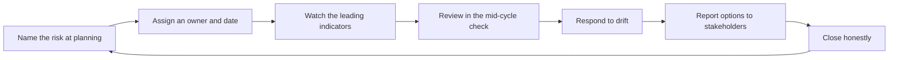

# Delivery Risk Management

> **Core skill:** Surfacing delivery risks early, tracking them in a register someone actually reads, and reporting them to stakeholders as options rather than alarms.

## Why This Matters

Delivery surprises are rarely sudden. They are risks that were visible weeks earlier and quietly ignored — an integration nobody validated, a scope creep nobody named, a dependency that went quiet. The tech lead's risk practice exists to convert those silent risks into named, owned, dated items while there is still time to act.

Risk management at team level is not a spreadsheet exercise. It is a conversational habit: risks are named at planning, checked against leading indicators through the cycle, and reported to stakeholders in plain language with options. A team that does this well is never the one announcing the crisis — it is the one that predicted the crisis last month and already chose a mitigation.

## The Team Delivery Risk Register

A risk register earns its existence by being read. The lead keeps it small, current, and owned.

| Column | What goes in it | Discipline |
|--------|-----------------|------------|
| Risk | One sentence naming the threat to delivery | If it cannot be stated in a sentence, it is not a risk yet |
| Probability | Low, medium, or high likelihood | Agreed by the team, not by the loudest voice |
| Impact | What breaks if it lands: date, scope, quality | Name the concrete victim, not a generic bad day |
| Mitigation | The action that reduces probability or impact | Every risk has one, even if it is a watch item |
| Owner | One named person | An ownerless risk is a hope |
| Review date | When the team re-reads it | Every risk expires and must be renewed or closed |

The register lives where the team already looks — in the tracker, next to the plan — not in a document nobody opens. A register of five real risks beats a register of forty theoretical ones; the lead prunes aggressively.

## Leading Risk Conversations in Planning

Planning is where risks are cheapest to name and most likely to be skipped. The lead builds a risk segment into the planning meeting so that naming risk is part of making the plan, not a separate chore.

| Planning moment | The risk question to ask | What the answer feeds |
|-----------------|--------------------------|-----------------------|
| Increment walkthrough | What is the one assumption this increment depends on? | Assumptions become watch items |
| Estimation discussion | Where did estimates diverge, and what did that reveal? | Divergence becomes a named uncertainty |
| Commitment setting | Which commit are we least confident in, and why? | The weakest commit gets a mitigation |
| Cross-team dependencies | Which external promise has no date we control? | Dependency risks get a counterpart owner |
| Close of planning | What did we decide not to worry about? | Explicit non-risks prevent re-litigating later |

The lead's rule: every risk named at planning leaves the room with an owner and a review date. Risks that cannot get an owner are either not real risks or are real risks that have already been accepted — and acceptance should be a conscious act, recorded in the register.

## Leading Indicators of Drift

Most risks land slowly, and their approach is visible in signals. The lead watches leading indicators so the team responds to drift while it is still cheap to correct.

| Signal | What it indicates | Lead's response |
|--------|-------------------|-----------------|
| Scope growth without plan changes | The plan is silently absorbing additions | Re-run the trade conversation; update the register with a scope risk |
| Slowing merge rate | Integration friction or review bottleneck | Investigate review queues and CI health before it becomes a date slip |
| Rising WIP | Too much started, too little finished | Cap WIP; the team finishes before it starts |
| Dependency slips | External promise moving right | Re-sequence now; inform stakeholders who planned on the original date |
| Estimation divergence on new work | Understanding is uneven across the team | Re-slice or spike before committing |
| Rising incident or support load | Production is eating delivery capacity | Name it in the register and renegotiate the plan |

These signals are read weekly in a ten-minute pass over the tracker and CI data. The lead's job is not to become a dashboard — it is to notice when a signal repeats and turn it into a register entry with an owner.

## Mid-Cycle Drift Detection and Response

The mid-cycle review is where the plan meets reality under supervision. The lead runs it as a checkpoint, not a status meeting.

| Review element | Question | Exit condition |
|----------------|----------|----------------|
| Commit-by-commit status | Which commits are on track, which are drifting? | Drifting commits get a named cause |
| Register re-read | Which risks changed since planning? | Updated probabilities and mitigations |
| Leading indicators | Which signals moved in the last week? | Each movement is explained or escalated |
| Renegotiation triggers | Did any trigger from the plan fire? | Options presented to stakeholders, decision scheduled |
| One line per risk | What would change our mind about this risk? | A clear condition for upgrading, downgrading, or closing |

The response to drift follows a fixed order: name the cause, re-estimate the affected work, re-sequence around it, and renegotiate the commitment if the plan cannot absorb it. The team never absorbs drift silently — that is how a small slip becomes a missed quarter.

## Reporting Risk to Stakeholders

Stakeholders do not need the register; they need to know what matters, what could happen, and what they can choose. The lead translates risk into plain language with options.

| Principle | What it looks like |
|-----------|--------------------|
| Plain language | Risk stated as what could happen, not as a category name |
| Options, not alarms | Every risk report ends with two or three choices and a recommendation |
| Trends and ranges | How the risk moved since last report, not just where it is now |
| Named owners | The stakeholder knows who holds the mitigation |
| No surprise escalation | If a risk is going to land, the stakeholder heard about it before it landed |

The one-sentence rule: if the lead cannot state the team's top three risks and their mitigations in a sentence each, the risk picture is not ready for stakeholders. Reporting is a discipline of compression, and the register is what makes the compression honest.

## Closing Risks Honestly

A risk is closed when its conditions have changed — not when the team is tired of looking at it.

| Close reason | What it means | Register action |
|--------------|---------------|-----------------|
| Mitigated | The action reduced probability or impact to an accepted level | Record the mitigation and close with a date |
| Realized | The risk happened and was handled | Convert to a post-incident or retro item; learn from it |
| Expired | The conditions that created it no longer exist | Close with a one-line reason |
| Accepted | The team deliberately chose to carry it | Record the acceptance and the stakeholder who agreed |

Honest closing is what keeps the register credible. A register that only ever grows teaches the team that risks are permanent decorations; one that closes items teaches that naming risks leads somewhere.

## The Risk Lifecycle



## Practical Applications

**Run the team risk practice with this checklist:**

- [ ] Keep a register of 5-10 real risks in the tracker, next to the plan
- [ ] Give every risk a probability, impact, mitigation, owner, and review date
- [ ] Name risks in every planning session; assign owners before the room breaks
- [ ] Watch leading indicators weekly: scope growth, merge rate, WIP, dependency slips
- [ ] Run the mid-cycle check with a fixed agenda and exit conditions
- [ ] Report to stakeholders as options with a recommendation, never alarms
- [ ] Close risks with a recorded reason, including deliberate acceptance

**Risk register template:**

```markdown
| Risk | Probability | Impact | Mitigation | Owner | Review date |
|------|-------------|--------|------------|-------|-------------|
| [The integration contract slips] | [Low / Medium / High] | [Quarter date missed] | [Weekly sync with counterpart; fallback sequence] | [Name] | [Date] |
| [Scope grows from support requests] | [Medium] | [Two commits dropped] | [Triage rule: trade or defer; register review each cycle] | [Name] | [Date] |
```

## Common Pitfalls

| Pitfall | Why It Is a Problem | Better Approach |
|---------|---------------------|-----------------|
| A register nobody reads | Risks are written down and forgotten until they land | Keep it in the tracker with owners and review dates |
| Forty theoretical risks | Attention spreads so thin that nothing is watched | Prune to the 5-10 that could actually break the plan |
| Risk talk only at planning | Risks that appear mid-cycle are discovered at the review | Weekly leading-indicator pass, ten minutes, no meeting |
| Reporting alarms instead of options | Stakeholders brace for crisis instead of choosing | Every report ends with two or three options and a recommendation |
| Closing risks by neglect | The register fills with zombies and loses credibility | Close with a reason: mitigated, realized, expired, accepted |
| Absorbing drift silently | Small slips compound into missed quarters | The mid-cycle check names causes and renegotiates early |

## Success Indicators

- The team's top three risks can be stated in one sentence each, with owners
- Risks named at planning get mitigations before the planning session ends
- Leading indicators are checked weekly and feed the register
- Stakeholders hear about risks before they land, with options in hand
- The register shrinks as often as it grows, through honest closes
- No realized risk in the last two quarters came as a surprise to the team

## Related Topics

- [[01_Delivery_Planning_Leadership]]: risks are named at planning and tracked through the cycle
- [[05_Coordinating_Across_Teams]]: dependency risks live in the cross-team agreement
- [[02_Estimation_and_Forecasting_for_Teams]]: wide uncertainty ranges are risks with drivers
- [[career-path/02_Senior_Software_Engineer/04_Delivery_and_Execution/07_Risk_Management|Risk Management (Senior)]]: the personal risk skills this area scales to a team
- [[career-path/12_Technical_Program_Manager/00_overview|Technical Program Manager]]: the neighboring path specialized in program-level risk

## Summary

Delivery risk management turns quiet hazards into named, owned, dated items. Name risks at planning, watch leading indicators weekly, respond to drift at the mid-cycle check, and report to stakeholders as options with recommendations. A register that is read, pruned, and honestly closed keeps the team predictable — and predictable teams get trusted with harder work.
