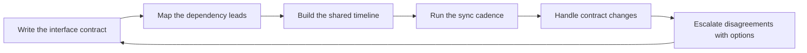

# Coordinating Across Teams

> **Core skill:** Synchronizing work that crosses team boundaries — through explicit interface contracts, named dependency leads, and a sync cadence that catches slips before they hurt.

## Why This Matters

Most delivery failures are not technical; they are boundary failures. Two teams each deliver their half correctly, but the halves do not fit — the contract changed, the date moved, the assumption was never stated. The tech lead is the person who owns the team's side of every boundary and keeps the seams from tearing.

Coordination by goodwill fails on a predictable schedule: it works while everyone remembers, and breaks when someone forgets, joins late, or leaves. The lead replaces goodwill with structure — contracts written down, counterparts named, cadences scheduled — so that coordination works even when no one is being particularly nice about it.

## Interface Contracts

Every place two teams touch is an interface, and every interface deserves a contract: a written statement of what each side provides, expects, and assumes.

| What the contract covers | Example | Why it matters |
|--------------------------|---------|----------------|
| The interface itself | API shape, schema, event format, protocol | Both teams build against the same reality |
| Semantics | What a field means, error behavior, guarantees | Silent mismatches hide in interpretation |
| Timing | When the interface will be available, in what order | Sequences prevent wasted integration work |
| Evolution rules | How changes are proposed and who approves them | Prevents unilateral breaking changes |
| Ownership | Who fixes it, who tests it, who owns it after launch | Nobody-owns is the most expensive ownership model |

A contract is written because the act of writing forces the teams to discover what they assumed. A one-page contract beats a shared understanding; the shared understanding was never actually shared.

## Shared Timelines and Joint Milestones

When two teams' work interleaves, each team's plan is only as real as the other's. The lead builds the cross-team timeline into the plan so that milestones are joint, not borrowed.

| Artifact | What it contains | Lead's role |
|----------|------------------|-------------|
| Shared timeline | Both teams' key milestones on one calendar | Keep it in the cross-team doc, updated after each sync |
| Joint milestones | Dates both teams commit to together | Treat them as commit goals of both teams, not suggestions |
| Integration points | When the pieces meet and are tested together | Schedule them explicitly; they are the moments of truth |
| Buffers | Slack between the teams' commitments | Protect the downstream team from upstream drift |

The lead's rule: a milestone the team cannot control is not a milestone — it is a dependency with a date. It belongs in the timeline, yes, but labeled as external, with a fallback sequence attached.

## Dependency Lead Mapping

Every dependency has two sides, and each side needs a named person. The dependency lead map is the cross-team version of the risk register.

| Role | Who | Responsibility |
|------|-----|----------------|
| Our dependency lead | The tech lead, or a named engineer for a specific dependency | Owns the team's side: needs, dates, contract points |
| Counterpart lead | The named lead on the other team | Owns their side: delivery, changes, early warnings |
| Escalation counterpart | The EM or manager above the counterpart | The next rung when the counterpart cannot deliver |
| Contract owner | The person who can approve interface changes | Keeps the contract honest when reality shifts |

The map lives with the cross-team agreements, and every sync starts by confirming the map is still accurate. People change teams; the map must be updated within days, or the coordination silently loses its counterpart.

## Sync Cadences

Coordination needs a rhythm that matches the risk: frequent enough to catch drift, light enough that nobody dreads it.

| Cadence | Format | Content |
|---------|--------|---------|
| Weekly leads sync | 30 minutes, the leads of the teams involved | Contract status, milestone health, next integration point, open asks |
| Async status | Written update between syncs | The one-line status of each dependency, posted where both teams see it |
| Joint planning | Per quarter or per program | Aligned timelines, joint milestones, contract review |
| Ad-hoc war room | On demand, when an integration is at risk | The people with the authority to fix the immediate problem |

The weekly sync has a standing agenda and a standing output: the shared timeline updated, the open asks listed, the next sync booked. If the sync can be skipped because the async status shows everything green, skip it — but the default is that the cadence runs.

## Contract Changes Mid-Flight

Contracts change. The danger is not the change — it is the change that happens in one team's head and arrives as a surprise in the other team's integration test.

| Change type | Example | Protocol |
|-------------|---------|----------|
| Interface change | Field added, type changed, endpoint moved | Propose in writing with migration path; counterpart lead agrees before work starts |
| Timing change | Delivery slips or lands early | Inform immediately; re-check the shared timeline and downstream buffers |
| Scope change | The other team needs more or less from us | Re-negotiate the contract scope; update owners and dates |
| Ownership change | The team maintaining the interface changes | Announce at the leads sync; update the dependency map |

The lead's discipline during a mid-flight change: acknowledge it in writing, re-check the downstream impact, and re-confirm the contract version both teams are building against. The contract is a living document — but every change to it is a small re-negotiation, not a unilateral edit.

## Shared Component Ownership Pitfalls

When several teams use one component, everyone assumes someone else owns it — and the commons rots. The lead names the ownership question before it becomes an incident.

| Pitfall | How it shows up | Better approach |
|---------|-----------------|-----------------|
| Nobody owns the commons | The shared library breaks and each team waits for another | Name one owning team and one owning lead, with a budget |
| Everyone owns it | Every team patches it their own way; the interfaces fork | The owner defines contribution rules; change goes through review |
| The owner is the original author | The component dies when that person leaves | Ownership transfers with a written handover and bus-factor coverage |
| Maintenance is invisible | Teams discover the breakage in production | Shared components appear in each team's plan as first-class work |

The lead's move is to make shared ownership an explicit agenda item at the leads sync at least once a quarter: who owns what, who is accountable for the commons, and what the next evolution of each shared component is.

## Escalation Between Teams

When two teams disagree, the lead escalates the disagreement, not the other team.

| Stage | What happens | What it needs |
|-------|--------------|---------------|
| Lead-to-lead | The two leads talk directly with facts and options | The disagreement stated as a problem, not a verdict |
| Lead-to-EM | The EMs decide if the disagreement is about priorities or people | A written summary of the options and the trade-offs |
| Management | Cross-org priority call | The decision that unblocks both teams, recorded |

The rule of cross-team escalation: escalate the earliest moment at which the disagreement is clearly beyond the leads' authority — and always with options, never with a demand to take sides. Teams that escalate their disagreements well end up trusting each other more, not less.

## Documenting Cross-Team Agreements

Every agreement that matters is written down where both teams can find it, with a date and an owner. The lead keeps a single cross-team doc per significant boundary.



## Practical Applications

**Set up cross-team coordination with this checklist:**

- [ ] Write a one-page interface contract for every team boundary
- [ ] Confirm the counterpart lead by name and keep the dependency map current
- [ ] Build the shared timeline with joint milestones and buffers
- [ ] Book the weekly leads sync with a standing agenda
- [ ] Post async status where both teams can see it without asking
- [ ] Agree a protocol for contract changes mid-flight
- [ ] Name the owner of every shared component, with a review each quarter
- [ ] Record every cross-team agreement with a date and an owner

**Cross-team agreement template:**

```markdown
# Agreement: [Interface or initiative]
Date: [date] | Owners: [our lead] / [counterpart lead]

## Interface
[One paragraph: shape, semantics, timing, evolution rules]

## Milestones
| Milestone | Date | Owner | Buffer |
|-----------|------|-------|--------|
| [Integration point] | [date] | [name] | [days] |

## Changes
[How changes are proposed, approved, and announced]

## Escalation
[Lead-to-lead first; then EM names and contact]
```

## Common Pitfalls

| Pitfall | Why It Is a Problem | Better Approach |
|---------|---------------------|-----------------|
| Coordination by goodwill | It works until someone forgets or leaves | Contracts, maps, and cadences that work without remembering |
| Unwritten contracts | Each team builds against its own assumptions | One-page written contracts with semantics and timing |
| No named counterpart | The dependency has no face or owner on the other side | Dependency lead map, updated when people move |
| Syncs with no agenda | The meeting drifts; the timeline decays | Standing agenda and a standing output: updated timeline, open asks |
| Mid-flight contract edits | One team builds against a reality the other never agreed to | Changes proposed in writing with a migration path and counterpart approval |
| The commons nobody owns | Shared components rot and break in production | Explicit owner with a budget, reviewed each quarter |
| Escalating the person, not the problem | Disagreements become grudges | Escalate the earliest moment with facts and options |

## Success Indicators

- Every team boundary has a written contract with a named counterpart
- The shared timeline is updated at every sync and matches both teams' plans
- Integration points are tested together on schedule, not discovered by accident
- Contract changes arrive with migration paths and prior agreement
- Each shared component has a named owner and visible maintenance work
- Cross-team disagreements escalate to decisions within days, with options

## Related Topics

- [[03_Unblocking_and_Escalation]]: dependency blockers escalate through the counterpart map
- [[04_Delivery_Risk_Management]]: cross-team agreements feed the delivery risk register
- [[01_Delivery_Planning_Leadership]]: the shared timeline slots into the team's plan
- [[02_System_Ownership_and_Production_Responsibility/00_overview|System Ownership and Production Responsibility]]: shared components are system ownership at the boundary
- [[career-path/12_Technical_Program_Manager/00_overview|Technical Program Manager]]: the neighboring path specialized in multi-team delivery

## Summary

Cross-team coordination is structure, not goodwill: written interface contracts, named dependency leads, a shared timeline with joint milestones, a sync cadence that catches drift, and a protocol for change and escalation. The lead owns the team's side of every boundary — and keeps the seams from tearing when memory, attention, or people change.
