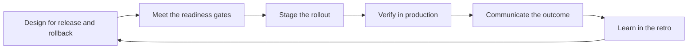

# Release and Deployment Leadership

> **Core skill:** Owning the team's release strategy — the release type, the safety mechanisms, the rollback design, and the communication — so that shipping is routine instead of adrenaline.

## Why This Matters

A release is the moment a team's promise becomes a user's reality, and it is the moment of maximum risk. When releasing depends on a hero and a prayer, the team ships less, fears more, and the fear quietly shapes what work gets attempted at all.

The senior engineer ships her own changes safely; the tech lead designs the path everyone ships through. This is the difference the area marks: the lead owns the release system — its type, its gates, its rollbacks, its communication — and makes safe shipping the default property of the team, not the specialty of one person.

## Choosing the Release Type

The release type is a strategic choice, made from the system's risk profile and the business's appetite for change — not a default inherited from last year.

| Release type | How it works | Best for | Cost |
|--------------|--------------|----------|------|
| **Continuous** | Every merged change ships when it passes the pipeline | Low-risk services, strong automated tests, small changes | Requires pipeline maturity and test discipline |
| **Scheduled trains** | Changes accumulate and ship on a fixed cadence | Platforms with compatibility requirements and cross-team coordination | Slower feedback; big-bang risk if gates are weak |
| **Release-on-demand** | Business decides when each feature goes live | Sales-led or regulatory environments with controlled moments | Needs feature flags to separate deploy from release |

The lead's choice is documented and reviewed when the system or the team changes. Release type is not a religion — a team can run continuous for services and trains for platform changes, as long as the choice is conscious per system.

## Feature Flags and Dark Launches

The most powerful release mechanism a team can own is the ability to separate deployment from release: code lands in production while the feature stays dark until the business is ready.

| Mechanism | What it does | Discipline required |
|-----------|--------------|---------------------|
| Feature flags | Toggle a feature on or off in production | Named flags, expiration dates, flag cleanup in the definition of done |
| Dark launches | Code runs in production invisibly, validating behavior | Metrics on the dark path; rollback by toggling |
| Kill switches | Instantly disable a risky subsystem in production | Tested periodically; known by the on-call rotation |

Flags turn a release from a one-way door into a reversible decision. The lead's rules: every flag has an owner and an expiry, both paths of the flag are tested, and flag sprawl is treated as technical debt with a cleanup backlog.

## Staged Rollouts

When a change is too big for a blind deploy, the team stages it — exposing the change to a widening slice of reality while watching the signals.

| Technique | Mechanism | Risk profile | When to prefer it |
|-----------|-----------|--------------|-------------------|
| **Canary** | New version serves a small live traffic share first | Low; production-validated | User-facing services with real traffic patterns |
| **Percentage rollout** | Feature enabled for a growing share of users | Low; reversible by flag | Features that can be flagged and measured per cohort |
| **Blue-green** | Two environments, instant traffic switch | Very low; instant rollback | Critical systems needing zero downtime and instant revert |

The lead defines the rollout plan before the release: the stages, the metrics that must hold at each stage, the dwell time between stages, and the abort condition. A staged rollout without a written abort condition is a staged rollout that will be aborted by panic instead of by criteria.

## Rollback as a First-Class Design Requirement

Every design decision that touches production should answer one question: how do we undo this? Rollback is a requirement, designed in from the start, not a hope applied at the end.

| Undo mechanism | Speed | Data risk | When it is the right answer |
|----------------|-------|-----------|-----------------------------|
| Feature flag toggle | Seconds | None | The feature was behind a flag; flip it off |
| Traffic switch | Minutes | None | Blue-green or canary infrastructure exists |
| Redeploy previous version | Minutes | Possible for schema changes | No flag, no traffic routing, small surface |
| Data migration reversal | Slow and risky | High | Only when migrations must be undone — prefer forward fixes |

The lead's stance: forward fixes beat rollbacks when the change is small and understood, rollbacks beat forward fixes when the change is large or the investigation is slow. The decision framework is agreed before the release, including who makes the call and what signals trigger it.

## Release Readiness Criteria

A release is ready when its gates are green, not when the calendar says so. The lead maintains the readiness bar with the team and defends it.

- All tests pass: unit, integration, and the end-to-end suite for the changed paths
- Code review completed and the release branch is clean
- Performance and security checks done for the changed surface
- Database migrations reviewed for locks, duration, and reversibility
- Rollback plan written, and the rollback owner is named
- Monitoring and alerting cover the new paths, with known baselines
- Release notes written in language users and support can act on
- Stakeholders and support are told what is coming and when

A readiness bar the lead defends is a gift to the team: it takes the awkwardness out of saying no to a release that is not ready. The bar is published, and the lead's job is to make every release meet it, not to make exceptions graceful.

## Communication Around Releases

Releases are communication events. The lead owns the messages that go out before, during, and after — so that nobody learns about the release from the incident page.

| Audience | Before | During | After |
|----------|--------|--------|-------|
| Stakeholders | What ships, when, and what it means | Status at key gates | What landed and the numbers that show it |
| Support | What changes for users, known issues, where to report | The war-room channel if something goes wrong | What was fixed, what remains known |
| Users | Release notes in their language | Status page if visibility is warranted | Confirmation and what is next |
| The team | The plan, the gates, the rollback criteria | Signal discipline during the release | A short retro: what the process cost and earned |

The lead's rule: every release has a pre-written communication plan with named owners, so that communication during the release is execution, not improvisation.

## Post-Release Verification

The release is not done when the deploy finishes; it is done when the verification window closes.

- Smoke test the critical paths against production within minutes of release
- Watch error rates, latency, and the business metrics named in the rollout plan
- Confirm the release notes match reality before announcing completion
- Leave the monitoring window running and name who watches it
- Record the release outcome in the team's log: what shipped, what was flagged, what the verification found

The verification window is the part of the release most teams skip — and it is where the lead earns the difference between shipping and shipping safely.

## The Release Flow



## Practical Applications

**Run the next release with this checklist:**

- [ ] Confirm the release type is the conscious choice for this system
- [ ] Check every feature flag has an owner, an expiry, and tested both paths
- [ ] Write the rollout plan: stages, metrics, dwell times, abort condition
- [ ] Confirm the rollback mechanism works — practice it in staging
- [ ] Walk the readiness gates and record the results
- [ ] Send the pre-release communication to stakeholders, support, and users
- [ ] Name the rollback decision-maker before the release starts
- [ ] Run post-release verification for the full monitoring window
- [ ] Log the outcome and schedule the retro

**Release communication template:**

```markdown
Subject: Release [name] — [date] [time]

What ships: [one paragraph in user language]
Why it matters: [the outcome, not the feature list]
Impact: [downtime, behavior changes, migration notes]

Rollout: [canary / percentage / blue-green / train]
Verification window: [start] to [end], owner [name]
Rollback: [mechanism], decision-maker [name]

Known issues: [list or none]
Where to report: [channel or owner]
```

## Common Pitfalls

| Pitfall | Why It Is a Problem | Better Approach |
|---------|---------------------|-----------------|
| Release type by default | The team ships the way it always has, regardless of risk | Choose per system, document the choice, review it |
| Deploy equals release | Code in production is treated as shipped to users | Feature flags separate deployment from release |
| Rollout without abort criteria | Panic decides when to stop the rollout | Written stages, metrics, dwell times, and abort conditions |
| Rollback as an afterthought | The undo path is invented during the incident | Rollback is a design requirement with a named owner |
| Readiness gates bent for the calendar | The release ships, the incident follows | Publish the bar; the lead defends it |
| Communication improvised at release time | Support learns from users; stakeholders learn from the incident | Pre-written communication plan with owners |
| Verification skipped | The release is announced done while it is still failing | Keep the monitoring window and name its watcher |

## Success Indicators

- Releases happen on the chosen cadence without heroics
- Every release has written rollout and rollback plans before it starts
- Rollbacks and flag flips are practiced and boring, not terrifying
- Readiness gates are met or the release is postponed — without drama
- Stakeholders, support, and users hear about releases from the team first
- Post-release verification catches issues the tests could not

## Related Topics

- [[07_Delivery_Metrics_and_Health]]: deployment frequency and change failure rate measure this system
- [[04_Delivery_Risk_Management]]: release risk is a standing register entry
- [[02_System_Ownership_and_Production_Responsibility/00_overview|System Ownership and Production Responsibility]]: release design is production responsibility at the boundary
- [[07_Incident_Leadership_and_Production_Excellence/00_overview|Incident Leadership and Production Excellence]]: release failures flow into incident leadership
- [[career-path/02_Senior_Software_Engineer/04_Delivery_and_Execution/05_Release_Management|Release Management (Senior)]]: the personal release craft this area scales to the team system

## Summary

Release leadership is designing the path everyone ships through: choosing the release type deliberately, separating deploy from release with flags, staging rollouts with abort criteria, treating rollback as a design requirement, and communicating around the release with pre-written plans. When the system is boring, the team ships more, fears less, and the lead watches verification windows instead of crisis calls.
