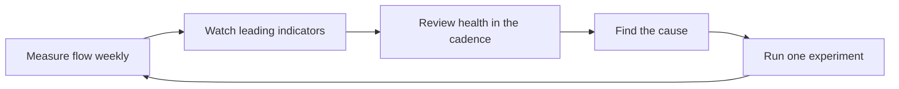

# Delivery Metrics and Health

> **Core skill:** Reading the team's delivery health from flow signals, not vibes — using metrics to start conversations, never to judge people.

## Why This Matters

A team without metrics argues from impression: the lead thinks things are fine, the engineer knows the cycle time doubled, and the stakeholder hears whichever voice is loudest. Metrics replace impressions with a shared, checkable picture — but only if the right metrics are read the right way.

The wrong metric practice is worse than none. Velocity used as a performance score, teams compared against each other, individuals measured on throughput — these turn measurement into gaming and fear, and the numbers quietly stop meaning anything. The lead's job is to build a metric culture that informs decisions without corrupting behavior.

## Flow Metrics Over Utilization

The team's delivery health is best read through flow: how work moves through the system, not how busy the people look.

| Metric | What it measures | What a healthy team sees |
|--------|------------------|--------------------------|
| **Cycle time** | Time from work started to work delivered | Stable or shrinking; predictable per work size |
| **Throughput** | How many items finish per week | Consistent with the team's stated capacity |
| **WIP** | How many items are in flight at once | Low and deliberate; finishing beats starting |
| **Utilization** | Share of time people are busy | High utilization is NOT the goal — it hides queueing |

Utilization is the trap metric: a team at 95 percent utilization looks productive and is, in fact, a queue. Flow metrics reveal what utilization hides — the waiting time between steps, the WIP that never finishes, the cycle time that quietly doubled. The lead reads flow first and treats utilization as context, never as a target.

## Leading vs Lagging Indicators

Some metrics tell the team what already happened; others warn about what is coming. The lead's dashboard needs both, with the balance tipped toward leading.

| Type | Examples | Use |
|------|----------|-----|
| **Leading** | WIP level, merge rate, review queue depth, dependency slips, scope additions | Watch weekly; they signal drift before it lands |
| **Lagging** | Cycle time, throughput, delivered scope, incident rate | Review in retrospectives; they confirm what the leading signals predicted |

The practice: leading indicators trigger action during the cycle, lagging indicators validate the action after it. A team that only reads lagging metrics is a team that discovers its problems in the retro — useful, but a cycle too late.

## Metrics Anti-Patterns

Metric cultures die from misuse faster than from bad numbers. The lead recognizes and refuses the classic anti-patterns.

| Anti-pattern | Why it corrupts | The lead's stance |
|--------------|------------------|-------------------|
| **Velocity as performance** | Teams inflate points, game estimates, and stop trusting the number | Velocity is a planning input, never an evaluation |
| **Comparing teams** | Context differs: domains, legacy, maturity — the comparison is fiction | Compare a team to its own history, never to another team |
| **Individual metrics** | People optimize personal numbers and stop helping each other | Measure the flow of the team's work, not the flow of a person |
| **Metrics as sticks** | Numbers become threats; reporting becomes creative | Metrics open questions; they never close verdicts |
| **Dashboard worship** | More charts than decisions; nobody knows what to change | Every metric on the board has a decision attached |

The lead protects the metric culture with a simple test, applied to every number: would this metric improve if people gamed it, and what would the gaming cost? If the answer is expensive, the metric is used only in aggregate, with context, and never attached to individuals or pay.

## The Delivery Health Review Format

Health reviews are how the team reads its numbers together. The lead runs a fixed, short format so the review is a habit and not a tribunal.

| Element | What happens | Time |
|---------|--------------|------|
| Flow picture | Cycle time, throughput, WIP read against the last several cycles | 10 minutes |
| Leading indicators | WIP, merge rate, review depth, dependency status | 5 minutes |
| The one anomaly | The team picks the single number that most needs explanation | 5 minutes |
| Cause conversation | Why did that number move? The team names causes, not blame | 10 minutes |
| One experiment | One change agreed for the next cycle, with a prediction | 5 minutes |

The review's output is one experiment with a predicted effect, checked at the next review. A health review that produces no experiment is a status meeting in disguise.

## Using Metrics to Start Conversations, Not to Judge

The lead's language around metrics sets the culture. The same number can be a weapon or an invitation.

| Instead of | Say | Effect |
|-----------|-----|--------|
| Your cycle time is bad | Cycle time doubled since the API migration — what changed? | Opens investigation instead of defense |
| We are slower than Team B | Our throughput dropped two weeks running — what is the cause? | Focuses on the team's own system |
| Why is this taking so long | This item has been in WIP for three weeks — what is it waiting on? | Surfaces the blocker instead of the person |
| Our velocity fell, we must work harder | Velocity fell after the onboarding wave — is the plan realistic? | Questions the plan, not the effort |

The rule the lead models: metrics describe the system's behavior, people explain it, and the team fixes it. The moment a metric is used to assign blame, the data stops being true — the team learns to hide, and the measurement dies.

## Reporting Delivery to Stakeholders Honestly

Stakeholder reporting is compression with integrity: trends, ranges, and causes — not a single green status that collapses the whole story.

| Reporting principle | What it looks like |
|---------------------|--------------------|
| Trends over snapshots | Where the number has been, not just where it is |
| Ranges over points | Forecasts as ranges with confidence, never single dates |
| Causes over blame | The explanation is a condition, not a person |
| Actions over apologies | Every problem arrives with an owner and a next step |
| Honesty over comfort | The amber report now beats the red report later |

The lead's one-sentence rule for stakeholder reports: what is true, what it means, and what we are doing about it. Reports written that way earn trust, and trust is what lets the team say no to scope it cannot carry.

## The Metrics Loop



## Practical Applications

**Build the team's metric practice with this checklist:**

- [ ] Track cycle time, throughput, and WIP — not utilization — as the core picture
- [ ] Watch leading indicators weekly: WIP, merge rate, review depth, dependency status
- [ ] Ban velocity-as-performance, team comparisons, and individual throughput metrics
- [ ] Run the health review on a fixed cadence with the one-anomaly format
- [ ] Attach one experiment with a prediction to every review
- [ ] Apply the gaming test to every new metric before adopting it
- [ ] Report to stakeholders as trends, ranges, and causes

**Health review template:**

```markdown
# Delivery Health Review — [date]

## Flow picture
Cycle time: [value] vs [previous cycles] | Throughput: [value] | WIP: [value]

## Leading indicators
- WIP: [status and note]
- Merge rate: [status and note]
- Review depth: [status and note]
- Dependencies: [status and note]

## The one anomaly
[The single number that most needs explanation]

## Cause
[What changed in the system, named without blame]

## Experiment for next cycle
[One change] — prediction: [expected effect on which metric]
```

## Common Pitfalls

| Pitfall | Why It Is a Problem | Better Approach |
|---------|---------------------|-----------------|
| Velocity as a performance score | Estimates get gamed; the number stops meaning anything | Velocity is a planning input, reviewed in private context |
| Comparing teams on numbers | Context differences make the comparison fiction | Compare the team to its own history |
| Individual throughput metrics | Collaboration dies; people hoard the easy work | Measure the flow of team work, not persons |
| Dashboard without decisions | Charts grow; nobody knows what to change | Every metric has a decision attached |
| Metrics as weapons | The team hides the truth; the numbers rot | Metrics open questions; they never close verdicts |
| Reading only lagging metrics | Problems are discovered a cycle too late | Watch leading indicators weekly |
| Green-washing stakeholder reports | The report soothes; the surprise lands anyway | Trends, ranges, and causes — amber now beats red later |

## Success Indicators

- The team can state its current cycle time, throughput, and WIP from memory
- Health reviews end with one experiment and a prediction, every time
- Nobody is judged by a metric in a 1:1 or a performance conversation
- Stakeholders receive trends and ranges and act on them
- Leading indicators trigger action during the cycle, not after it
- The metric board shrinks as decisions get clearer

## Related Topics

- [[02_Estimation_and_Forecasting_for_Teams]]: actuals against estimates feed the flow picture
- [[06_Release_and_Deployment_Leadership]]: deployment frequency and change failure rate are release health
- [[04_Delivery_Risk_Management]]: leading indicators are delivery risk in motion
- [[06_Process_and_Quality_Stewardship/00_overview|Process and Quality Stewardship]]: the processes these metrics measure and tune
- [[career-path/02_Senior_Software_Engineer/04_Delivery_and_Execution/00_overview|Delivery and Execution (Senior)]]: the personal delivery metrics this area scales to a team

## Summary

Delivery health is read from flow metrics — cycle time, throughput, WIP — watched through leading indicators, and reviewed in a fixed cadence that ends in one experiment. The lead protects the metric culture from the anti-patterns that corrupt numbers, uses metrics to open conversations rather than judge people, and reports to stakeholders as trends, ranges, and causes. Measured this way, metrics make the team's next decision obvious instead of debatable.
