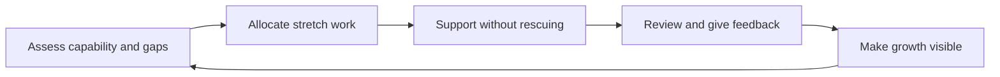

# Team Development and Mentoring Leadership

> **Core capability:** The tech lead grows the team's technical capability deliberately — through work allocation, mentoring structures, and a learning culture — without becoming the team's ceiling or its dependency.

## Why This Matters

A tech lead's effectiveness is capped by the team. A team of engineers who cannot decide, design, or debug independently turns the lead into a bottleneck with a growing queue. The escape is not working harder — it is **building capability into the team faster than the system grows complex**.

Development at this level is not only 1:1 mentoring (that is the senior-engineer skill). It is designing the conditions under which many people grow at once: who gets which work and why, how knowledge moves, how the team reviews and learns, and how growth is visible to the people growing.

## Topics in This Capability Area

| Topic | Core Skill | When It Matters |
|-------|------------|-----------------|
| [[01_Work_Allocation_as_Development]] | Assigning work to grow people, not just to finish it | Every planning cycle |
| [[02_Growing_Engineers_at_Levels]] | Stretching juniors, mids, and seniors appropriately | Team composition changes, promotion seasons |
| [[03_Team_Learning_Structures]] | Building recurring learning into the team's rhythm | Onboarding lag, knowledge silos, skill gaps |
| [[04_Knowledge_Management_and_Documentation]] | Keeping critical knowledge out of individual heads | Bus-factor risks, onboarding, rotations |
| [[05_Delegation_and_Trust]] | Delegating outcomes, not tasks — and meaning it | Overload, growth opportunities, succession |
| [[06_Growing_Future_Leaders]] | Developing seniors who can lead | Succession planning, scaling beyond one team |
| [[07_Team_Technical_Communication]] | Raising the team's written and spoken technical voice | Design docs, RFCs, demos, stakeholder updates |

## The Development Flywheel

Each turn of the flywheel raises what the team can be trusted with — which raises what you can delegate.

## What Changes from Senior to Tech Lead

| Activity | Senior engineer | Tech lead |
|----------|-----------------|-----------|
| Mentoring | Mentees assigned or informal | Designs mentoring for the whole team |
| Growth | Grows individuals | Grows the team's aggregate capability |
| Delegation | Hands off tasks | Hands off outcomes with support structures |
| Knowledge | Documents own area | Owns the team's knowledge strategy |
| Leadership | Leads by example | Builds people who lead — succession is the goal |

## Practical Applications

### Team Development Checklist

- [ ] The team's capability map is current: strengths, gaps, growth goals per person
- [ ] Every planning cycle includes at least one stretch assignment
- [ ] A learning cadence (demos, tech talks, post-incident sessions) runs on rhythm
- [ ] Bus-factor risks are identified; no critical knowledge lives in one head
- [ ] Delegated outcomes have context, constraints, and check-ins — not task lists
- [ ] At least one engineer is being grown toward lead-level responsibility
- [ ] Growth made this quarter is visible to the people who grew

## Common Pitfalls

| Pitfall | Why It Is a Problem | Better Approach |
|---------|---------------------|-----------------|
| **Rescue-mode development** | Person never struggles; never learns; you stay busy | Let people struggle productively; support, don't rescue |
| **Delegating tasks, not outcomes** | You keep the thinking; they keep the treadmill | Delegate the problem and its constraints |
| **Development off the books** | Growth happens only when convenient | Allocate stretch work in every plan |
| **Mentoring only juniors** | Mids and seniors plateau; seniors leave | Grow every level, including future leads |

## Success Indicators

- The team's usable capability rises measurably quarter over quarter
- People take problems to each other before to you
- At least one engineer could take your role in a year
- Onboarding time shrinks because the structures carry knowledge

## Related Capabilities

- [[01_The_Tech_Lead_Role_and_Operating_Model/00_overview|The Tech Lead Role and Operating Model]]: capability-building is how the mandate scales
- [[04_Team_Delivery_and_Execution_Leadership/00_overview|Team Delivery and Execution Leadership]]: delivery work is the development fuel
- [[career-path/02_Senior_Software_Engineer/07_Mentoring_and_Team_Leadership/00_overview|Mentoring and Team Leadership (Senior)]]: the 1:1 skills this area organizes at team scale
- [[career-path/11_Engineering_Manager/00_overview|Engineering Manager]]: the neighboring path that owns careers and performance formally

## Summary

Team development is the tech lead's compounding investment. Allocate work as growth, build learning and knowledge structures, delegate outcomes, and grow successors deliberately. The win condition: the team's capability grows faster than its workload — and your absence stops being a risk.
