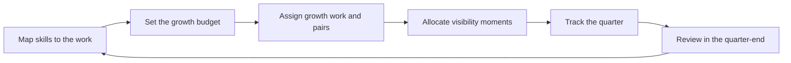

# Work Allocation as Development

> **Core skill:** Assigning work to grow people, not just to finish it — allocating stretch, pairing, rotation, and visibility deliberately every planning cycle.

## Why This Matters

The work itself is the team's most powerful development instrument. Every planning cycle hands out assignments that either grow engineers or quietly flatten them — yet most allocation happens by habit: the fastest person gets the hard work, the junior gets the tickets, and growth is left to whatever the work happens to provide.

The tech lead treats allocation as a design decision with a development budget. Who gets which work, who pairs with whom, who presents, who writes the design — each choice is a small investment in someone's capability. Allocated deliberately across a quarter, these small choices compound into measurable growth; allocated by habit, they compound into bottlenecks and plateaus.

## The Growth vs Delivery Tension

The tension is real: delivery wants the best person on every hard problem; development wants the hard problems spread around. The lead does not pretend the tension away — she manages it with a budget.

| Pressure | What it pushes toward | The cost of giving in |
|----------|----------------------|-----------------------|
| Delivery pressure | Fastest person takes every hard item | That person overloads; everyone else plateaus; the bus factor worsens |
| Development pressure | Hard items rotate through the team | Some items take longer or need more review |
| The lead's own appetite | The lead keeps the interesting work | The team learns the lead's specialty, nothing else |

The resolution is not a feeling but a budget: a share of every plan's hard work is allocated to growth, the cost is named, and the lead defends that share in planning the way she defends capacity. A team that always optimizes delivery is a team that never grows — and a team that never grows eventually stops delivering.

## The Skill and Challenge Matrix

Allocation starts from a map of each engineer against the work: what they can do easily, what stretches them, what is new, and what is rusting.

| Zone | Definition | Allocation rule |
|------|------------|-----------------|
| **Overload** | Challenge far beyond current skill, without support | Protect people from it; it produces anxiety and failure, not growth |
| **Growth** | Challenge slightly beyond current skill, with support available | The target zone: a meaningful share of every engineer's plan |
| **Comfort** | Challenge matches skill; work is smooth and known | Fine in small doses; a diet of it produces stagnation |
| **Rust** | Skill exists but has not been used recently | Re-expose deliberately: a component the person has not touched in months |

The lead keeps a working map of who sits where on the team's work. It is updated at every planning cycle and used the same way capacity is used — as input to the plan, not as a report card. The map is a private planning tool; it is shared with each engineer as a development conversation, never posted as a ranking.

## Pairing Assignments

Pairing is the cheapest high-yield allocation move available: it transfers skill while the work gets done.

| Pair | What it transfers | What the lead ensures |
|------|-------------------|-----------------------|
| Junior + senior | Craft, review judgment, tooling fluency | The senior explains, the junior drives; roles alternate |
| New + expert | Domain knowledge, system map, unwritten rules | The expert is the navigator, not the typist |
| Mid + mid | Cross-pollination of specialties and perspectives | Both get something new; neither is the teacher |
| Lead + anyone | The lead's own craft and judgment | The lead pairs on real work, not just on ceremonies |

The pairing rule: the driver and the navigator are named and rotated, and the pair debriefs briefly at the end — what did each learn, what would each do differently. A pair that never rotates roles is a lecture with a keyboard.

## Rotation Strategy

Rotation keeps the team's skill surface wide and its bus factor low. Two rotations matter, and the lead runs both deliberately.

| Rotation type | What rotates | Cadence | Purpose |
|---------------|-------------|---------|---------|
| **Component rotation** | Which system or service each engineer owns | Every few cycles, or after a major delivery | Prevents the same three people owning the critical systems forever |
| **Role rotation** | Who plays each team role | Per cycle or per quarter | Spreads the skills: reviewer, on-call lead, demo presenter, incident commander |

Rotation has a cost — context rebuild, slower first days — and the lead pays it deliberately where it compounds: on critical components, on visible roles, and on engineers who have sat in the same seat for too long. The team's rule of thumb: if an engineer has owned the same component for two quarters and the knowledge has not been spread, that is a bus-factor problem, not a stability win.

## Visibility Allocation

Growth needs the work to be seen. Who presents, who writes the design, who demos, who answers the stakeholder question — these visibility moments are allocation decisions with outsized development value.

| Visibility opportunity | Who should get it | Why |
|------------------------|-------------------|-----|
| The demo | The engineer who built the work, not the lead | Owning the demo owns the outcome and the questions |
| The design doc | The engineer who will own the build | Writing forces thinking; review makes it better |
| The stakeholder update | The engineer with the most context, coached | Presentation is a skill; it grows by doing, not by watching |
| The incident summary | The engineer who handled the incident, debriefed | Turning chaos into a narrative is a senior skill |
| The cross-team sync | The engineer owning the dependency | Being the face of an interface teaches ownership |

The lead's rule: the lead stops being the default voice for anything a team member can carry with coaching. Every visibility moment the lead hoards is a development moment the team loses.

## Tracking Growth Allocation Across a Quarter

What gets allocated gets measured — not to judge, but to check that the budget is actually being spent.

| Tracker column | What it records |
|----------------|-----------------|
| Engineer | Who |
| Work item | What was allocated |
| Growth intent | Which zone: growth, comfort, rust, or pairing |
| Skill targeted | The capability this assignment builds |
| Review point | When the lead and engineer check how it went |

The quarter-end review reads the tracker against the intent: did each engineer get a meaningful share of growth work, or did the plan quietly eat the budget? The review feeds the next quarter's allocation map — and the growth tracker, reviewed honestly, is the difference between intending to develop people and actually doing it.

## The Allocation Flow



## Practical Applications

**Allocate the next cycle with this checklist:**

- [ ] Update the skill and challenge map for every engineer
- [ ] Name the growth budget: which hard items go to whom, and why
- [ ] Assign at least one growth-zone item and one pairing per engineer per cycle
- [ ] Rotate at least one component owner or role each quarter
- [ ] Move one visibility moment from the lead to an engineer, with coaching
- [ ] Log every assignment with its growth intent in the tracker
- [ ] Review the tracker at quarter-end against the intent, honestly

**Growth allocation tracker template:**

```markdown
| Engineer | Work item | Zone | Skill targeted | Review point |
|----------|-----------|------|----------------|--------------|
| [Name] | [Item] | Growth | [e.g. system design] | [Mid-cycle check] |
| [Name] | [Item] | Rust | [e.g. legacy component] | [Pairing debrief] |
```

## Common Pitfalls

| Pitfall | Why It Is a Problem | Better Approach |
|---------|---------------------|-----------------|
| Always the fastest person | One engineer overloads; the rest plateau; the bus factor worsens | The hard work rotates; delivery cost is named and budgeted |
| Shielding the juniors | Juniors never meet the hard work or the customers | Give juniors real slices with pairing support and review gates |
| Hoarding interesting work | The lead keeps the design and the visibility; the team stays dependent | The lead takes the boring parts and allocates the growth away |
| Comfort-zone allocation | Everyone does what they already know; the team quietly stagnates | Every plan has growth-zone items per engineer |
| Growth off the books | Development happens only when there is spare time | The growth budget is part of the plan, not a remainder |
| The map as a report card | The skill map becomes a ranking and defensiveness follows | The map is a planning tool, shared as development conversation |

## Success Indicators

- Every engineer has at least one growth-zone item per cycle, tracked and reviewed
- The fastest person's load is no longer the team's risk
- Component and role rotations happen on a cadence, not by emergency
- Visibility moments rotate: demos, designs, and updates have varied faces
- The growth tracker is reviewed at quarter-end and feeds the next map
- Engineers can name what they are working on and what it is growing

## Related Topics

- [[02_Growing_Engineers_at_Levels]]: the level-specific development that allocation serves
- [[05_Delegation_and_Trust]]: handing over outcomes is how growth work gets real support
- [[06_Growing_Future_Leaders]]: future leads are built by what they get allocated
- [[04_Team_Delivery_and_Execution_Leadership/00_overview|Delivery and Execution Leadership]]: delivery work is the fuel allocation runs on
- [[career-path/02_Senior_Software_Engineer/07_Mentoring_and_Team_Leadership/00_overview|Mentoring and Team Leadership (Senior)]]: the 1:1 mentoring skills this area organizes at team scale

## Summary

Work allocation is the team's development curriculum, taught through assignments. Map skill against challenge, set a named growth budget, pair deliberately, rotate ownership and roles, allocate visibility moments, and track it all across the quarter. The lead who allocates for growth turns every planning cycle into a compounding investment in the team's capability — and spends it before the delivery pressure spends it first.
