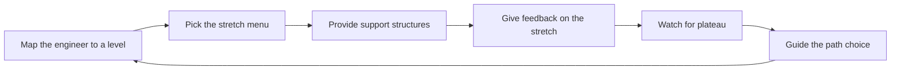

# Growing Engineers at Levels

> **Core skill:** Stretching juniors, mids, and seniors appropriately — with a per-level development menu, honest plateau detection, and clear guidance on engineering manager versus tech lead paths.

## Why This Matters

Different engineers need different growth. A junior needs foundations and fast feedback; a mid needs ownership of real components; a senior needs ambiguous scope and the chance to lead others. The most common development failure is treating all three the same — giving everyone more tickets and calling it growth.

The tech lead's job is to develop the whole team's aggregate capability — a team managed as a set of levels with different needs. Getting the menu right per level turns a collection of individuals into a pipeline where every seat has someone growing toward it.

## The Level Map

The team's development work starts from a shared map of what each level means. The map is a coaching tool, not a ranking.

| Level | Core focus | Typical evidence | Growth target |
|-------|------------|------------------|---------------|
| **Junior** | Foundations: code fluency, tools, feedback loops | Completes well-scoped tasks with review; asks good questions | Independent delivery of small slices |
| **Mid** | Component ownership, design participation | Owns a component end to end; contributes to designs | Leading design for their area, mentoring juniors |
| **Senior** | Ambiguous scope, cross-team work, mentoring | Slices vague problems; influences beyond the team | Delegated leadership, representation |
| **Senior-plus / future lead** | Delegated leadership, team-level thinking | Runs rituals, leads initiatives, represents the team | Readiness for a tech lead or specialist role |

The map is written down and used in every development conversation.

## Juniors: Foundations, Feedback Loops, Supervised Autonomy

The junior year is about building the loops: write code, get feedback, improve, repeat — fast.

| Need | What the lead provides | Anti-pattern to avoid |
|------|------------------------|----------------------|
| Fast feedback | Reviews within a day, tied to concrete examples | Review queues that teach juniors their work does not matter |
| Small real slices | Real tickets, small enough to finish, valuable enough to matter | Tickets-only diet that never touches the system's real shape |
| Supervised autonomy | A slice with a clear boundary and a named review gate | Either hovering on every keystroke or vanishing entirely |
| The system map | Walkthroughs of architecture and domain before deep work | Junior builds in a corner and learns the system by accident |
| Learning to ask | A named go-to for questions and a safe culture | Junior stuck silently because asking feels like failure |

The junior's stretch menu: a first end-to-end slice, presenting their own work in demo, pairing as driver with a senior navigator, and owning a small fix end to end. Each item is small, but each is real.

## Mids: Component Ownership and Design Participation

The mid's growth is about moving from completing work to owning it — and from implementing designs to shaping them.

| Need | What the lead provides | Anti-pattern to avoid |
|------|------------------------|----------------------|
| Real ownership | A component with a boundary, a budget, and an owner's hat | Shared-everything ownership where nobody feels accountable |
| Design participation | A seat at the design table, with a specific part to design | Design by the lead alone, implementation by everyone |
| Estimation and planning | Their component's estimates and sequencing | Mids who never see the planning side of their own work |
| Technical writing | Their component's docs and ADR drafts | All writing flowing through the lead |
| Review judgment | Rotating into reviewer roles with guidance | Reviews as a checkbox with no judgment development |

The mid's stretch menu: design and run a medium initiative, own the component's release and on-call, mentor a junior, and draft the component's next ADR.

## Seniors: Ambiguous Scope, Mentoring Others, Cross-Team Work

The senior's growth is about scope: bigger, vaguer, more people, more influence.

| Need | What the lead provides | Anti-pattern to avoid |
|------|------------------------|----------------------|
| Ambiguous problems | A vague goal with constraints, not a ticket | Seniors given only crisp tasks; their judgment atrophies |
| Mentoring assignments | A junior or mid to grow, with coaching on the coaching | Senior mentees handed over with no support or feedback |
| Cross-team surface | A dependency or contract to own with another team | Seniors kept inside the team's walls |
| Architecture input | A real voice in technical direction and trade-off calls | Decisions handed down, seniors implementing |
| Failure with review | Hard problems that might not work, with a safe review point | Failure hidden or punished, so seniors stop attempting |

The senior's stretch menu: lead a cross-team initiative, mentor a mid through a first design, represent the team at a stakeholder forum, and run a risky slice's review.

## Senior-Plus and Future Leads: Delegated Leadership

Future leads grow by leading — small, then bigger, always with a safety net and a debrief.

| Need | What the lead provides | Anti-pattern to avoid |
|------|------------------------|----------------------|
| Delegated authority | A ritual or initiative run entirely by the engineer, with the lead as backup | Authority delegated in name while the lead keeps deciding |
| Representation | Standing in for the lead at syncs and forums | The same two people representing the team forever |
| Judgment calls | Real decisions with consequences, made with advice | All consequential decisions routed through the lead |
| The lead's operating model | Why the lead does what she does — made visible | The lead's craft stays implicit and undiscussable |

The stretch menu: run the planning or retro cycle, lead a small cross-team initiative, own a stakeholder relationship, and take the lead's seat for a cycle.

## Spotting Plateau

Plateaus are quiet: delivery is fine, learning stops, and the team's capability stops compounding. The lead watches for signals.

| Signal | What it usually means | Lead's move |
|--------|------------------------|-------------|
| Same-sized work for many cycles | Comfort-zone allocation is stuck | Re-map; push one level of scope up |
| No questions in design reviews | Disengagement or comfort masquerading as confidence | Ask for their position; give them a design to own |
| Mentoring never mentioned | The growth loop has stopped feeding | Assign a mentee and coach the coaching |
| Complaints about other teams' quality | Their influence has hit the team boundary | Give them a cross-team surface to own |
| Doing the lead's job poorly on purpose | Either unclear expectations or lost motivation | Name the gap, rebuild the support, re-check the path |

The lead's rule: plateau detection is a quarterly conversation, never a surprise.

## Development Conversations vs Performance Conversations

The two conversations get conflated, and both suffer. They have different purposes, different evidence, and different rooms.

| Dimension | Development conversation | Performance conversation |
|-----------|--------------------------|--------------------------|
| Purpose | Where the engineer is growing and where the next stretch is | Whether expectations were met in the period |
| Evidence | Growth over time, capability trajectory | Outcomes against the agreed plan |
| Owner | The tech lead, with the engineer | The engineering manager, with the lead's input |
| Frequency | Ongoing, at least monthly touchpoints | Per the company's review cycle |
| Output | A development plan and a stretch menu | A rating, a plan, and consequences if any |

The lead keeps the boundary clean: the development conversation is a growth planning session; the performance conversation is an accountability session. Mixing them makes the growth talk feel like a threat and the review feel like a surprise.

## Recommending Paths: EM vs TL vs Specialist

As engineers grow, they face a fork. The lead helps each person choose with their own evidence, not with the loudest suggestion.

| Path | What it rewards | Signals it fits | Signals it does not fit |
|------|-----------------|-----------------|--------------------------|
| **Tech lead path** | Systems thinking, people development, technical stewardship | Energized by team capability and architecture; enjoys growing others | Wants to go deep alone; finds people work draining |
| **Engineering manager path** | People management, org health, process | Energized by careers, hiring, and org design | Wants to stay hands-on in code full time |
| **Specialist path** | Deep expertise in one domain | Energized by a narrow, deep technical frontier | Wants breadth, influence, or people |

The lead's honesty duty: recommend from observed evidence, not charm or convenience — and say out loud that all three paths are careers; the best engineers are not automatically the best leads.

## The Level Growth Flow

## Practical Applications

**Develop the team by level with this checklist:**

- [ ] Keep the level map written down and used in development conversations
- [ ] Give juniors fast feedback, small real slices, and supervised autonomy
- [ ] Move mids into component ownership and design participation
- [ ] Give seniors ambiguous scope, mentees, and cross-team surface
- [ ] Delegate real rituals and initiatives to future leads with a safety net
- [ ] Check for plateau signals in the quarterly development conversation
- [ ] Keep development and performance conversations in separate rooms
- [ ] Discuss the EM versus TL versus specialist fork with evidence, not vibes

## Common Pitfalls

| Pitfall | Why It Is a Problem | Better Approach |
|---------|---------------------|-----------------|
| One menu for every level | Juniors drown or mids coast; growth stalls in both directions | Per-level stretch menus with support structures |
| Junior as ticket machine | Foundations never meet the real system | Small real slices, pairing, system walkthroughs |
| Mid with no ownership | Everything is shared; accountability and pride never land | Named components, budgets, and owner's decisions |
| Senior with crisp tasks only | Judgment and influence never develop | Ambiguous scope, mentees, cross-team ownership |
| Plateau unnoticed | The team's capability quietly stops compounding | Quarterly plateau check with named signals |
| Review as the only conversation | Growth is a yearly surprise | Monthly development touchpoints, separate from performance |
| Pushing everyone to lead | The org gets reluctant managers and loses specialists | Honest evidence-based path guidance in all three directions |

## Success Indicators

- Each engineer can state their level, their stretch items, and their support structures
- Juniors ship real slices with decreasing rescue; mids run releases without hand-holding
- Seniors influence beyond the team and grow their mentees measurably
- Path conversations produce decisions the engineer owns, in all three directions

## Related Topics

- [[01_Work_Allocation_as_Development]]: the allocation machinery that delivers the stretch menu
- [[06_Growing_Future_Leaders]]: the senior-plus tier is the leadership pipeline
- [[03_Team_Learning_Structures]]: the team-level learning that supports per-level growth
- [[career-path/11_Engineering_Manager/00_overview|Engineering Manager]]: the path for engineers who grow toward people management
- [[career-path/02_Senior_Software_Engineer/07_Mentoring_and_Team_Leadership/00_overview|Mentoring and Team Leadership (Senior)]]: the mentoring craft seniors practice while growing

## Summary

Growth by level is a menu problem: juniors need foundations and fast feedback, mids need ownership and design seats, seniors need ambiguous scope and mentees, and future leads need delegated authority with safety nets. The lead runs the level map, watches for plateaus, keeps development conversations distinct from performance, and guides the EM versus TL versus specialist fork with evidence. A team developed this way is a pipeline — every seat has someone growing toward it.
