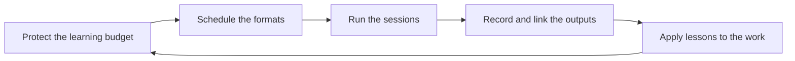

# Team Learning Structures

> **Core skill:** Building recurring learning into the team's rhythm — talks, demos, post-incident sessions, and pairing — with a protected time budget and visible outputs.

## Why This Matters

Individual engineers learn on their own; teams learn together or not at all. When learning is left to personal initiative, the same three people always know the new things, the rest of the team hears about them in the incident review, and the knowledge silos quietly harden.

The tech lead designs learning as a structure: recurring formats on a cadence, a time budget the lead defends, and outputs that make learning visible. Structured learning is what turns a team that reacts to knowledge gaps into a team that closes them before they matter.

## Recurring Learning Formats

The formats are the skeleton of the team's learning rhythm. Each one has a cadence, a purpose, and an owner.

| Format | Cadence | What happens | Who runs it |
|--------|---------|--------------|-------------|
| **Tech talk or demo** | Biweekly or monthly | One engineer shows something: a technique, a tool, a lesson | Rotates; the presenter gains visibility, the team gains the content |
| **Brown-bag lunch** | Monthly | Informal session on a topic of interest, no slides required | Whoever volunteers; low barrier by design |
| **Post-incident learning** | After every significant incident | What happened, what the system allowed, what we change | The incident responder, debriefed by the lead |
| **Reading group** | Monthly or per topic | A paper, book chapter, or article discussed together | A rotating facilitator |
| **Community of practice** | Per specialty, quarterly | People with the same specialty across teams share practice | A named champion per specialty |
| **Internal workshop** | Per need | Hands-on skill-building: testing, debugging, security basics | The lead or the expert host |

The lead's rule for formats: every format has a named owner and a place on the calendar before the quarter starts. Learning that is scheduled survives; learning that is hoped for does not.

## Post-Incident Learning Sessions

The most expensive lessons the team will ever get come from production. The post-incident session is how those lessons become team property instead of one person's scar tissue.

| Element | What it does | Anti-pattern to avoid |
|---------|--------------|----------------------|
| Timeline walkthrough | Establishes the facts everyone agrees on | Blame-hunting before the timeline exists |
| System conditions | Names what the system allowed to happen | Stopping at human error, which teaches nothing |
| The fix and its verification | One change, with evidence it works | A list of twenty improvements nobody will do |
| The team-wide lesson | What everyone should know now | The lesson staying in the incident doc |

The session is short, blameless, and scheduled within days of the incident. Its output is one verified fix and one team-wide lesson — not a ceremony.

## Pairing as Learning

Pairing is the team's most flexible learning structure: it needs no calendar slot, only a deliberate assignment. The lead uses it as both a delivery tactic and a curriculum.

| Pairing shape | Learning transfer | When to use it |
|---------------|-------------------|----------------|
| Junior + senior | Craft, judgment, system map | New joiners, first hard slice |
| New + expert | Domain and architecture knowledge | Onboarding, unfamiliar components |
| Mid + senior | Design thinking, review depth | First design ownership |
| Cross-specialty | Perspective transfer, fewer blind spots | Frontend plus backend, test plus product |

The pairing debrief is what makes pairing learning rather than collaboration: two minutes at the end — what did each person learn, what would they do differently. The lead checks that pairs rotate roles and that the debrief actually happens.

## Learning Time Budgets

Learning needs protected time. The lead's stance: 10 to 20 percent of the team's capacity is a learning budget — and it is spent, not hoped for.

| Budget rule | How it works | Why it matters |
|-------------|--------------|----------------|
| Named in planning | Learning time is a line in the capacity model, like ceremonies | Unbudgeted learning is the first thing delivery pressure eats |
| Spent, not banked | Learning time unused this cycle does not roll over as guilt | The budget exists to be used, and using it is not slacking |
| Visible in the tracker | Learning items appear as real work items | Hidden learning is unprotectable learning |
| Lead-protected | The lead defends the budget against scope pressure | If the lead will not defend it, nobody will |

The 10-20 percent range is a floor with judgment: high-risk systems or new domains sit at the top, stable systems at the bottom. The point is not the exact number — it is that learning has a budget line that survives contact with the plan.

## Making Learning Visible

Learning that stays in people's heads helps the people who were in the room. Learning that is written down, recorded, and linked helps everyone forever.

| Visibility mechanism | What it produces |
|----------------------|------------------|
| Notes from every session | A searchable knowledge trail, not a memory |
| Recordings of talks | The content survives new joiners and absent team members |
| A learning log | The team's own history of what it studied and why |
| The wiki index | Every session linked from the team's knowledge home |
| Follow-up items | Each session's action items tracked like real work |

The lead's test for visibility: if a new joiner arrived next month, could they find the team's last ten learning sessions and their lessons? If not, the learning happened but the team did not.

## The Learning Rhythm



## Practical Applications

**Build the team's learning rhythm with this checklist:**

- [ ] Put the learning formats on the calendar before the quarter starts
- [ ] Rotate presenters so visibility spreads beyond the usual voices
- [ ] Schedule a post-incident learning session within days of every incident
- [ ] Assign one deliberate pairing per cycle with a named debrief
- [ ] Add the learning time budget to the capacity model, 10 to 20 percent
- [ ] Log learning as real work items in the tracker
- [ ] Publish notes or recordings of every session
- [ ] Check the learning log quarterly: what did the team learn, and did it apply?

**Learning calendar template:**

```markdown
# Team Learning Calendar — [quarter]

| Week | Format | Topic | Owner | Output |
|------|--------|-------|-------|--------|
| 1 | Tech talk | [topic] | [name] | [notes link] |
| 3 | Brown-bag | [topic] | [name] | [notes link] |
| 5 | Workshop | [topic] | [name] | [recording link] |
| 8 | Reading group | [material] | [name] | [discussion notes] |

Budget: [percent] of team capacity, logged in the tracker.
```

## Common Pitfalls

| Pitfall | Why It Is a Problem | Better Approach |
|---------|---------------------|-----------------|
| Learning as slack-time filler | It only happens when nothing urgent is going on — so never | A budget line in the plan, defended by the lead |
| Mandatory fun | Attendance-forced sessions breed resentment and theater | Voluntary sessions, good content, visible value |
| The same three presenters | Visibility and learning concentrate in the few | Rotation with coaching for first-time presenters |
| Sessions with no output | The lesson evaporates with the meeting | Notes, recordings, and follow-up items as the standard |
| Incident lessons that stay in the doc | The team repeats the incident's conditions | A team-wide lesson stated in the session, not just a fix |
| Learning calendar that dies in week two | Structure without ownership decays | Named owner per format, checked at the quarter review |

## Success Indicators

- The learning calendar is full before the quarter starts and mostly survives it
- Presenters rotate, including first-timers who get coached
- Every significant incident produces a learning session with one verified fix
- The learning budget appears in the plan and is actually spent
- New joiners can find the team's recent learning and its lessons
- Lessons from sessions show up in the team's code and process

## Related Topics

- [[04_Knowledge_Management_and_Documentation]]: session outputs feed the team's knowledge base
- [[02_Growing_Engineers_at_Levels]]: learning structures deliver the per-level curriculum
- [[07_Team_Technical_Communication]]: talks and demos are also communication craft
- [[06_Process_and_Quality_Stewardship/00_overview|Process and Quality Stewardship]]: the team rhythm that carries the learning calendar
- [[career-path/02_Senior_Software_Engineer/07_Mentoring_and_Team_Leadership/00_overview|Mentoring and Team Leadership (Senior)]]: the 1:1 teaching skills that pair with team formats

## Summary

Team learning is a designed rhythm: recurring formats with owners, a protected time budget, post-incident sessions that convert scars into lessons, and outputs that make learning visible and searchable. The lead schedules it, defends it, and records it — so the team learns together at a pace that keeps knowledge silos from ever hardening.
