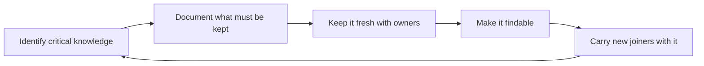

# Knowledge Management and Documentation

> **Core skill:** Keeping the team's critical knowledge out of individual heads — deciding what must be documented, reducing bus factor, and making documentation part of done.

## Why This Matters

Knowledge lives in heads until the head leaves, and then the team pays the price twice: once in the scramble to reconstruct what was known, and again in the mistakes made while reconstructing it. The tech lead's knowledge strategy decides which knowledge is protected as team property and which is allowed to stay tacit.

The enemy is not a lack of documentation — it is documentation that does not get read, kept, or trusted. A wiki full of stale pages is worse than no wiki: it teaches the team that the written word is fiction. The lead's job is a curation job: document the few things that must be documented, keep them fresh, and make finding them trivial.

## What Must Be Documented vs Tribal Knowledge

Not everything deserves a document. The lead sorts knowledge by what happens if it stays in heads.

| Knowledge type | Examples | If it stays tribal |
|----------------|----------|--------------------|
| **Runbooks** | How to restart a service, respond to an alert, recover a queue | The on-call hero is the only one who can fix the night |
| **Decisions and ADRs** | Why the team chose this architecture, this library, this trade-off | Future teams re-litigate or silently reverse the decision |
| **Onboarding material** | How the system fits together, where the seams are, who owns what | Every new joiner costs a month of the team's patience |
| **Domain concepts** | What the business terms mean, how the domain rules work | Engineers guess; the product drifts from the domain |
| **Interfaces** | Contracts with other teams, event schemas, API semantics | Cross-team work breaks at the seam |
| **Tactics and preferences** | How someone likes their coffee, the one-off trick for a tool | Leave it tribal; documentation has a budget |

The sorting test: would this knowledge hurt the team within a week if the holder vanished? If yes, it is documented. If no, it stays tribal and nobody feels guilty about it.

## Bus-Factor Analysis and Reduction

The bus factor is the number of people who can disappear before the team is stranded. The lead measures it for the critical knowledge, not for the team as a whole.

| Knowledge area | Bus-factor question | Reduction move |
|----------------|---------------------|----------------|
| Critical components | How many people could rebuild or fix this blind? | Pair on it, rotate an owner, write the runbook |
| The team's history | Who remembers why the last three decisions were made? | ADRs with dates and reasons |
| External relationships | Who owns the contacts that make things move? | Dependency maps and written agreements |
| Operations | Who can actually run the production systems? | Runbooks, on-call rotation, incident practice |

The lead's rule of thumb: any critical knowledge held by one person is a risk being carried until it is spread. Spreading is done deliberately — pairing, rotation, documentation — and re-checked when people leave or join.

## Documentation as Part of Definition of Done

Docs that are added after the work, as an afterthought, are docs that never get written. The lead puts documentation into the definition of done so that the work is not done without it.

| Work type | Required documentation |
|-----------|------------------------|
| New or changed behavior | A runbook or operational note if operations touch it |
| Architectural decision | An ADR with the context, the choice, and the alternatives rejected |
| Interface change | The contract updated, with a migration note |
| New component | A system map entry: what it is, who owns it, how it fails |
| Onboarding touchpoint | Any change that a new joiner would need explained |

The mechanism is simple: the review checklist includes the doc, and a work item without its doc is not closed. The lead protects the rule even when it feels bureaucratic — the doc is the team's memory, and the definition of done is how the memory gets written.

## Knowledge Freshness

A stale document is worse than an absent one. The lead runs a freshness system with ownership and dates.

| Mechanism | How it works |
|-----------|--------------|
| Review dates | Every critical doc carries a last-reviewed date |
| Named owners | Every critical doc has a person accountable for its truth |
| Expiry and re-verify | Docs past their review window are flagged, not silently trusted |
| Touch-point refresh | Touching a system means updating its docs in the same change |

The freshness rule the lead enforces: if a document is wrong, fixing it is part of the change that revealed it was wrong. A team that updates the doc in the same pull request as the code keeps its memory honest without any extra ceremony.

## Onboarding Path Design

Onboarding is the moment the knowledge strategy pays out — or fails loudly. The lead designs the first weeks so that new joiners are carried by documents, not by the patience of the team.

| Week | Focus | What carries it |
|------|-------|-----------------|
| Week 1 | Orientation: the system map, the domain, the team's ways | The onboarding doc, the system map, a named buddy |
| Week 2 | First real slice: small, real, end to end | The runbooks, pairing, review gates |
| Week 3 | Independence: a slice owned with light supervision | The docs the team relies on; the joiner improves them |
| Beyond | Component ownership and contribution | The joiner writes the next onboarding improvements |

The measure of the onboarding path is not the joiner's speed — it is whether the joiner's questions are answered by documents more than by people. Every question that needed a person is a documentation gap, logged and closed.

## Wiki and Search Hygiene

Knowledge that cannot be found might as well not exist. The lead keeps the team's knowledge space findable and trustworthy.

- One index page that maps the team's knowledge: systems, decisions, runbooks, onboarding
- Standard naming and one home per topic, so search returns the right page first
- Dead links and orphan pages pruned on a cadence, like a garden
- The index updated whenever a new critical doc is born
- Search as the default: the team is taught to look first, ask second

## The Knowledge Flow



## Practical Applications

**Run the team's knowledge strategy with this checklist:**

- [ ] List the critical knowledge areas and their bus factor
- [ ] Write runbooks, ADRs, onboarding material, domain concepts, and interfaces — nothing else
- [ ] Add required documentation to the definition of done
- [ ] Give every critical doc an owner and a review date
- [ ] Update docs in the same change that makes them wrong
- [ ] Design the week 1/2/3 onboarding path around documents
- [ ] Keep one index page and prune dead links on a cadence
- [ ] Log every new-joiner question that needed a person as a doc gap

**Documentation template:**

```markdown
# [Title]

Last reviewed: [date] | Owner: [name] | Status: [current / needs review]

## Purpose
[One paragraph: what this document exists to explain]

## The knowledge
[The content — kept to what the team actually needs]

## When this changes
[The trigger that makes this document wrong]
```

## Common Pitfalls

| Pitfall | Why It Is a Problem | Better Approach |
|---------|---------------------|-----------------|
| Doc dumps | Volume buries the few documents that matter | Document only what fails the one-week test |
| Stale docs worse than none | The team learns to distrust everything written | Review dates, owners, and fix-in-the-same-change |
| Documentation theater | Pages exist for the audit, not for the reader | Delete docs nobody reads; keep the ones that get used |
| Everything in one head | The bus factor quietly sits at one | Pairing, rotation, and runbooks for critical knowledge |
| Docs after the fact | The afterthought never happens | Documentation in the definition of done |
| A wiki nobody can search | Knowledge exists but cannot be found | One index, standard naming, regular pruning |
| New joiners as knowledge harvesters | Onboarding drains the team instead of the docs | Design the path around documents and log the gaps |

## Success Indicators

- Every critical system can be operated from its runbook by someone new to it
- The team can state its knowledge areas and their bus factors
- Work items are not closed without their required documentation
- Docs are updated in the same change that makes them stale
- New joiners' questions come from documents more than from people
- The knowledge space is findable: one index, working links, pruned pages

## Related Topics

- [[03_Team_Learning_Structures]]: session outputs feed the documented knowledge base
- [[07_Team_Technical_Communication]]: documentation is the written half of the team's voice
- [[01_The_Tech_Lead_Role_and_Operating_Model/00_overview|The Tech Lead Role and Operating Model]]: knowledge ownership is part of the lead's mandate
- [[02_System_Ownership_and_Production_Responsibility/00_overview|System Ownership and Production Responsibility]]: runbooks are production responsibility made visible

## Summary

Knowledge management is curation with a budget: document what would hurt within a week if it stayed in a head, reduce the bus factor on critical knowledge, make documentation part of done, keep everything fresh with owners and dates, and design onboarding to be carried by documents. A team whose memory is written, findable, and trusted stops paying the reconstruction tax every time someone leaves.
