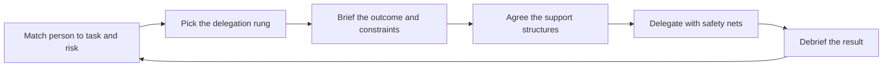

# Delegation and Trust

> **Core skill:** Delegating outcomes, not tasks — matching authority to person and risk, building support structures that are not micromanagement, and handling failure without retaking the work.

## Why This Matters

Delegation is how a tech lead scales. Every task the lead keeps is a task the team cannot own; every decision the lead makes alone is a decision the team cannot learn. A lead who does not delegate becomes the team's bottleneck, and the team quietly learns to wait.

But delegation is also where trust gets tested. Delegate too little and the team stalls; delegate too much, too soon, and the work fails and the lead retakes it — teaching everyone that delegation is a trap. The skill is matching the delegation to the person and the risk, and building structures that make failure survivable without making the delegate feel watched.

## Delegating Outcomes, Not Tasks

The distinction that makes delegation growth instead of labor-splitting: hand over the outcome and the constraints, not the step-by-step execution.

| Delegating tasks | Delegating outcomes |
|------------------|---------------------|
| Here is the list of steps, do them | Here is the result we need, and here are the constraints |
| You implement, I decide | You decide within the boundary, I review |
| Check with me at every step | Check in at the agreed points |
| The thinking stays with the lead | The thinking is transferred with the work |
| The delegate executes | The delegate owns |

Task delegation keeps the lead's thinking monopoly intact and gives the engineer a treadmill. Outcome delegation transfers the judgment along with the work — slower at first, compounding forever after. The lead's test for every hand-off: does the engineer know the outcome, the constraints, and the authority, without needing to ask what to do next?

## The Delegation Ladder

Authority is delegated in degrees, matched to the person's capability and the task's risk. The ladder is a decision tool, not a career rank.

| Rung | What it means | Use it when |
|------|---------------|-------------|
| **Do** | The lead does it; the engineer observes | The task is beyond anyone else, or a rare one-off |
| **Tell** | The lead does it, explaining as she goes | The engineer needs to see the craft before owning it |
| **Consult** | The engineer does it; the lead advises | The engineer is learning; the outcome matters |
| **Advise** | The engineer decides; the lead is informed | The engineer is capable; the risk is medium |
| **Delegate** | Full ownership; the lead hears the outcome | Capability proven; the risk is manageable |

Two axes decide the rung: how capable the person is on this task type, and how risky the task is. High capability plus low risk is full delegation; low capability plus high risk is do-or-tell with a debrief. The lead names the rung out loud when handing off work — silent assumptions about authority are how delegation conversations go wrong.

## Supportive Structures vs Micromanagement

Support structures are what make delegation safe; micromanagement is what makes it feel like a prison. The difference is visible in the details.

| Supportive structure | Micromanagement |
|----------------------|-----------------|
| Context: the outcome, constraints, and why it matters | Instructions: the exact steps, in order |
| Check-ins at agreed points, tied to milestones | Status checks at random moments, tied to anxiety |
| Review gates on the risky seams | Review of every intermediate artifact |
| A named escalation path for stuck moments | The lead hovering in the channel |
| Debrief at the end: what worked, what to change | Post-mortem of every small deviation |

The lead's rule: a support structure is something the delegate can name in advance — the check-in schedule, the review points, the escalation contact. If the delegate cannot predict the lead's involvement, the structure has curdled into micromanagement.

## Trusting With Safety Nets

Full delegation does not mean no safety. The safest delegations are the ones with nets — because the net is what makes the risk acceptable to both sides.

| Safety net | What it protects | How it stays honest |
|------------|------------------|---------------------|
| Review gates | Quality on the risky seams | Named in advance, focused on the seam, not the style |
| Rollback plans | Production when the change lands | Written before the release, practiced, boring |
| Time-boxed autonomy | The schedule when exploration runs long | A named checkpoint where the lead gets involved |
| The rescue rule | The delegate's dignity when it fails | The lead helps fix the problem, never seizes it |

The net is agreed before the work starts, and its triggers are explicit — the delegate knows exactly when the lead will step in. Trust with surprise interventions is not trust; it is surveillance.

## Handling Delegation Failure Without Retaking

Delegated work fails sometimes. The lead's behavior in that moment decides whether the team ever accepts delegation again.

| Wrong move | Why it poisons | The right move |
|-----------|----------------|----------------|
| Retaking the work | The team learns that failure means losing ownership | Fix the problem together, then return the work to the owner |
| Blaming in public | The team learns to hide failure | Debrief privately, focus on conditions and decisions |
| Silent correction | The delegate never learns what changed | Name the deviation, the cause, and the better decision |
| Lowering the bar | Failure is smoothed over; the next task fails the same way | Adjust the rung or the net, and say why — then delegate again |

The lead's stance: failure of delegated work is a design signal — the rung was wrong, the net was wrong, or the context was incomplete. The fix is in the design, not in the person. Delegation continues, adjusted; the only true failure is retaking the work and calling it leadership.

## What Never to Delegate

Some things stay with the lead — not out of distrust, but because delegation would be wrong or impossible.

| Item | Why it stays | What the lead does instead |
|------|--------------|----------------------------|
| Mandate-defining decisions | The team's mission and boundaries are the lead's to set | Decide with input, then state the mandate clearly |
| Personnel issues | Performance and conflict belong to the engineering manager | Hand the issue to the EM with context, stay out of the verdict |
| Cross-team commitments | Commitments bind the team; only the lead's authority carries them | Negotiate with counterpart leads, delegate the delivery |
| The final call on risky releases | The risk sits with the team's reputation | Take the call with the team's analysis, explain the reasoning |

Delegating these looks generous and costs the team dearly — a mandate blurred, a commitment broken, a personnel verdict the lead was never authorized to give. The lead's boundary is as important as her willingness to let go.

## The Delegation Flow



## Practical Applications

**Delegate the next piece of work with this checklist:**

- [ ] State the outcome and constraints, not the steps
- [ ] Choose the rung from capability and risk, and name it out loud
- [ ] Agree check-ins, review gates, and the escalation path in advance
- [ ] Set the safety nets: rollback plans, time-boxes, the rescue rule
- [ ] Let the delegate own the decisions inside the boundary
- [ ] Debrief at the end: what worked, what the design should change
- [ ] If it failed, adjust the rung or the net — never retake the work
- [ ] Keep mandate decisions, personnel issues, and commitments off the table

**Delegation brief template:**

```markdown
# Delegation — [work item]

Outcome: [the result that must exist, in one sentence]
Constraints: [boundaries, budgets, non-negotiables]
Authority: [decisions the delegate owns; decisions that need the lead]

Rung: [delegate / advise / consult / tell / do]
Check-ins: [points and what triggers them]
Review gates: [the seams reviewed and when]
Escalation: [who to contact when stuck, and when]

Safety nets: [rollback plan, time-box, rescue rule]
Debrief: [when and what it covers]
```

## Common Pitfalls

| Pitfall | Why It Is a Problem | Better Approach |
|---------|---------------------|-----------------|
| Delegating tasks, not outcomes | The lead keeps the thinking; the team keeps the treadmill | Hand over the outcome, constraints, and authority together |
| Silent authority assumptions | The delegate guesses wrong and the lead gets surprised | Name the rung and the decision boundary out loud |
| Support that becomes surveillance | Check-ins multiply until the work is the lead's again | Predictable structures agreed in advance |
| Retaking after failure | The team learns that ownership is revocable | Fix together, adjust the design, delegate again |
| Delegating everything to the strongest | One person carries; the rest never grow | Match rung to person; spread the risky growth work |
| The lead as final approver of everything | Every decision queues on the lead's calendar | Delegate decisions within named boundaries |
| Handing off what must stay | Mandate, personnel, and commitments get blurred | Keep the boundary explicit and defend it |

## Success Indicators

- Most team work proceeds without the lead in the loop
- Engineers can name their authority and their check-in points for current work
- Delegated work fails sometimes — and ownership stays with the owner
- The lead's calendar has room for the work only the lead can do
- Delegates request more scope, and the ladder moves up over time
- Debriefs change the delegation design, not the person

## Related Topics

- [[01_Work_Allocation_as_Development]]: delegation rungs are how growth work gets its support
- [[06_Growing_Future_Leaders]]: full delegation is the rehearsal for leadership
- [[03_Unblocking_and_Escalation]]: the escalation path inside a delegation brief
- [[01_The_Tech_Lead_Role_and_Operating_Model/00_overview|The Tech Lead Role and Operating Model]]: what stays with the lead comes from the mandate
- [[career-path/11_Engineering_Manager/00_overview|Engineering Manager]]: personnel matters belong to the manager's lane

## Summary

Delegation is the lead's scaling mechanism and the team's growth mechanism at once. Delegate outcomes with constraints, choose the rung from capability and risk, build support structures the delegate can predict, and wrap the work in safety nets. When delegation fails, adjust the design and delegate again — the only true failure is taking the work back.
