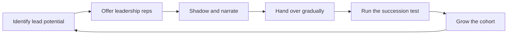

# Growing Future Leaders

> **Core skill:** Building a leadership pipeline — spotting lead potential, delegating leadership work deliberately, and making succession a team property instead of a lottery.

## Why This Matters

A team with no one who can lead is a team that stops when its lead stops: the lead cannot take leave, cannot be promoted, cannot be ill. The tech lead who builds successors is not grooming a replacement — she is making the team's leadership a durable capability rather than a single point of failure.

Succession also answers the team's deepest career question: is there a seat above me, and can I grow into it? Teams that see leadership grown deliberately stay; teams that see leadership hoarded leave. The lead who grows future leaders multiplies her own options too — a team that can run without her is the precondition for her own next step.

## Identifying Lead Potential

Leadership potential shows up in behavior long before it shows up in titles. The lead watches for three clusters of evidence.

| Signal | What it looks like in practice | What it predicts |
|--------|-------------------------------|------------------|
| **Systems thinking** | Talks about the team's whole, not just the task; names second-order effects | Can design conditions, not just execute work |
| **Natural influence** | People come to them with problems; their suggestions get adopted without authority | Can move the team without the title |
| **Escalation judgment** | Knows when a problem is theirs, when it needs the lead, and when it needs the EM | Can handle the lead's hardest decisions |
| **Growth instinct** | Explains things so others get better; celebrates others' wins genuinely | Will grow the team, not just themselves |

Potential is evidence, not vibes. The lead collects observations across months — who do people ask, whose designs get referenced, who noticed the problem nobody assigned? The identification is a lens for allocation, never a verdict whispered in a hallway.

## Delegated Leadership Opportunities

Potential grows through leadership reps. The lead hands out leadership-shaped work the way growth work is handed out — deliberately, with support, and on a ladder of size.

| Opportunity | What it exercises | First rep | After several reps |
|-------------|-------------------|-----------|--------------------|
| Running rituals | Facilitation, time-boxing, decision capture | Running the retro | Running planning with the lead as backup |
| Leading a small initiative | Scoping, sequencing, stakeholder touchpoints | A two-week slice with a named outcome | A quarter-scale initiative with a stakeholder |
| Representing the team | Speaking for the team with authority | Standing in at a leads sync | Owning a stakeholder relationship |
| Incident command | Calm, judgment, communication under pressure | Shadowing the incident lead | Commanding a real incident with a coach |
| Mentoring | Growing others, giving feedback | Co-mentoring a junior with the lead | Owning a mentorship with quarterly review |

The rule: each opportunity has a named outcome, a support structure, and a debrief. Leadership reps without debriefs are just chores; with debriefs they are a curriculum.

## Shadowing Programs

Shadowing is the cheapest leadership development that exists: the future leader watches the lead think in real situations, and the lead narrates her own judgment.

| Shadowing mode | How it works | What it transfers |
|----------------|--------------|-------------------|
| Meeting shadowing | The engineer attends with the lead and debriefs after | How decisions are made in rooms, not just in docs |
| Decision shadowing | The lead narrates a real decision as she makes it | The trade-off reasoning behind the choice |
| Crisis shadowing | The engineer is in the room during an incident or escalation | Composure and judgment under pressure |
| Role shadowing | The engineer takes the lead's calendar for a day | What the lead actually does, hour by hour |

The lead's narration is the whole value: decisions that look obvious from outside are revealed as judgment calls, and the shadow learns that leadership is a set of moves, not a talent.

## Gradual Handover of Responsibilities

Succession is a process, not an event. The lead hands over responsibilities one at a time, each with the rung, the net, and the review — until the handover is complete and the lead is genuinely redundant for the transferred piece.

| Handover stage | What the lead does | What the future leader does |
|----------------|--------------------|-----------------------------|
| Shadow | Does the work, narrates the thinking | Watches, asks, debriefs |
| Pair | Does the work together | Contributes decisions, takes half |
| Lead with net | Watches, advises at checkpoints | Owns the work with named support |
| Own | Is informed, not involved | Owns fully; escalates only the exceptional |
| Handed over | Reviews at the cadence, no longer day to day | Runs it; the team looks to them |

The lead's discipline: once a responsibility is handed over, it stays handed over. Re-taking it, even kindly, teaches the team that handovers are reversible — and the next handover will be resisted.

## The Succession Test

The test for succession is brutally simple: can the team run without the lead for two weeks? Not forever, not perfectly — two weeks, with the current systems.

| Level of readiness | What it means | What remains |
|--------------------|---------------|--------------|
| The team stalls | No one holds the lead's context or authority | The succession work has barely started |
| The team copes | Work continues; decisions defer to the lead's return | A caretaker exists, not a leader |
| The team runs | Decisions get made, escalation works, rituals happen | Only the exceptional waits for the lead |
| The team improves | Someone grows the team in the lead's absence | The lead is no longer the ceiling |

The test is run deliberately — a planned two-week absence, with the successors briefed and the debrief structured afterward. A lead who has never tested the team's ability to run without her does not know whether she has built successors or comfort.

## Growing Multiple Leaders Not One

A pipeline of one is a bus factor with a title. The lead grows several candidates so that the team's leadership does not depend on a single anointed person.

| Why several | What it prevents |
|-------------|------------------|
| The single candidate leaves or declines | The pipeline is empty and the lead starts from zero |
| The candidate is not actually ready | There is no alternative; the team promotes someone unready |
| The candidate becomes the lead | The second-leader gap appears immediately |
| Comparison and rivalry | Competition is natural; a cohort channels it into growth |

A cohort also gives the lead honest feedback: if only one person shows potential, the conditions may be selecting for one — and the fix may be in the team's structure, not in the people.

## The Succession Anti-Patterns

| Pitfall | Why It Is a Problem | Better Approach |
|---------|---------------------|-----------------|
| The anointed heir | The team stops developing everyone else; the heir gets entitlement | Grow a cohort; the role is earned by evidence |
| Leader-as-threat | The lead sees successors as rivals and quietly blocks them | The lead's growth is measured by the successors she produces |
| Zero-sum promotion thinking | One promotion reads as everyone else's loss | Multiple candidates, honest feedback, several directions |
| Succession as a secret | The team never knows a path exists, so it never walks it | Name the path and the evidence, openly |
| Handover by abandonment | The successor gets the role and no net | Gradual handover with support until it is genuinely owned |
| The two-week test never run | The lead believes succession exists without evidence | Run the absence deliberately, debrief honestly |

## The Succession Flow



## Practical Applications

**Build the team's leadership pipeline with this checklist:**

- [ ] Watch the three evidence clusters: systems thinking, influence, escalation judgment
- [ ] Give every candidate leadership reps with debriefs
- [ ] Run shadowing with narration — meetings, decisions, crises
- [ ] Hand over responsibilities one at a time, and never retake them
- [ ] Run the two-week absence test deliberately, with a structured debrief
- [ ] Grow a cohort of candidates, not one anointed heir
- [ ] Name the path to leadership openly, with its evidence
- [ ] Review the pipeline quarterly: who is growing, who has plateaued

**Handover plan template:**

```markdown
# Handover — [responsibility]

From: [lead] | To: [candidate] | Date: [date]

## What is being handed over
[The outcome, decisions, and relationships involved]

## Stage plan
1. Shadow: [duration] — the lead narrates
2. Pair: [duration] — shared decisions
3. Lead with net: [duration] — checkpoints [list]
4. Own: [date] — the lead is informed, not involved

## Safety net
[Review gates, escalation path, who catches what]

## Success check
[What it looks like when the handover is truly complete]

Review: [date]
```

## Common Pitfalls

| Pitfall | Why It Is a Problem | Better Approach |
|---------|---------------------|-----------------|
| Anointed heir | Everyone else stops growing; the heir is entitled | A cohort, with the role earned by evidence |
| Leader-as-threat | The lead blocks the pipeline to protect her seat | Measure the lead by the leaders she produces |
| Zero-sum thinking | One promotion reads as losses for the rest | Multiple candidates and honest, individual paths |
| Secret succession | The team cannot walk a path it cannot see | Name the path and the evidence openly |
| Abandonment handover | The successor gets the role with no net | Gradual handover, support until genuinely owned |
| Test never run | Succession is believed but never proven | Planned absence, structured debrief |

## Success Indicators

- The team runs a planned two-week absence without the lead, including decisions
- Multiple candidates hold leadership reps with visible growth
- Handed-over responsibilities stay handed over, with the team looking to the new owner
- Candidates debrief their reps and can name what they learned
- The path to leadership is open knowledge, with evidence the team understands
- The lead's own next step is possible because the team no longer needs her day to day

## Related Topics

- [[02_Growing_Engineers_at_Levels]]: the senior-plus tier is where the pipeline begins
- [[05_Delegation_and_Trust]]: handovers run on delegation rungs and safety nets
- [[01_Work_Allocation_as_Development]]: leadership reps are growth work allocated deliberately
- [[01_The_Tech_Lead_Role_and_Operating_Model/00_overview|The Tech Lead Role and Operating Model]]: the mandate the future leader is growing toward
- [[career-path/11_Engineering_Manager/00_overview|Engineering Manager]]: the neighboring seat the pipeline can also feed

## Summary

Growing future leaders is the lead's compounding investment in the team's durability. Identify potential by evidence, offer leadership reps with debriefs, shadow with narration, hand over gradually without retaking, run the two-week test, and grow a cohort rather than an heir. A team with a pipeline is a team that can run without its lead — and a lead who built that team has already earned her own next step.
