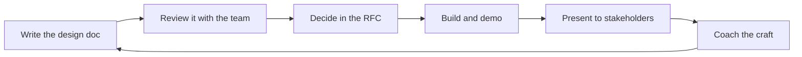

# Team Technical Communication

> **Core skill:** Raising the team's written and spoken technical voice — design doc norms, RFC culture, demo culture, and stakeholder presence, coached as a team standard rather than a personal talent.

## Why This Matters

A team's influence is bounded by its ability to communicate. The best design in the company persuades nobody if its rationale cannot be written; the best engineers in the company are invisible if they cannot present. The tech lead's job is to make strong technical communication a team property — norms, templates, review flows — instead of a gift that some people happen to have.

Communication is also how the team's work becomes legible to the rest of the organization. Teams that communicate well get asked for harder problems, get their trade-offs respected, and get their ideas adopted. Teams that do not are perpetually explained by someone else — usually the lead, which is exactly the dependency this area exists to break.

## Design Doc Norms

Design docs are the team's primary written instrument. The lead establishes the norm: a template, a review flow, and an expectation that significant work starts with a doc.

| Norm element | What it looks like |
|--------------|---------------------|
| A template | Context, goals and non-goals, options considered, decision, risks — in that shape |
| Proportionality | A one-page doc for a small change; a deep doc for a system decision |
| Review flow | The doc is reviewed before the code, by named reviewers, in the repo |
| Living status | The doc records its decision and its updates, dated |
| The bar | Every doc states what was rejected and why, so future teams do not re-litigate |

The lead's rule: if a change will outlive its author or affect more than one person's code, it starts with a design doc. The doc is the cheapest place to find the design's flaws — far cheaper than the code review, and vastly cheaper than production.

## RFC Culture

Beyond individual docs, the team needs a channel for proposals that shape shared direction. RFCs make technical disagreement productive and decisions durable.

| RFC practice | How it works |
|--------------|--------------|
| Propose in writing | A short proposal: the problem, the options, the recommendation |
| Comment on the document | Discussion happens in threads on the proposal, not in meetings |
| Decide on a date | The proposal has a decision deadline; no zombie RFCs |
| Record the outcome | Accepted, rejected, or merged — with the reason, stored with the proposal |

The RFC culture's test: can a proposal that divided the team be found, six months later, with its decision and its reasoning? If yes, the team argued well and remembers the argument. If no, the team will re-argue the same question forever.

## Demo Culture

Demos are the team's proof mechanism: working software, shown, on a cadence. The lead builds a demo culture where showing is normal, early, and safe.

| Demo practice | What it establishes |
|---------------|---------------------|
| Working software on a cadence | The team ships demos every cycle, not at milestones |
| Early and rough is welcome | A half-working slice shown early beats a polished surprise later |
| The builder presents | The engineer who built it owns the story of it |
| Questions are the point | Demos exist to surface mismatches while they are cheap |
| Demos to stakeholders | The team practices translating work into outcomes |

Demo culture is the antidote to two failure modes: the team that talks forever and never shows, and the team that shows everything only when it is finished. Both are avoided by making the demo a rhythm, not a reveal.

## Written Updates

Most team communication is asynchronous, which means most team communication is written. The lead sets the standard for updates that can be read fast and trusted.

| Standard | What it looks like |
|----------|--------------------|
| One-line status first | The conclusion before the detail |
| Evidence with claims | Numbers, links, and examples behind every statement |
| Owner and next step | Every update ends with who does what next |
| Plain language | The update is readable by a stakeholder who has not lived the week |
| Written once, read many | Updates live where they can be found, not in disappearing threads |

The lead's coaching target: an engineer's written update should let a reader answer three questions in ten seconds — what happened, what it means, what happens next.

## Presenting to Stakeholders as a Growth Assignment

Presenting is a leadership skill, and it grows the same way everything else does: by doing it with a net. The lead allocates stakeholder exposure deliberately.

| Assignment | Support structure | Growth outcome |
|------------|-------------------|----------------|
| Presenting the demo | Rehearsal with the lead, feedback after | Owning the story of the work |
| Owning a stakeholder update | A prepared structure, the lead in the room | Translating work into outcomes |
| Defending a design decision | Pre-brief on the likely questions | Holding a position under challenge |
| Running a cross-team sync | The counterpart map and a standing agenda | Representing the team with authority |

The rule from allocation applies here too: the lead stops being the default voice. Every presentation the lead gives solo is a growth moment the team did not get.

## Review and Coaching of Team Writing and Presentations

Communication quality improves fastest when it is reviewed the way code is — with feedback tied to specifics, given by someone who wants the person to win.

| Coaching move | What it looks like |
|---------------|--------------------|
| Review the draft, not the person | Feedback on the structure and evidence, not the grammar personality |
| One thing to improve | One concrete change per review beats a list of nits |
| Show the standard | A well-written doc used as a model, with why it works |
| Debrief the room | After a presentation: what landed, what to change next time |
| Feedback in the flow | Coaching happens on the real artifact, in the repo, not in a class |

The lead's stance: communication coaching is part of reviewing work, not a separate kindness. A design doc that arrives unclear gets returned with the same seriousness as code that fails review — and the standard is the same for everyone.

## Communication as a Team Standard

Strong communication is not a talent the team happens to contain; it is a standard the team holds for itself. The lead makes the standard visible and shared.

| Standard element | How the lead holds it |
|------------------|-----------------------|
| Templates and formats | The norm is written down and used by everyone |
| Review expectations | Docs and demos are reviewed to the same bar as code |
| Growth rotation | Visibility rotates; coaching follows the rotation |
| No lead monopoly | The lead is one voice among the team's, not the only one |
| The bar applies to the lead | The lead's own writing and presenting is reviewed too |

The test of the standard: when the lead is absent, does the team's communication quality hold? If the team's docs, demos, and updates degrade without the lead, the standard was the lead's personal talent — and the work of making it a team property is not done.

## The Communication Flow



## Practical Applications

**Raise the team's technical voice with this checklist:**

- [ ] Publish the design doc template and the proportionality rule
- [ ] Require docs before significant code, reviewed in the repo
- [ ] Run RFCs with comments, decision dates, and recorded outcomes
- [ ] Demo working software every cycle, presented by the builder
- [ ] Standardize written updates: status first, evidence, owner, next step
- [ ] Allocate stakeholder presentations with rehearsal and debrief
- [ ] Return unclear docs with the same seriousness as failing code
- [ ] Check the standard quarterly: does communication hold without the lead?

**Design doc template:**

```markdown
# [Title] — Design Doc

Status: [draft / in review / decided] | Date: [date] | Author: [name]

## Context
[The problem and why it matters, in a paragraph]

## Goals and Non-Goals
Goals: [what this design must achieve]
Non-goals: [what this design explicitly does not do]

## Options Considered
1. [Option] — [trade-offs]
2. [Option] — [trade-offs]

## Decision
[The choice and the reasoning]

## Risks and Mitigations
[What could go wrong and what catches it]

## Open Questions
[What still needs an answer, and by whom]
```

## Common Pitfalls

| Pitfall | Why It Is a Problem | Better Approach |
|---------|---------------------|-----------------|
| Lead as sole spokesperson | The team's voice never develops; the lead is the dependency | Rotate visibility with coaching |
| Docs nobody reads | Writing becomes ritual; the team trusts memory instead | Proportionate docs, reviewed in the flow of work |
| Demo theater | Polished reveals replace honest early showing | Demo early and rough, on a cadence |
| Zombie RFCs | Proposals hang forever; the team decides by inertia | Decision dates and recorded outcomes |
| Feedback as personality | Writers cannot act on vague impressions | Concrete feedback on structure and evidence |
| The standard as personal talent | Communication quality dies with the lead's attention | Templates, review bars, and rotation the team owns |

## Success Indicators

- Significant changes start with design docs that get reviewed before code
- RFCs close with decisions that are findable months later
- Demos happen every cycle, presented by the builders, early enough to matter
- Written updates answer what happened, what it means, and what is next in ten seconds
- Stakeholder exposure rotates with coaching, and the team holds its own
- The team's communication quality holds when the lead is out of the room

## Related Topics

- [[04_Knowledge_Management_and_Documentation]]: design docs and RFCs are the written knowledge base
- [[03_Team_Learning_Structures]]: talks and demos are also team learning formats
- [[01_Work_Allocation_as_Development]]: visibility moments are growth work allocated deliberately
- [[03_Technical_Direction_and_Architecture/00_overview|Technical Direction and Architecture]]: design communication is how technical direction becomes collective
- [[career-path/02_Senior_Software_Engineer/06_Communication_and_Influence/00_overview|Communication and Influence (Senior)]]: the personal communication skills this area organizes at team scale

## Summary

Team technical communication is a standard the lead builds: design doc norms, RFC culture, demo rhythm, crisp written updates, and stakeholder presence allocated as growth work — all coached and reviewed to the same bar as code. When the team's voice holds without the lead in the room, communication has become a team property, and the lead's monopoly is finally broken.
