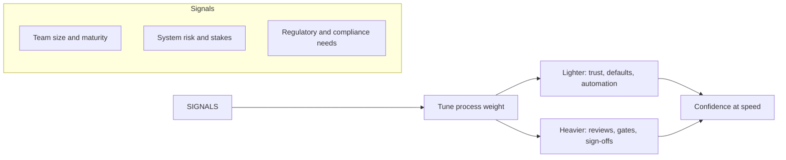

# Process and Quality Stewardship

> **Core capability:** The tech lead owns how the team works — its workflow, its definition of done, its engineering practices — and tunes both process and quality systems to the team's context, not to a textbook.

## Why This Matters

Process is not bureaucracy; it is the team's accumulated memory of how to work without re-arguing everything. Quality systems are not ceremony; they are how a team ships confidently at speed. Both decay in two directions: **rot** (nobody follows the process anymore) and **calcification** (everyone follows it, but it no longer fits).

The tech lead is the steward: watching how work actually flows, keeping the definition of done honest, keeping the practice set proportionate to risk, and changing the process deliberately when the context changes — new people, new system, new stakes.

## Topics in This Capability Area

| Topic | Core Skill | When It Matters |
|-------|------------|-----------------|
| [[01_Team_Workflow_Design]] | Choosing and evolving the team's way of working | Team formation, dysfunction signals, growth |
| [[02_Definition_of_Done_and_Working_Agreements]] | Keeping quality agreements explicit and honest | Every story; every review |
| [[03_Test_Strategy_Leadership]] | Leading the team's test strategy, not just writing tests | Coverage debates, flaky suites, release confidence |
| [[04_Code_Review_Standards]] | Running review as a quality and teaching system | Every PR; review culture drift |
| [[05_Quality_Gates_and_Automated_Checks]] | Deciding what CI enforces vs what humans judge | Pipeline design, gate disputes, velocity pressure |
| [[06_Continuous_Improvement_Rhythm]] | Running retrospectives that actually change things | Every retro cycle; repeated issues |
| [[07_Scaling_Process_with_Team_Growth]] | Adapting process as the team and system grow | New engineers, team splits, multi-team work |

## Process Fits Context

Process weight is a dial the tech lead turns deliberately — never a fixed inheritance.

## What Changes from Senior to Tech Lead

| Activity | Senior engineer | Tech lead |
|----------|-----------------|-----------|
| Testing | Writes great tests for own work | Owns the team's test strategy and its ROI |
| Code review | Reviews thoroughly, teaches authors | Sets review standards and runs the culture |
| Retrospectives | Participates honestly | Runs them; owns the follow-through |
| Definition of done | Follows it | Negotiates it; keeps it honest |
| Process | Suggests improvements | Changes the system; owns the result |

## Practical Applications

### Process and Quality Checklist

- [ ] The team can describe its workflow and why it fits the current context
- [ ] The definition of done is written, team-authored, and actually applied
- [ ] Test strategy allocates effort by risk, with a flaky-test policy in force
- [ ] Review standards define turnaround, depth, and assignment expectations
- [ ] Every quality gate is fast, trustworthy, and justified — or removed
- [ ] Retro actions are few, owned, dated, and tracked to closure
- [ ] Process weight was re-tuned the last time the team changed size

## Common Pitfalls

| Pitfall | Why It Is a Problem | Better Approach |
|---------|---------------------|-----------------|
| **Cargo-cult process** | Ceremonies nobody can justify; ritual without effect | Every practice must earn its place — say the why |
| **Quality theater** | Gates that pass everything; coverage that covers nothing | Measure outcomes: escapes, confidence, speed |
| **Retro fatigue** | Problems named repeatedly, never fixed | Fewer actions, real owners, visible follow-up |
| **One-size process** | Startup ceremony on a prototype; enterprise trust on a bank | Tune weight to stakes and maturity |

## Success Indicators

- The team can explain why each practice exists — and what would have to change to drop it
- Quality gates catch real problems; humans spend judgment where it matters
- Retros produce fewer, completed actions instead of many, forgotten ones
- New engineers follow the team's way of working without being told

## Related Capabilities

- [[04_Team_Delivery_and_Execution_Leadership/00_overview|Team Delivery and Execution Leadership]]: process is how delivery stays reliable
- [[03_Technical_Direction_and_Architecture/00_overview|Technical Direction and Architecture]]: standards become real through the practices here
- [[02_System_Ownership_and_Production_Responsibility/00_overview|System Ownership and Production Responsibility]]: quality systems protect the system the team owns
- [[career-path/10_Quality_and_Test_Engineering/00_overview|Quality and Test Engineering]]: the specialist path for depth in test strategy

## Summary

Process and quality stewardship means owning how the team works: a workflow that fits, a definition of done that means something, a test and review system scaled to real risk, and an improvement rhythm that changes things. The steward's test: practices earn their keep, and everyone knows why they exist.
