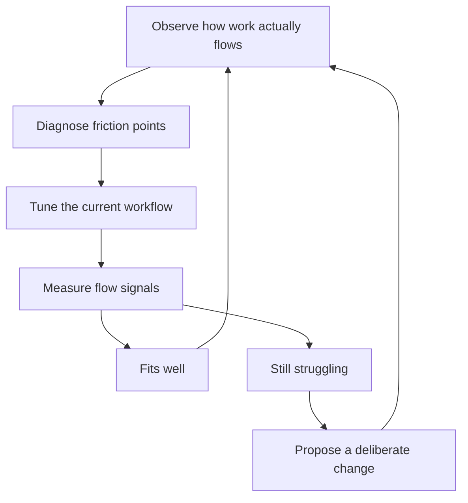

# Team Workflow Design

> **Core skill:** Choosing and evolving the team's way of working so work flows smoothly, ownership is clear, and process weight fits the team's context.

## Why This Matters

A workflow is not a ceremony; it is the team's operating system for converting intent into shipped work. When it fits, work moves visibly, people know what to pick up next, and quality checks happen at natural points. When it does not fit, the team experiences pileups, thrash, and invisible work — and no amount of individual effort fixes a broken flow.

The tech lead owns the team's workflow the way an architect owns the system: the default is not to switch frameworks, but to understand why the current one is straining, tune it, and change it deliberately only when the evidence says the context has changed. This note covers the main workflow options, how to diagnose dysfunction, and how to change the way of working without losing the team's trust.

## Workflow Options and Fit

| Workflow | Core Mechanics | Best Fit | Signals It Fits |
|----------|----------------|----------|-----------------|
| **Kanban** | Continuous pull, WIP limits per column, no fixed iterations | Support and ops work, unpredictable flow, mature stable team | Work items are small; priorities change weekly |
| **Scrum (fixed sprints)** | Time-boxed iterations, planning and review ceremonies, committed scope | Product work with predictable themes, stakeholder cadence needs | The business expects regular demos and estimates |
| **Shape-up-like** | Six-week appetite cycles, no backlog during cycle, bet-based selection | Small senior teams shipping bold features; strong autonomy | The team is senior; the org tolerates no-backlog style |
| **Continuous flow with milestones** | No iteration boundary; work ships when ready; milestones for coordination | Platform and infrastructure work, migration-heavy periods | Work varies wildly in size; dates matter more than sprints |

The choice is rarely "the right methodology" — it is the least-wrong fit for the team's size, the work's shape, and the stakeholders' needs. A team can also run a hybrid: kanban for support flow inside a sprint rhythm for feature work.

## Choosing by Context

| Context Factor | Lean Toward | Reason |
|----------------|-------------|--------|
| Small team, 3-4 engineers | Lighter ceremonies, continuous flow | Ceremony overhead per person is high; trust carries more |
| External stakeholder cadence | Fixed iterations with demos | Predictable touchpoints protect the team from ad hoc asks |
| Many small urgent items | Kanban with strict WIP limits | Sprints get shattered by interrupts; pull-based flow absorbs them |
| Long technical initiatives | Milestones, not story points | Big work does not fit sprint boxes; fake estimates are worse than none |
| New team or many juniors | More structure, explicit definitions | Structure is scaffolding while norms are still being built |



## Diagnosing Workflow Dysfunction

| Symptom | Likely Cause | Diagnostic to Run |
|---------|--------------|-------------------|
| WIP pileups in one column | Column has no WIP limit; handoff bottleneck | Count items per column weekly; find the widest queue |
| Stale columns nobody touches | Ceremony survived its purpose | Ask the team what the column means; delete it if nobody can say |
| Thrash: stories re-scoped mid-flight | Scope enters too early; no spec bar | Track how many stories change after first commitment |
| Everything is urgent | No prioritization authority | Check who decides priority; make it one owner with a visible list |
| Work finishes but never releases | Done means code, not shipped | Redefine done to include deployed and verified |
| Meetings multiply | Process compensating for poor async communication | Audit meeting hours vs decision throughput |

## Introducing Workflow Change Without Mutiny

1. **Name the problem with data** — show the pileup graph or the thrash count before proposing anything.
2. **Propose a small experiment, not a new religion** — "two weeks with a WIP limit of three" beats "we are now doing kanban."
3. **Make the change reversible** — agree on the review date and the exit condition up front.
4. **Change one variable at a time** — workflow plus roles plus tooling in one go makes the cause of improvement unknowable.
5. **Let the team own the proposal** — the tech lead frames the trade-offs; the team chooses the option.
6. **Celebrate the evidence** — when the experiment works, say what the numbers showed before and after.

## Working Agreements

Explicit agreements are the workflow's constitution — the few rules the team holds each other to:

- **Pull policy:** who may pull work into the active column, and what must be true for it to be pullable.
- **Definition of ready:** what a story needs before it enters active work (acceptance criteria, dependencies resolved).
- **Update cadence:** what gets updated in the tracker daily, and what lives only in chat.
- **Interrupt policy:** how urgent asks enter the flow without shattering the WIP limits.
- **Escalation path:** what to do when the workflow itself is the blocker.

## When Process Weight Should Increase or Decrease

| Direction | Trigger | What to Add or Remove |
|-----------|---------|-----------------------|
| Increase | New juniors joining; incidents from missed checks | Explicit checklists, review gates, definition of ready |
| Increase | Regulatory or audit requirements | Sign-offs, evidence trails, change records |
| Decrease | Team is senior and flow is smooth | Drop redundant ceremonies, raise trust, automate the checks |
| Decrease | Ceremony time exceeds decision time | Cut meetings, merge roles, simplify the board |
| Increase | Repeated escapes or miscommunication | Add the one checkpoint that would have caught it — nothing more |

## Workflow Metrics That Inform Tuning

| Metric | What It Tells You | Action When It Degrades |
|--------|-------------------|-------------------------|
| Cycle time (start to done) | How long work really takes | Look for handoff delays and WIP limits too loose |
| Throughput per week | Team's sustainable capacity | Compare to commitments; stop overloading |
| WIP count | How much is half-done | Tighten limits; finish before starting |
| Age of oldest item | Stale work rotting in the flow | Explicit decision: kill, shrink, or reprioritize |
| Release lag (done to shipped) | Whether done means shipped | Fix the release path; treat it as flow, not ceremony |

## Practical Applications

**Run a workflow audit with your team:**

- [ ] Draw the current board and label what each column means to someone new
- [ ] Count items per column for the last four weeks; identify the widest queue
- [ ] Measure the average age of items in each column
- [ ] Ask the team: which meeting or column would you cut if you could?
- [ ] Pick one experiment (WIP limit, ready definition, dropped ceremony) with a review date
- [ ] Write the team's working agreements as a one-page doc

**Working agreements template:**

```markdown
# Working Agreements

## Pull Policy
- [ ] Work enters the active column only when the definition of ready is met
- [ ] WIP limit per engineer is [X]; new work waits, it does not stack

## Definition of Ready
- [ ] Acceptance criteria written and understood by the implementer
- [ ] Dependencies unblocked; no hidden handoffs

## Updates
- [ ] Tracker is the source of truth; chat is for discussion only
- [ ] Items are updated by end of day when their status changes

## Interrupts
- [ ] Urgent asks route through [person or channel] and get a triage decision within [time]

## Review
- [ ] This document is revisited at every retrospective; changes are deliberate
```

## Common Pitfalls

| Pitfall | Why It Is a Problem | Better Approach |
|---------|---------------------|-----------------|
| **Cargo-cult methodology** | Ceremonies run on habit, not fit; the team stops believing in them | Every practice must have a stated purpose and a drop condition |
| **Changing workflow during a crisis** | The team learns a new system while already overloaded | Stabilize first; change the workflow when the smoke clears |
| **WIP limits that are ignored** | The board lies; nobody trusts the flow data | Enforce limits gently but consistently, or remove them |
| **Designing workflow solo** | The team resists what it did not shape | Bring the trade-offs; let the team pick the option |
| **Optimizing for the tracker, not the work** | Statuses and fields multiply; real flow is hidden | Measure flow, not board hygiene |
| **Process weight creeping up** | Every complaint adds a rule; the system calcifies | Removing a rule must be as easy as adding one |

## Success Indicators

- Anyone on the team can explain why the workflow is shaped the way it is
- Work items move from start to done without unexplained pauses
- The team can name the current experiment and its review date
- Cycle time and WIP are stable or improving over the quarter
- New joiners learn the way of working within their first two weeks
- The team changes the workflow when evidence says so — not when fashion does

## Related Topics

- [[02_Definition_of_Done_and_Working_Agreements]] — the quality contract every work item must meet in the flow
- [[06_Continuous_Improvement_Rhythm]] — the rhythm that tunes the workflow continuously
- [[07_Scaling_Process_with_Team_Growth]] — how the workflow must change as the team grows
- [[04_Team_Delivery_and_Execution_Leadership/00_overview|Delivery and Execution Leadership]] — the delivery loop this workflow exists to serve
- [[career-path/11_Engineering_Manager/00_overview|Engineering Manager]] — the adjacent role that owns process at the org level

## Summary

Team workflow design is the tech lead's way of making good work habits structural: choose a workflow that fits the team's size, work shape, and stakeholders; watch the flow signals; diagnose dysfunction with data rather than opinion; and change the system through small, reversible, team-owned experiments. A workflow that fits is invisible — the team notices only when it stops fitting, and the lead's job is to notice before they do.
