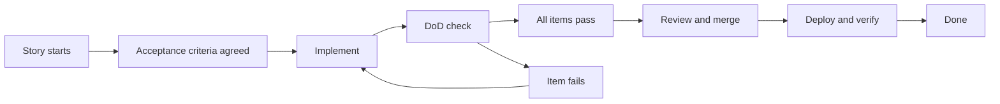

# Definition of Done and Working Agreements

> **Core skill:** Keeping the team's quality contract explicit, honest, and renegotiated — so done means done, every time.

## Why This Matters

"Done" is the most expensive word in software. When it means different things to different people, code merges without tests, features ship without observability, and the first time the team learns a story was not actually done is when production breaks. A Definition of Done (DoD) is the team's shared answer to "what must be true before this work counts as finished" — the quality contract that makes review arguments unnecessary.

The tech lead does not write the DoD alone and hand it down. The team must author it, because a contract the team believes in is enforced by the team; a contract imposed from above is enforced by nobody. And the DoD is not permanent: as the team matures, the system changes, and the stakes change, the contract must be renegotiated deliberately. This note covers building the DoD, extending it by story type, spotting drift, and the working agreements that sit beside it.

## The DoD as a Quality Contract

A good DoD is short, checkable, and team-authored. It applies to every story and creates a single standard: no negotiation per PR, no "this is just a small change" exceptions.

| Property | Why It Matters |
|----------|----------------|
| **Team-authored** | People enforce contracts they helped write |
| **Checkable** | Each item is a yes/no question, not a vibe |
| **Short** | Ten items is a wall; six is a contract |
| **Applied universally** | Exceptions for small changes are how erosion starts |
| **Visible** | Posted in the tracker, the repo, and the PR template |

## Building a Team-Authored DoD

Run a working session where the team answers: "What has to be true for you to sleep well after this ships?"

- [ ] Code reviewed and approved by someone other than the author
- [ ] Automated tests written or updated for the change
- [ ] Full test suite green on the branch
- [ ] Documentation touched where behavior changed
- [ ] Observability added: logs, metrics, or tracing for the new path
- [ ] Security check done for changes touching auth, data, or inputs
- [ ] Rollback or feature-flag path confirmed for the change
- [ ] Manual verification done on a realistic environment

Then cut the list to the items the team genuinely cannot ship without. Each item needs an owner of the standard (the person who notices when it is skipped) and a cost estimate — a DoD item nobody can afford is a DoD item that gets ignored.

## Per-Story-Type DoD Extensions

The base DoD covers everything; certain story types need extra items because their failure modes differ.

| Story Type | DoD Extensions | Why |
|------------|----------------|-----|
| **Feature** | Acceptance criteria demonstrated; feature-flag plan; metrics for the feature | A feature without measurement is a guess |
| **Bug fix** | Regression test that reproduces the bug; verification on the affected version | The bug's return should be impossible to miss |
| **Spike or research** | Written findings; recommendation; decision recorded | A spike is done when knowledge is captured, not when code is written |
| **Migration** | Before/after comparison data; rollback plan; cutover runbook | Migrations fail at the edges, not in the plan |
| **Dependency upgrade** | Upgrade in a staging-like environment first; changelog review; perf check | Upgrades break silently in corners tests never visit |

## DoD vs Acceptance Criteria

These two get confused constantly, and the confusion is costly.

| Aspect | Acceptance Criteria | Definition of Done |
|--------|---------------------|--------------------|
| Scope | One story | All stories, every time |
| Answers | Did we build the right thing? | Is it done to a quality standard? |
| Written by | Product owner or requester | The whole team |
| Content | Behavior: given/when/then | Practice: tested, reviewed, documented |
| Fails when | Behavior does not match the ask | Quality bar is not met |

A story can meet every acceptance criterion and still fail the DoD — correct feature, no tests, no observability. Both must be true before done.

## DoD Drift and Erosion Signals

| Signal | What Is Happening | Action |
|--------|-------------------|--------|
| "This is a small change" exceptions | The contract is being negotiated per story | Make exceptions visible and rare; log them |
| Reviewers only check logic | The DoD is no longer in the review template | Put the DoD in the PR template itself |
| Tests added after the merge | Done means merged, not verified | Move the check into the merge gate |
| New joiners ship without docs | The DoD lives in someone's head | Document it in the repo readme and onboarding |
| The DoD checklist is all ticks, always | The bar is too low to matter | Raise it; every item should occasionally hurt |



## Working Agreements Beyond the DoD

The DoD governs the work product; working agreements govern behavior. Keep both on one page.

| Category | Example Agreements |
|----------|--------------------|
| **Meeting norms** | Start on time; agenda in the invite; decisions recorded with owners |
| **Code norms** | Small PRs; author self-reviews before requesting; no silent rewrites after approval |
| **Communication norms** | Async first; blockers raised within hours, not at standup; channel for urgent items |
| **Review norms** | Reviews within one working day; comments are questions, not verdicts |
| **Failure norms** | Incidents reported to the team within the hour; postmortems are blameless |

## Renegotiating the DoD as the Team Matures

The DoD is a living contract with a review cadence:

1. **Review at every retrospective** — one question: is any item now noise, and is any escape now possible?
2. **Add items when escapes happen** — a production incident caused by missing observability is the strongest possible argument for adding an observability item.
3. **Remove items when they become automation** — when a linter enforces what the DoD used to ask by hand, the item moves from the checklist to the pipeline.
4. **Escalate the bar with maturity** — a team that never misses can raise the bar; a team drowning in process should lower it.
5. **Renegotiate, never silently drift** — every change to the contract is a deliberate team decision, recorded.

## Practical Applications

**DoD renegotiation workshop:**

- [ ] Print the current DoD and mark each item: always true, sometimes true, never checked
- [ ] List the last three production escapes and ask: which DoD item would have caught them?
- [ ] Ask each engineer for the one item they would add and the one they would cut
- [ ] Agree the new DoD, post it in the repo, and put it in the PR template
- [ ] Decide the review date for the new contract
- [ ] Add the DoD to onboarding so new joiners see it before their first PR

**DoD one-pager template:**

```markdown
# Definition of Done

Every story, bug, and task counts as done only when ALL of these are true:

- [ ] Code reviewed and approved by another engineer
- [ ] Tests written or updated; full suite green
- [ ] Documentation updated where behavior changed
- [ ] Observability added for the changed path
- [ ] Security check completed for auth, data, or input changes
- [ ] Rollback or feature-flag path confirmed
- [ ] Verified on a realistic environment

## Story-Type Extensions

| Type | Extra Items |
|------|-------------|
| Feature | Criteria demonstrated, metrics defined |
| Bug | Regression test, version verified |
| Migration | Rollback plan, before/after data |
| Spike | Findings written, decision recorded |

## Renegotiation

This contract is reviewed every retrospective. Changes are deliberate and recorded.
```

## Common Pitfalls

| Pitfall | Why It Is a Problem | Better Approach |
|---------|---------------------|-----------------|
| **DoD as a poster** | Written once, hung on a wall, followed by nobody | Put the DoD in the PR template and the merge gate |
| **DoD written by the lead** | The team finds excuses because the contract is not theirs | Facilitate the session; let the team author the list |
| **DoD creep** | Thirty items means everything is optional | Keep it short; the test is whether every item is checked |
| **DoD and acceptance criteria conflated** | Quality and behavior get negotiated in the same argument | Keep them separate; both must pass |
| **Erosion by exception** | Small changes skip items until skipping is normal | Exceptions must be visible, rare, and logged |
| **Static contract** | The DoD never changes as the team matures | Review it every retrospective and after every escape |

## Success Indicators

- Any team member can recite the DoD without looking it up
- PR templates and merge gates reference the DoD automatically
- "Done" means the same thing to the author, the reviewer, and the stakeholder
- Escapes from the last quarter map to missing DoD items that were then added
- New joiners ship their first change through the full DoD without being reminded
- The DoD has changed at least once this quarter — deliberately

## Related Topics

- [[01_Team_Workflow_Design]] — the workflow the DoD plugs into at every handoff
- [[05_Quality_Gates_and_Automated_Checks]] — automation that enforces DoD items without asking
- [[04_Code_Review_Standards]] — the review system that checks the DoD on every PR
- [[04_Team_Delivery_and_Execution_Leadership/00_overview|Delivery and Execution Leadership]] — done is the unit of delivery, so the contract shapes every commitment
- [[career-path/11_Engineering_Manager/00_overview|Engineering Manager]] — the org-level owner of team norms and standards

## Summary

The Definition of Done is the team's quality contract: short, checkable, team-authored, and applied to every piece of work without exception, extended by story type where failure modes differ, and kept distinct from acceptance criteria. Working agreements sit beside it governing behavior, and both must be renegotiated deliberately as the team matures — because a contract that cannot change becomes a ritual, and a ritual protects nothing.
