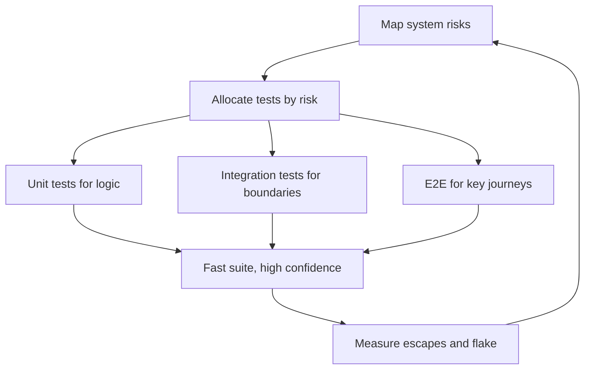

# Test Strategy Leadership

> **Core skill:** Leading the team's test strategy — shaping the pyramid, allocating tests by risk, and running flaky-test policy — so confidence per effort stays high.

## Why This Matters

Individual engineers write tests; the tech lead owns the system those tests form. Without strategy, test suites grow by accretion: thousands of slow unit tests that assert implementation details, a handful of flaky end-to-end tests that block every merge, and critical paths with no coverage at all. The team spends more time fighting the suite than trusting it — and the suite's credibility dies with its speed.

Test strategy is an investment problem: every test costs time to write, time to run, and time to maintain, and pays back in caught regressions and shipped confidence. The tech lead's job is to allocate that investment where the risk is, keep the suite fast and trustworthy, and make the team's testing practice deliberate instead of accidental. This note covers the test shape, risk-based allocation, flaky test policy, coverage conversations, and test data strategy.

## The Team Test Shape

The classic pyramid is a starting point, not a law. The right shape depends on the system's risk profile and how fast it must move.

| Layer | Typical Share | Purpose | Cost per Test | Keep in Mind |
|-------|---------------|---------|---------------|--------------|
| **Unit tests** | 60-80% | Verify logic in isolation | Low to write, low to run | They catch your bugs, not your integration |
| **Integration tests** | 15-30% | Verify components work together: database, APIs, boundaries | Medium | The highest value per effort for most systems |
| **End-to-end tests** | 5-15% | Verify user journeys through the real system | High to write, slow, flaky-prone | Keep to the few journeys that define the product |

For a data-heavy platform, integration tests should dominate; for a frontend with complex state, component-level tests matter more than a fat e2e layer. The shape follows the risk.

## Risk-Based Test Allocation

Tests earn their place by protecting against the failures that would hurt most. Allocate by asking three questions per area of the system:

| Question | Implication |
|----------|-------------|
| How much would a regression here cost? | Money paths, auth, and data integrity get deep coverage |
| How often does this area change? | Frequently changing code needs fast feedback tests, not slow ones |
| How hard is a bug here to detect in production? | Silent failure areas need tests; loud areas need monitoring |



## Shared Test Infrastructure Ownership

Test infrastructure — factories, fixtures, test databases, seeding tools, CI test runners — is a shared asset that dies without an owner.

| Asset | Owner Responsibility |
|-------|----------------------|
| Test data factories and fixtures | Kept current as schemas change; no hidden magic |
| Test environments | Reproducible, cheap, on-demand; nobody queues for a database |
| CI test runners | Fast, parallel, with clear failure output |
| Testing tools and frameworks | Upgraded deliberately; deprecations handled early |
| Test documentation | New joiners can write a test on day three |

Rotate ownership each quarter so no single person is the suite's hostage — but always have a named owner.

## Flaky Test Policy

Flaky tests are the fastest way to destroy the suite's trust. A test that fails for no reason teaches engineers to ignore failures — including real ones.

| Decision | When to Use | Notes |
|----------|-------------|-------|
| **Quarantine** | Flake identified but cause unknown, team is mid-delivery | Move to a skip list with an owner and a deadline; never leave it there |
| **Fix** | Root cause found; fix is under a day | Prefer fixing over deleting; the test was protecting something |
| **Delete** | The test's behavior is covered elsewhere, or the feature changed | Deleting honestly beats a permanently skipped test |
| **Rewrite** | The test is too slow or too coupled to details | Rewrite at the right level; do not just re-enable |

Policy in one line: no flaky test survives more than one sprint without a decision. Track flake rate per week; a rising rate is a strategy problem, not a test problem.

## Coverage Conversations

Coverage numbers are a floor, not a goal. The lead's job is to keep the conversation honest.

| Statement | Truth | What to Say Instead |
|-----------|-------|---------------------|
| "We have 90% coverage" | Coverage says nothing about what is asserted | "We have 90% of lines executed; here is what the tests assert" |
| "We must hit 80%" | A number with no risk basis invites coverage theater | "Here are the paths a regression would hurt; here is their coverage" |
| "Coverage is dropping" | Usually a symptom, not the problem | "New code is shipping without tests; which area, and why?" |
| "We need more e2e tests" | E2E is the most expensive way to raise confidence | "Which journey broke recently, and which test level missed it?" |

Use coverage to find untested risk areas, never as a merge criterion that rewards padding.

## Test Data Strategy

| Concern | Practice |
|---------|----------|
| Realism | Use production-shaped data for integration tests; synthetic for unit tests |
| Isolation | Each test owns its data; no shared mutable fixtures across tests |
| Speed | Seed once per suite where safe; reset per test where isolation matters |
| Secrets | Never real user data or credentials in test datasets |
| Versioning | Test data lives with the code, so schema changes update them together |

## Confidence per Effort as the Guiding Metric

The question that settles every testing debate: **for this amount of effort, how much confidence do we get?** A slow e2e suite that runs nightly gives less confidence per effort than integration tests that run in five minutes. The lead steers the team toward the tests that catch real regressions fast, and defends the suite's speed the way others defend uptime — because a suite the team doesn't run protects nobody.

## Practical Applications

**Test strategy review (run quarterly):**

- [ ] Draw the current test shape: count tests by level and measure total run time
- [ ] List the last three production bugs and identify which test level missed them
- [ ] Review the flake list: every flaky test has an owner and a date
- [ ] Check coverage on the top five risk areas, not the repo average
- [ ] Time the suite; set a target (for example, under ten minutes in CI)
- [ ] Decide one test-infrastructure improvement for the quarter and assign an owner

**Test strategy one-pager template:**

```markdown
# Team Test Strategy

## Shape
- Unit: [share] — fast logic checks
- Integration: [share] — boundaries, data, APIs
- E2E: [share] — [list the journeys protected]

## Risk Priorities
| Area | Risk | Test Level | Owner |
|------|------|------------|-------|
| [area] | [why a regression hurts] | [level] | [person] |

## Rules
- No flaky test survives more than one sprint without a decision
- New critical paths get tests in the same PR as the code
- Coverage targets apply to risk areas, not to the repo average

## Flake Policy
Quarantine with owner and deadline; fix if cheap; delete if redundant; rewrite if wrong level.
```

## Common Pitfalls

| Pitfall | Why It Is a Problem | Better Approach |
|---------|---------------------|-----------------|
| **Coverage theater** | Percentages are gamed; the suite asserts nothing | Review what tests assert, not how many lines they touch |
| **E2E everywhere** | Slow, flaky, expensive; the suite becomes the bottleneck | Push coverage down the pyramid; keep e2e for key journeys |
| **Flaky test tolerance** | Engineers learn to ignore red; real failures slip through | Strict policy: quarantine, fix, delete — with deadlines |
| **Testing by accretion** | Tests are added wherever someone remembered; gaps stay gaps | Map risk areas and allocate tests deliberately |
| **Test infra as afterthought** | Every engineer fights fixtures and environments | Name an owner; treat test infrastructure as a product |
| **Speed sacrificed silently** | The suite creeps to an hour; nobody runs it locally | Defend run time; it is the currency of confidence |

## Success Indicators

- The suite runs fast enough that engineers run it before every push
- Recent production bugs map to test gaps that were then closed
- Flake rate trends down; no flaky test is more than a sprint old
- Risk areas have deliberate coverage; the repo average is nobody's target
- New joiners write a passing test on their first change without help
- Testing debates end with confidence-per-effort, not with opinions

## Related Topics

- [[05_Quality_Gates_and_Automated_Checks]] — the pipeline that runs this strategy on every change
- [[04_Code_Review_Standards]] — where reviewers catch what tests miss
- [[02_Definition_of_Done_and_Working_Agreements]] — the contract that makes tests part of done
- [[career-path/10_Quality_and_Test_Engineering/00_overview|Quality and Test Engineering]] — the specialist path for depth in testing
- [[02_System_Ownership_and_Production_Responsibility/00_overview|System Ownership and Production Responsibility]] — testing serves the health of the system the team owns

## Summary

Test strategy leadership means treating the suite as a portfolio: shaped by the system's risk profile, allocated by what a regression would cost, kept fast and trustworthy by strict flaky-test policy, and steered by confidence per effort rather than coverage percentages. The tech lead does not write every test — they make the system in which good tests are easy to write, cheap to run, and impossible to ignore.
