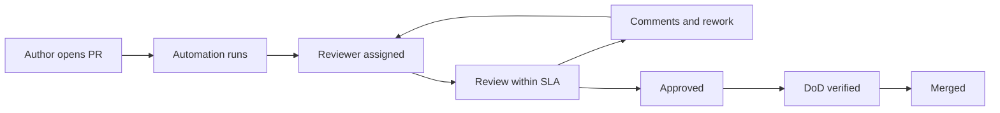

# Code Review Standards

> **Core skill:** Running code review as a team system — with SLAs, depth expectations, fair load, and teaching — so every PR is both a quality gate and a lesson.

## Why This Matters

Code review is the highest-leverage quality system a team has, because it catches what automation cannot: design mistakes, subtle logic errors, security smells, and operability problems. But review quality is not a property of individuals — it is a property of the system around them. Without standards, reviews are uneven: some PRs get a rubber stamp, others sit for days, and the same mistakes get explained to every new author separately.

The tech lead designs that system: how fast reviews happen, how deep they go, who reviews what, and how review comments teach rather than just correct. A review culture is also a teaching culture — the PR is where the team's standards are transmitted, one diff at a time. This note covers SLAs, depth, assignment, what humans must catch versus automation, load fairness, and review health metrics.

## Review as a Team System

| System Element | Standard It Needs |
|----------------|-------------------|
| **SLA** | A published target: first review within one working day |
| **Depth** | A shared understanding of what a review must check |
| **Assignment** | A rule for who reviews: round-robin, expertise, or pairing for learning |
| **Tooling** | Automation carries the mechanical checks; humans carry judgment |
| **Templates** | The PR template asks the questions reviewers should answer |
| **Escalation** | A path when a review stalls or a disagreement blocks merge |

The goal is that an author knows what will happen to their PR before they open it — the system is predictable, which makes it fair.



## Review SLAs

| PR Type | SLA | Notes |
|---------|-----|-------|
| **Normal change** | First review within one working day | Fast enough to keep flow; predictable enough to plan around |
| **Hotfix or incident fix** | Within the hour, with a named reviewer | Speed matters; pair the reviewer with the author if needed |
| **Large or architectural PR** | A scheduled review session, not async dribble | Book a slot; async review of a 2,000-line diff is theater |
| **Draft or early PR** | Review early on structure, not details | Early feedback is cheaper; say so in the draft |

## Review Depth Expectations

| Depth Tier | What the Reviewer Checks | When It Applies |
|------------|--------------------------|-----------------|
| **Triage** | Is the change sensible, scoped, and mergeable in shape? | Drafts, tiny changes, first-pass filtering |
| **Standard** | Correctness, tests, edge cases, naming, DoD items | Most PRs |
| **Deep** | Security, concurrency, data integrity, operability, rollback | Critical paths, auth, money, data migration |
| **Architectural** | Does this fit the system direction? Is it the right design? | Design-level changes; pair with a design review |

The depth tier is agreed between author and reviewer — an author can request a deep review, and a reviewer can insist on one. What is never acceptable is a review that only says "looks good."

## What Reviews Must Catch vs What Automation Should Catch

| Layer | Owned By | Examples |
|-------|----------|----------|
| **Formatting, lint, obvious smells** | Automation | Style, unused imports, trivial patterns |
| **Static correctness** | Automation first, humans confirm | Type errors, some null and bounds issues |
| **Semantic correctness** | Humans | Logic errors, wrong assumptions, off-by-one intent |
| **Security** | Humans plus scanners | Authorization holes, injection, secret handling |
| **Operability** | Humans | Logging, metrics, timeouts, retries, rollback path |
| **Design and maintainability** | Humans | Is this the right abstraction? Will the next change be easy? |
| **Test quality** | Humans | Do the tests assert the right things, or just cover lines? |

The rule: automation is the bouncer at the door; humans are the judges of what gets in. Reviewers who spend their time on formatting have already lost the review.

## Review Assignment Models

| Model | How It Works | Fit |
|-------|--------------|-----|
| **Round-robin** | Reviews rotate evenly through the team | Even load; broad awareness; can lack deep expertise |
| **Expertise-based** | The person closest to the area reviews | Best correctness; uneven load; silos deepen |
| **Rotation for learning** | Assign reviewers to stretch them into new areas | Grows the team; slower reviews; needs a safety net |
| **Pair or buddy system** | Each engineer has a designated review partner | Strong relationships; predictable; can drift into mutual approval |

Most teams need a blend: expertise for critical paths, rotation for growth, and a round-robin fallback for load balance. The lead watches both load and coverage — every area should have at least two people who can review it well.

## Teaching Through Reviews at Team Scale

- **Comments teach, not just correct:** "This pattern fails when X happens — here is the case that bit us" beats "use the helper."
- **Standard comments become documentation:** when the same explanation appears three times, write it in the contributing guide and link it.
- **Reviews are two-way:** the reviewer learns the author's area; the author learns the reviewer's standards.
- **Escalate patterns, not people:** a repeated class of issue goes to the retro and the standards doc, not into a list of grievances.
- **Pair on hard reviews:** a junior reviewing a security-sensitive change does it with a senior in the room, learning the questions to ask.

## Review Load Fairness

| Signal of Unfair Load | Fix |
|-----------------------|-----|
| The same two people review everything | Cap reviews per person per day; route by rotation |
| One person is the only expert on a critical area | Deliberately grow a second reviewer through pairing |
| Review time is invisible in planning | Count review as work; include it in capacity |
| Reviews happen at 11pm because the day is full | Protect review time; SLAs are a team commitment |
| Seniors review juniors but not vice versa | Rotate; everyone reviews, everyone learns |

## Measuring Review Health

| Metric | What It Tells You | Healthy Direction |
|--------|-------------------|-------------------|
| **First-response time** | Is the SLA real? | Median under one working day |
| **Review-to-merge time** | How long changes wait | Short and stable, not zero |
| **Rework cycles per PR** | Is feedback landing early? | Two or fewer for normal PRs |
| **Review density** | Are reviews substantive? | Comments that change code, not just style |
| **Escapes caught by review** | Does review catch what tests miss? | Track bugs found in review vs in production |
| **Review load distribution** | Is the system fair? | Even spread across the team |

## Practical Applications

**Review culture tune-up:**

- [ ] Measure first-response time for the last twenty PRs; compare to the SLA
- [ ] Audit ten recent reviews: did they check tests, operability, and design — or just logic?
- [ ] Publish the SLA and depth tiers where the team can see them
- [ ] Add the DoD checklist to the PR template
- [ ] Pick one repeated comment pattern and turn it into a doc or a lint rule
- [ ] Rotate review assignment for one sprint; measure the effect on load

**Review standards doc template:**

```markdown
# Code Review Standards

## SLAs
- First review within one working day
- Hotfix reviews within the hour, with a named reviewer

## Depth Tiers
| Tier | Scope | Applies To |
|------|-------|------------|
| Triage | Shape and scope | Drafts, tiny changes |
| Standard | Correctness, tests, DoD | Most PRs |
| Deep | Security, data, operability | Critical paths |
| Architectural | Design fit | Large changes |

## What Reviewers Must Check
- [ ] Correctness: does the logic do what the tests say it does?
- [ ] Tests: do they assert behavior, not lines?
- [ ] Operability: logging, metrics, rollback path
- [ ] Security: auth, data, inputs
- [ ] DoD: every item, every time

## What Automation Owns
Formatting, lint, type checks, trivial patterns. Reviewers do not comment on these.

## Norms
- Comments teach; they are questions and reasons, not verdicts
- Repeated feedback becomes a doc or a rule, not a personal record
- Reviews are work: counted in capacity, protected in the day
```

## Common Pitfalls

| Pitfall | Why It Is a Problem | Better Approach |
|---------|---------------------|-----------------|
| **Rubber-stamp reviews** | Merge is gated in name only; escapes ship | Define depth tiers; a review that adds nothing is not a review |
| **Bike-shedding** | Reviewers argue style while logic goes unexamined | Automation owns style; humans own correctness and design |
| **Review bottleneck** | One person gates everything; flow stalls | SLA plus rotation; the system must not depend on one reviewer |
| **Unfair load** | The willing few review everything and burn out | Track distribution; cap and rotate |
| **Nitpick culture** | Authors feel attacked; review becomes a hurdle | Teach in comments; separate must-fix from optional suggestions |
| **Review as gate, not lesson** | Same mistakes recur; learning never compounds | Capture repeated feedback in docs and pairing |

## Success Indicators

- Median first-response time meets the SLA every week
- Bugs found in review outnumber bugs found in production
- Every critical area has at least two people who can review it deeply
- Authors say review makes their code better, not just slower
- New joiners internalize team standards through their first reviews
- Review load is spread evenly across the team, week after week

## Related Topics

- [[02_Definition_of_Done_and_Working_Agreements]] — the contract every review checks
- [[05_Quality_Gates_and_Automated_Checks]] — automation that carries the mechanical review burden
- [[03_Test_Strategy_Leadership]] — reviews and tests form the same safety net
- [[05_Team_Development_and_Mentoring_Leadership/00_overview|Team Development and Mentoring Leadership]] — review is the team's daily teaching channel
- [[career-path/10_Quality_and_Test_Engineering/00_overview|Quality and Test Engineering]] — the specialist path for review tooling and static analysis

## Summary

Code review becomes a team system when the tech lead sets the standards: published SLAs, agreed depth tiers, sensible assignment that balances expertise and growth, automation carrying the mechanical checks so humans can spend judgment on correctness, security, and operability — and review load that is fair enough to sustain. Run this way, review is both the team's strongest quality gate and its most reliable teaching mechanism, compounding standards one diff at a time.
