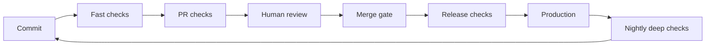

# Quality Gates and Automated Checks

> **Core skill:** Deciding what CI enforces and what humans judge — building a gate system that is fast, trustworthy, and actionable.

## Why This Matters

A pipeline of automated checks is the team's standing army: it enforces standards on every commit without a meeting, without a memory, and without mercy. Done well, it makes compliance automatic — the golden path is the easy path, and the DoD is enforced by machinery instead of arguments. Done badly, it is a gauntlet: forty minutes of checks that catch nothing real, gates that pass everything, and flaky failures that teach engineers to ignore red.

The tech lead designs this system like an architect designs a system: each gate has a cost and a benefit, each runs at the right stage, and each one is trusted because it is reliable. This note covers gate design principles, the gate inventory, where gates belong in the pipeline, why trust is everything, golden paths, and the exception process.

## Gate Design Principles

| Principle | Meaning | Test |
|-----------|---------|------|
| **Fast** | Feedback arrives while the context is still warm | A change should know it is broken within minutes |
| **Trustworthy** | Green means good; red means broken — no ambiguity | Flaky checks are removed, not tolerated |
| **Actionable** | A failure tells the engineer what to do | Message names the file, the rule, and the fix |
| **Proportionate** | Cost of the check matches the risk it guards | No 40-minute suite for a typo |
| **Fail-closed where it matters** | Critical checks cannot be skipped silently | The gate is the only path forward |

## The Gate Inventory

| Check | Catches | Cost | Where It Runs | Notes |
|-------|---------|------|---------------|-------|
| **Lint and format** | Style, dead code, trivial smells | Seconds | Every push | Keep opinionated; move rules out of review |
| **Type check** | Type errors, contract violations | Seconds to a minute | Every push | Non-negotiable in typed languages |
| **Unit tests** | Logic regressions | Minutes | Every push | The fast feedback layer |
| **Integration tests** | Boundary and data failures | Minutes to tens of minutes | Every push or PR | The highest value per minute |
| **Security scan** | Known-vulnerable dependencies, secrets | Minutes | Every PR and nightly | Scanner plus humans for logic-level security |
| **Coverage check** | Untested risk areas | Seconds on top of tests | Every PR | Guard risk areas, not repo averages |
| **Performance check** | Regressions in hot paths | Variable | PR for hot paths, nightly broadly | Thresholds, not flaky benchmarks |
| **End-to-end tests** | Journey breakage | Slow | PR on critical journeys, nightly for the rest | Keep the count small and sacred |

## Where Gates Belong

| Stage | What Runs | Why |
|-------|-----------|-----|
| **Push / branch** | Lint, type, unit, fast integration | Catch the cheap stuff before anyone else sees it |
| **PR** | Full integration, security scan, coverage, e2e on key journeys | The human review and the machine review happen together |
| **Merge** | Final combined check, conflict resolution | The merged tree must be green, not just the branch |
| **Release** | Full suite, smoke tests, canary checks, migration checks | The last chance before production; slow is acceptable here |
| **Nightly** | Broad e2e, performance, soak tests | Deep checks that are too slow for the PR loop |



## Trust in Gates

A gate's only currency is trust. Every flaky failure teaches the team to click "re-run" and move on; every green run that later turns out to have been broken teaches the team that green means nothing.

| Trust Erosion Signal | Consequence | Repair |
|----------------------|-------------|--------|
| Flaky failures with re-runs | Engineers ignore red — including real red | Quarantine or fix flaky checks; track flake rate |
| Gates that pass everything | The pipeline is theater; quality lives in review alone | Raise the bar until it occasionally hurts |
| Silent skips and bypasses | The gate is a suggestion | Make bypass impossible or logged |
| Long queues of stale runs | Context lost; re-runs become habit | Shrink the suite or parallelize until the loop is short |
| Red main branch tolerated | Merge gate means nothing | Block merges on red; fix forward within the hour |

## Golden Paths and Templates

The strongest quality system is the one nobody has to think about:

- **Scaffolding and templates** make new services, new tests, and new components arrive with the checks already attached — compliance is inherited, not remembered.
- **The golden path** is the blessed route: generate the service, get the pipeline, follow the conventions. Any deviation is a conscious, logged decision.
- **The PR template** asks the questions the DoD would ask, so the author self-checks before reviewers arrive.
- **Convention over configuration** means the team's default setup is the safe setup; dangerous options require effort.

## The Gate Exception Process

Even good gates are sometimes wrong. The process matters more than the policy:

1. **Request, don't bypass:** exceptions are visible, logged, and temporary.
2. **Justify in the record:** the exception comment states why the gate is wrong for this change and what replaces the protection.
3. **Time-box every exception:** a skipped gate gets a follow-up item to restore coverage within a sprint.
4. **Review exceptions in the retro:** three exceptions for the same gate means the gate is misconfigured, not the engineers.
5. **Never allow exceptions on the checks that protect money, auth, or data** — those fail closed, period.

## Practical Applications

**Gate system audit:**

- [ ] List every check in the pipeline and its run time; mark the slowest three
- [ ] Time the full PR loop; set a target (for example, under fifteen minutes)
- [ ] Count re-runs and flaky failures in the last two weeks; name the top offender
- [ ] Check which gates are bypassable and how often they are bypassed
- [ ] Verify the merged main branch has been green for the last ten merges
- [ ] Pick one gate that automation should own but humans still do — and automate it

**Gate configuration template:**

```markdown
# Quality Gate Configuration

## Fast Loop — every push
- [ ] Lint and format
- [ ] Type check
- [ ] Unit tests

## PR Loop — every pull request
- [ ] Integration tests
- [ ] Security scan
- [ ] Coverage on risk areas
- [ ] E2E on key journeys

## Release Loop — every deploy
- [ ] Full test suite
- [ ] Migration and smoke checks
- [ ] Canary health window

## Trust Rules
- Flaky checks are quarantined within one sprint, with an owner
- Red main blocks merges; fix forward within the hour
- Exceptions are logged, justified, time-boxed, and reviewed in retro

## Golden Path
New components are generated from the template; the template carries these gates.
```

## Common Pitfalls

| Pitfall | Why It Is a Problem | Better Approach |
|---------|---------------------|-----------------|
| **Gate sprawl** | Twenty checks, forty minutes, three of them matter | Inventory the gates; cut anything without a recent catch |
| **Flaky gate tolerance** | Re-runs become reflex; red loses meaning | Zero-tolerance policy with quarantine and owners |
| **Coverage as a number** | Teams pad lines; the gate protects nothing | Guard risk areas with meaningful assertions |
| **Slow loop** | Engineers stop running checks locally; CI is the only feedback | Keep the PR loop short; parallelize or trim |
| **Bypass culture** | The golden path is the hard path | Make the blessed route the easiest route |
| **Gates as a substitute for review** | Automation passes, design still broken | Gates carry mechanics; humans carry judgment |

## Success Indicators

- The PR loop completes fast enough that engineers wait for it
- Every gate failure message tells the engineer exactly what to fix
- Flake rate is near zero; re-runs are rare enough to notice
- The merged main branch has been green for weeks
- New services and tests arrive with gates already attached
- Exceptions exist but are logged, time-boxed, and reviewed

## Related Topics

- [[04_Code_Review_Standards]] — humans judge what gates cannot
- [[03_Test_Strategy_Leadership]] — the suite the gates run
- [[02_Definition_of_Done_and_Working_Agreements]] — automation enforces the DoD without asking
- [[03_Technical_Direction_and_Architecture/00_overview|Technical Direction and Architecture]] — golden paths are an architecture decision
- [[career-path/10_Quality_and_Test_Engineering/00_overview|Quality and Test Engineering]] — the specialist path for test automation depth

## Summary

Quality gates are the team's enforcement system: a proportionate inventory of checks, placed at the stages where they protect most, designed to be fast, trustworthy, and actionable — with trust protected the way uptime is protected, because a gate nobody believes in is worse than no gate at all. The tech lead's signature is a pipeline where the golden path is the easy path, compliance is automatic, and human judgment is reserved for what automation cannot see.
