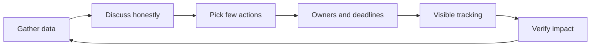

# Continuous Improvement Rhythm

> **Core skill:** Running retrospectives that actually change things — with disciplined action items, visible follow-through, and an improvement backlog that gets worked.

## Why This Matters

Every team claims to improve; few actually do. The difference is not intention — it is rhythm. A retrospective is not a meeting where problems are named; it is a loop in which problems become actions, actions become done work, and done work becomes measurable change. When the loop breaks, the meeting becomes what everyone secretly knows it is: a place where the same complaints are aired every two weeks and nothing moves.

The tech lead runs that loop: choosing the right format for the moment, forcing action-item discipline, tracking items to closure, escalating recurring issues before they calcify into culture, and watching for retro fatigue in the team itself. This note covers formats and their fit, the discipline that makes actions stick, escalation of recurring patterns, measurement, and treatment for the most common retro disease.

## Retro Formats and When Each Fits

| Format | How It Works | Best Fit |
|--------|--------------|----------|
| **Start-Stop-Continue** | Three columns: start doing, stop doing, keep doing | Steady-state sprints; quick and concrete |
| **4Ls** | Liked, Learned, Lacked, Longed for | Balanced review after a mixed period |
| **Mad-Sad-Glad** | Emotional map of the period | After intense or draining work; surfaces feelings first |
| **Sailboat** | Wind pushes forward, anchors hold back, rocks are risks | Before a big push; forward-looking |
| **Timeline** | Walk the period event by event | After a chaotic or incident-heavy stretch |
| **5 Whys** | Drill into one recurring problem | One issue dominates; root-cause depth needed |

The format is a tool, not a tradition. The lead picks the tool that matches the moment, and rotates so the ritual stays alive.

## The Retro Loop



## Action Item Discipline

The single highest-leverage retro practice is ruthless action discipline. Most retros produce too many actions, which produces no actions.

| Rule | Why |
|------|-----|
| **Few** | Three or fewer actions per retro; the team can actually do them |
| **Owned** | Every action has a named owner — not "the team" |
| **Deadlined** | Every action has a date; undated actions do not exist |
| **Visible** | Actions live on a board or tracker everyone sees, not in the notes |
| **Started immediately** | First step happens within a week, or the action is renegotiated |
| **Closed or renegotiated** | At the next retro, every item is done, rescheduled with reason, or killed |

## Tracking Actions to Closure

| Mechanism | Practice |
|-----------|----------|
| **Improvement board** | A persistent column for retro actions, separate from feature work |
| **Retro opener** | Every retro starts with the previous actions: done, pending, killed — with reasons |
| **Sprint inclusion** | Owners pull their action into the sprint so it is real work with capacity |
| **Personal reminder** | The lead checks in with owners between retros, not at the retro |
| **Definition of closure** | An action is closed when its effect is verified, not when the ticket is ticked |

## Recurring Issue Escalation

The same topic appearing in three consecutive retros is not bad luck — it is a systemic problem the team's normal process cannot fix.

| Signal | Interpretation | Escalation |
|--------|----------------|------------|
| Same issue three retros running | The current system produces this failure by design | Treat it as a project: dedicate a working session, not another action item |
| Same issue, different wording | The team has given up naming it directly | Name the pattern in the retro; make it discussable |
| Actions for the issue never close | The fix is too big for the action format | Break it into a funded improvement initiative |
| The issue appears only after incidents | Learning is reactive, not continuous | Add a standing review so the pattern is caught earlier |

The escalation rule: **a recurring issue graduates from an action item to an initiative** — with a small scope, a named owner, a deadline, and the authority to change the system.

## The Improvement Backlog

Continuous improvement is work, and work needs a backlog. The improvement backlog holds the ideas retros generate but the team cannot do this sprint:

- Ideas enter with one sentence of context and the problem they solve
- Items are sized in effort, not story points
- The lead protects a small slice of capacity for improvement work each cycle
- Nothing sits in the backlog for more than a quarter — it is picked up, merged into another initiative, or killed
- The backlog is reviewed at every retro so it stays honest

## Measuring Improvement

| Metric | What It Tells You | Target Direction |
|--------|-------------------|------------------|
| **Action closure rate** | Is the loop actually closing? | 80%+ of actions closed on time |
| **Recurring issue count** | Are systemic problems declining? | The same topic stops appearing |
| **Time from action to effect** | How fast change lands | Shrinking |
| **Retro attendance and energy** | Is the ritual healthy? | Full attendance, real discussion |
| **Named problem freshness** | Are retros raising new issues or recycling? | New issues each cycle |

## Retro Fatigue: Diagnosis and Treatment

| Symptom | Cause | Treatment |
|---------|-------|-----------|
| Silence; the same people talk | The retro feels pointless because nothing changes | Fix action follow-through first — that is the root cause |
| Everything is fine, every time | The team is coasting or afraid | Change format; add a data review; lower the stakes of honesty |
| Complaints without specifics | Discussion is vibes, not evidence | Bring data: cycle times, incidents, review backlogs |
| Actions are jokes or busywork | The team has given up on real change | Cut the actions to one real one; rebuild credibility |
| The lead talks most | The retro is a status meeting in disguise | Facilitate, then leave the room; let the team own it |

When fatigue is systemic, the boldest treatment is to cancel the retro for a cycle and bring it back with a different format and a demonstrated follow-through record.

## Practical Applications

**Run a retro that changes things:**

- [ ] Open with last retro's actions: done, pending, killed — with reasons
- [ ] Bring one piece of data: a metric, a timeline, an incident count
- [ ] Choose the format for this period, and say why you chose it
- [ ] Capture everything, then vote: the team picks the top three problems
- [ ] Convert the top problem into one action with one owner and one date
- [ ] Add the action to the improvement board before the meeting ends

**Action item template:**

```markdown
# Retro Action Item

- **Problem:** [one sentence — the symptom the team agreed on]
- **Action:** [what will change — concrete, observable]
- **Owner:** [one person]
- **Deadline:** [date]
- **First step:** [the smallest thing that starts it, done within a week]
- **Verification:** [how we will know it worked — the signal we check at the next retro]
- **Status:** [open / in progress / closed / killed]
```

## Common Pitfalls

| Pitfall | Why It Is a Problem | Better Approach |
|---------|---------------------|-----------------|
| **Action vomit** | Twelve actions, none done; the retro loses all credibility | Three or fewer actions, each with one owner and one date |
| **No follow-through visibility** | Actions vanish between meetings | Persistent improvement board; retro opens with the old list |
| **Same issue forever** | The team learns the retro changes nothing | Escalate recurring issues to initiatives with real scope |
| **Vibes without data** | Discussion is opinion; decisions are ungrounded | Bring one metric or timeline to every retro |
| **The lead dominates** | The team's honesty is capped by power dynamics | Facilitate lightly; let the team generate and choose |
| **Improvement without capacity** | Actions compete with feature work and lose | Protect a slice of capacity for improvement every cycle |

## Success Indicators

- Action closure rate stays high; most retros open with mostly-done lists
- The same topic stops appearing in three consecutive retros
- Retro energy is visible: full attendance, real disagreement, new ideas
- Improvement work ships alongside feature work, not instead of it
- The team can name the last three things that changed because of a retro
- Retros surface new problems — proof the old ones actually got fixed

## Related Topics

- [[01_Team_Workflow_Design]] — the workflow is the main thing retros tune
- [[07_Scaling_Process_with_Team_Growth]] — improvement must adapt as the team grows
- [[02_Definition_of_Done_and_Working_Agreements]] — renegotiation happens in the retro rhythm
- [[04_Team_Delivery_and_Execution_Leadership/00_overview|Delivery and Execution Leadership]] — improvement actions are delivery work
- [[career-path/11_Engineering_Manager/00_overview|Engineering Manager]] — the role that scales this rhythm beyond one team

## Summary

Continuous improvement is a loop, not a meeting: honest discussion grounded in data, ruthlessly few action items with owners and deadlines, visible tracking to closure, and escalation of recurring issues into real initiatives. The tech lead keeps the loop turning — because a team that can reliably change its own way of working compounds, while a team with retro fatigue repeats its history on a two-week cycle.
