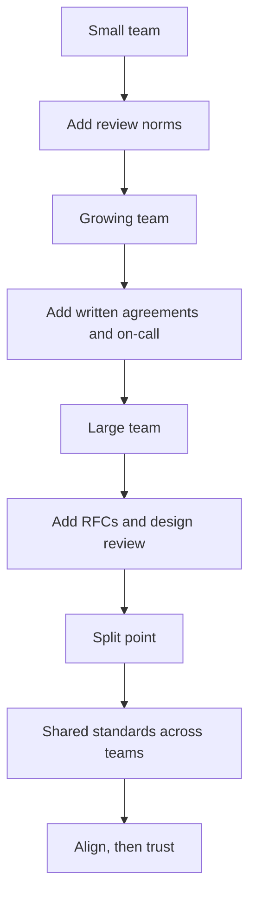

# Scaling Process with Team Growth

> **Core skill:** Adapting process deliberately as the team grows — adding the right practices at the right stage, splitting teams cleanly, and keeping quality intact through rapid growth.

## Why This Matters

A process that works for four engineers fails for ten, and a process that works for ten suffocates twenty. Growth changes the math of coordination: with four people, everything is shared context; with twelve, context is fragmented and the cost of each informal handoff multiplies. Teams that do not adapt quietly accumulate failures — missed reviews, duplicated work, siloed knowledge — and then react with process panic: too much ceremony, added all at once, aimed at symptoms.

The tech lead anticipates the stages: knowing what to add when, what to keep light, how to recognize that the team is at a size where the old way stops working, and how to split without shredding the practices that made the team good. This note covers growth stages, stage-appropriate additions, split triggers, onboarding as a process sensor, multi-team alignment, and process debt.

## Growth Stages and What Each Needs

| Stage | Size | Coordination Reality | Process That Fits |
|-------|------|----------------------|-------------------|
| **Squad** | 3-4 engineers | Everyone knows everything; trust carries most things | Minimal ceremony: shared board, DoD, review norms; no heavyweight rituals |
| **Team** | 6-8 engineers | Context is splitting; informal handoffs start failing | Structure: planning cadence, working agreements, test strategy, on-call rotation |
| **Scaling team** | 10+ engineers | Silos form; the lead cannot know everything | Explicit practices: design reviews, RFCs, review standards doc, onboarding path |
| **Multi-team** | Two or more teams on one system | Coordination crosses boundaries; consistency matters | Shared standards: common DoD, common review norms, interface ownership |

The rule: add process when the *cost of not having it* exceeds the cost of having it — not when a book or a manager says so.

## What to Add at Each Stage

| Practice | 3-4 | 6-8 | 10+ | Why It Arrives When It Does |
|----------|-----|-----|-----|------------------------------|
| Code review norms | Informal | Written | Enforced | At 6+, "everyone knows" stops being true |
| Definition of done | Shared verbally | Written, visible | In PR template | Written contracts replace shared memory |
| Design review / RFC | On request | For significant changes | For most non-trivial changes | At 10+, design mistakes are expensive and silent |
| On-call rotation | Everyone | Named rotation | Documented runbooks | Incidents need owners, not volunteers |
| Documentation | Ad hoc | Key systems | Onboarding path and runbooks | Knowledge lives in more heads than can talk |
| Planning ceremony | None | Light cadence | Structured with capacity math | Commitments need a system, not a mood |

## Scaling the Practices



## Team Split Triggers and Process Implications

| Trigger | Example | Process Implication |
|---------|---------|---------------------|
| **Size** | Team passes about 10 engineers | Formalize what was informal before the split; write the standards down first |
| **Context separation** | Two products, one team | Split along context boundaries; each team gets its own board and cadence |
| **Velocity decay** | Planning and review cost more than they save | The team is too big for one loop; split the loop |
| **Expertise concentration** | One person owns a whole area | The split must distribute the knowledge, or the split creates a bus factor |

Before any split: **write down the standards first.** A team that splits while its practices live in shared memory produces two teams with no shared memory at all. The DoD, the review norms, the on-call design — captured in the week before the split, they become the inheritance both new teams start from.

## Onboarding-Driven Process

New joiners are the team's best process sensor: they fail at exactly the places where the team's knowledge stopped being structural.

| New Joiner Struggle | Process Gap It Reveals | Fix |
|---------------------|------------------------|-----|
| "What does done mean here?" | DoD is verbal, not written | Write the DoD; put it in the PR template |
| "How do I deploy?" | The release path lives in one head | Document the runbook; automate the path |
| "Who do I ask about X?" | Ownership is invisible | Ownership map; named area owners |
| "Why is this done this way?" | Decisions are unrecorded | Decision records; link them in onboarding |
| "I broke the build twice" | Gate expectations are unclear | Onboarding checklist includes the golden path |

Every onboarding is a free audit. The lead asks new joiners what surprised them in week two, while the memory is fresh — and treats each answer as a process item.

## Multi-Team Alignment vs Team Autonomy

| Decision | Align Globally | Keep Local | Example |
|----------|----------------|------------|---------|
| **DoD and quality bar** | Shared | — | One DoD across teams touching one system |
| **Review standards** | Shared principles | Local depth choices | Both teams review; each sets its own SLA |
| **Release process** | Shared platform, team-owned steps | — | Common pipeline; teams choose their rollout size |
| **Meeting cadence** | — | Local | Each team plans how it likes |
| **Coding conventions** | Shared where code meets | Local where isolated | Shared lint config; local style for internal modules |

The test for every cross-team standard: **would inconsistency here cause an incident or a costly rework?** If yes, align it. If no, leave it local. Aligning everything is bureaucracy; aligning nothing is chaos.

## Process Debt from Rapid Growth

Like technical debt, process debt accrues when growth outruns adaptation, and it must be paid down deliberately.

| Symptom | Debt | Paydown |
|---------|------|---------|
| Standards exist only in the founder's head | The team scales, the head does not | Write the top five standards down, now |
| Exceptions are the norm | The written process is fiction | Rewrite the process to match reality, then enforce it |
| Onboarding takes months | Knowledge is tribal | Onboarding checklist; first-week tasks; buddy system |
| Cross-team bugs repeat | Boundaries are unowned | Interface ownership; shared integration tests |
| Every team does its own thing | Duplicate infrastructure and standards | One shared standards review with the other leads |

## Practical Applications

**Growth readiness checklist:**

- [ ] The DoD, review norms, and on-call design are written and visible
- [ ] Onboarding has a checklist, and the last three joiners completed it in week one
- [ ] Every area has at least two people who can review or own it
- [ ] The team's planning cadence matches its size — and its meeting count matches its ceremony
- [ ] The split triggers are named in advance: what size or signal starts the discussion
- [ ] Cross-team standards are agreed with the neighboring leads, not imposed

**Team split planning template:**

```markdown
# Team Split Plan

## Trigger and Date
- Signal that started this: [size, context, velocity]
- Target date: [date]

## Standards to Write Down BEFORE the Split
- [ ] Definition of done
- [ ] Code review norms and SLA
- [ ] On-call rotation and escalation
- [ ] Release process and rollback path
- [ ] Ownership map for the system

## Team Boundaries
| Team | Context It Owns | Interfaces It Provides |
|------|-----------------|------------------------|
| Team A | [context] | [interface] |
| Team B | [context] | [interface] |

## Cross-Team Agreements
- [ ] Shared DoD and quality bar
- [ ] Shared review principles, local SLAs
- [ ] Interface owners named for every boundary

## Post-Split Check
- [ ] Both teams can onboard a new engineer with the written standards
- [ ] No area has a single owner
```

## Common Pitfalls

| Pitfall | Why It Is a Problem | Better Approach |
|---------|---------------------|-----------------|
| **Process panic at growth** | Everything added at once, aimed at symptoms | Add practices stage by stage, when the cost of absence bites |
| **Splitting before writing standards** | Two teams with no shared memory | Document the standards in the week before the split |
| **Copying another team's process** | Fit is local; borrowed ceremony fits nobody | Design from the team's own friction points |
| **Letting the lead be the knowledge store** | The team cannot grow past one brain | Write it down; grow a second owner for every area |
| **Over-aligning across teams** | Bureaucracy replaces judgment | Align only what would hurt if inconsistent |
| **Ignoring process debt** | Growth compounds the debt silently | Treat process debt like technical debt: visible and paid down |

## Success Indicators

- The team grew a stage without a quality regression or a morale dip
- New joiners are productive within their first two weeks
- Every standard the team relies on is written somewhere a new person can find it
- Team splits happened with standards intact on both sides
- Cross-team standards exist only where inconsistency would hurt
- The lead can name what the team will add next — and when

## Related Topics

- [[01_Team_Workflow_Design]] — the workflow that must be re-fit at every stage
- [[06_Continuous_Improvement_Rhythm]] — the rhythm that surfaces growth pains early
- [[02_Definition_of_Done_and_Working_Agreements]] — the contract that must survive every split
- [[05_Team_Development_and_Mentoring_Leadership/00_overview|Team Development and Mentoring Leadership]] — growing the people the process serves
- [[career-path/11_Engineering_Manager/00_overview|Engineering Manager]] — the role that scales process beyond the team boundary

## Summary

Scaling process with growth is anticipation, not reaction: add practices when their absence starts costing more than their presence, write standards down before knowledge fragments, use new joiners as sensors for structural gaps, split teams along context with the standards captured first, and align across teams only where inconsistency would hurt. A team that adapts its process at the right moments grows without losing the practices that made it good — and never needs process panic, because the panic never gets a chance to arrive.
