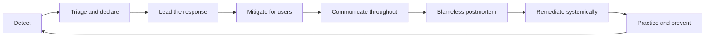

# Incident Leadership and Production Excellence

> **Core capability:** The tech lead leads the team through production failures — commanding the response, running blameless learning, and converting incidents into systemic improvement — and builds the reliability practices that prevent repeats.

## Why This Matters

Incidents are the moments that define a tech lead. Everyone is watching, information is incomplete, pressure is high, and the system you steward is failing in public. Individual engineers respond to incidents; tech leads **lead** them — establishing command, dividing the work, deciding when to mitigate and when to diagnose, and speaking to stakeholders so responders can work.

After the smoke clears, the bigger job begins: turning the incident into durable improvement without blaming the humans nearest the failure. Teams that learn from incidents get reliability compounding; teams that punish people get hidden incidents.

## Topics in This Capability Area

| Topic | Core Skill | When It Matters |
|-------|------------|-----------------|
| [[01_Incident_Command_Leadership]] | Leading the response when production fails | Every incident, from degradations to outages |
| [[02_Communication_Under_Pressure]] | Keeping stakeholders informed without stealing focus | Any visible incident; customer impact |
| [[03_Blameless_Postmortem_Leadership]] | Running learning reviews that fix systems, not people | After every meaningful incident |
| [[04_Remediating_Systemic_Weaknesses]] | Converting findings into funded, finished work | Post-incident weeks; repeated patterns |
| [[05_On_Call_Excellence]] | Designing humane, effective on-call for the team | On-call burnout, uneven load, poor pages |
| [[06_Resilience_Engineering_Practices]] | Practicing failure before production supplies it | Game days, chaos exercises, failure reviews |
| [[07_Production_Excellence_Culture]] | Making operational excellence a team identity | Always; hiring, rituals, standards |

## The Incident Lifecycle

Leadership spans the whole lifecycle — not only the firefight.

## What Changes from Senior to Tech Lead

| Activity | Senior engineer | Tech lead |
|----------|-----------------|-----------|
| During an incident | Debugs and mitigates actively | Commands: assigns, decides, communicates |
| Priorities | Finding root cause | Restoring service first; cause second |
| Stakeholders | Feeds info to the lead | Owns stakeholder updates directly |
| After | Contributes to the write-up | Runs the blameless review; owns follow-through |
| Prevention | Hardens own components | Owns the team's resilience practice and culture |

## Practical Applications

### Production Excellence Checklist

- [ ] Incident roles (command, comms, scribe) are pre-assigned and practiced
- [ ] Comms templates and cadences exist per severity — written before the incident
- [ ] Every meaningful incident gets a blameless postmortem with systemic actions
- [ ] Remediation items live in a register with owners and close on review
- [ ] On-call is humane: even load, actionable pages, shadow shifts for new joiners
- [ ] A game day or failure drill ran in the last two quarters
- [ ] The lead models the culture: joins incidents, reads dashboards, praises catches

## Common Pitfalls

| Pitfall | Why It Is a Problem | Better Approach |
|---------|---------------------|-----------------|
| **Lead as loudest debugger** | No one commanding; duplicated work; silence outward | Command first; debug through others when you can |
| **Root-cause tunnel vision** | Users wait while you investigate | Mitigate now; diagnose after users are safe |
| **Blameful reviews** | Facts get hidden; the same failure returns | Blameless process aimed at systems |
| **Remediation theater** | Actions assigned, never done; incidents repeat | Fewer actions, owners, deadlines, and review |

## Success Indicators

- Incidents have clear command from minute one
- Stakeholders say they knew what was happening, when
- Postmortem actions actually close — and repeat incidents decline
- On-call is sustainable: pages are actionable and the load is even
- The team talks about failure openly, even before it happens

## Related Capabilities

- [[02_System_Ownership_and_Production_Responsibility/00_overview|System Ownership and Production Responsibility]]: the health work that prevents these moments
- [[04_Team_Delivery_and_Execution_Leadership/00_overview|Team Delivery and Execution Leadership]]: remediation work must be delivered like any other
- [[career-path/02_Senior_Software_Engineer/05_Quality_Reliability_Security/04_Incident_Response|Incident Response (Senior)]]: the personal response skills this area scales to leadership
- [[career-path/07_SRE_and_Platform_Engineer/00_overview|SRE and Platform Engineer]]: the specialist path for reliability depth (SLOs, error budgets, chaos engineering)

## Summary

Incident leadership is the tech lead's most visible test: command the response, mitigate for users first, communicate steadily, then convert failure into systemic improvement through blameless learning and finished remediation. Between incidents, build the practices — on-call, game days, resilience reviews — that make the next one smaller.
