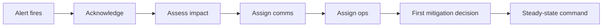

# Incident Command Leadership

> **Core skill:** Commanding the response when production fails — assigning roles, deciding between mitigation and diagnosis, and driving the incident to a clean close.

## Why This Matters

When production fails, the difference between a forty-minute outage and a four-hour one is rarely the engineers' debugging skill — it is command. Without command, three people debug the same thing, nobody updates stakeholders, the loudest voice steers, and the team discovers the fix five times before someone rolls it out. The tech lead is the default commander because they hold the trust of both the team and the stakeholders: they can assign work without politics and make calls without waiting for consensus.

Command is a discipline, not a personality. It means doing the least debugging yourself and the most coordinating — knowing that your value in the first hour is not your hands but your structure. This note covers the commander role, severity activation, the first fifteen minutes, incident roles, the decision points that define the response, and how to end an incident cleanly.

## Command vs Doing

| The Commander Does | The Commander Does NOT |
|--------------------|------------------------|
| Assigns roles and work | Debug the same issue as the ops lead |
| Sets the decision cadence | Hover over individual debugging |
| Owns all outward communication | Let stakeholders pull status from responders |
| Tracks mitigation options | Chase every theory that surfaces |
| Decides escalate or wait | Become the bottleneck on decisions |

The commander's hands stay free. If you find yourself typing a fix while the incident channel is silent, you have stopped commanding.

## Severity Levels and What Each Activates

| Severity | Definition | Activates | First Response |
|----------|------------|-----------|----------------|
| **SEV-1** | Major user impact; service down or critically degraded | Full incident mode: IC, comms lead, ops lead, scribe; immediate stakeholder notification | Within minutes; comms every 30 minutes |
| **SEV-2** | Significant impact with a workaround or partial degradation | Incident channel; IC named; hourly stakeholder updates | Within the hour |
| **SEV-3** | Isolated or minor impact | Triage in the normal flow; optional channel | Same day |
| **SEV-4** | No user impact; internal problem | Normal work tracking | Scheduled |

Severity is declared by impact, not by cause — and it can change. The commander re-grades severity as the picture sharpens, and the comms plan follows the grade.

## The First Fifteen Minutes



| Minute | Action | Output |
|--------|--------|--------|
| 0-2 | Acknowledge the alert; open the incident channel | A channel exists; severity declared provisionally |
| 2-5 | Assess: what is broken, who is affected, is it getting worse | One-line impact statement |
| 5-10 | Assign roles: comms lead, ops lead, scribe | Names in the channel; nobody guessing |
| 10-15 | First decision: mitigate now or diagnose first | A direction everyone follows |
| 15+ | Steady-state: decisions, updates, escalation | The response runs without the commander typing |

## Roles During an Incident

| Role | Responsibility | Notes |
|------|----------------|-------|
| **Incident Commander** | Decisions, coordination, outward communication | One person; never the debugger |
| **Ops lead** | Drives mitigation and diagnosis; directs responders | The best debugger in the room works here |
| **Comms lead** | Stakeholder updates, status page, support coordination | Takes the update burden off the responders |
| **Scribe** | Timeline, decisions, who said what | Makes the postmortem possible; can be anyone |

Small team? One person can hold comms and scribe, but commander and ops lead stay separate whenever possible — the person deciding must not be the person absorbed in a stack trace.

## The Decision Points

| Decision | How to Decide | Default |
|----------|---------------|---------|
| **Mitigate vs diagnose** | Is the user impact continuing? Is the cause knowable quickly? | Mitigate first; diagnose after users are safe |
| **Rollback vs hotfix** | Is the cause a recent deploy? Is the hotfix provable quickly? | Roll back first; hotfix only when the fix is certain |
| **Page more people** | Is the response stuck? Is expertise missing? | Page early; the cost of a false alarm is lower than an hour of stuck |
| **Escalate severity** | Is impact growing? Is stakeholder visibility needed? | Escalate on impact, not on embarrassment |
| **Declare resolved** | Is the symptom gone for a sustained window? Is the cause understood enough? | Wait for a monitoring-verified window before declaring |

The discipline that matters most: **decide in public.** Every decision, with its reasoning, goes in the incident channel — because the team needs to understand the commander's model to work against it.

## Incident Termination and Handoff

An incident ends cleanly, not just when the graph is green:

1. **Declare resolution** only after a verified stable window, with monitoring as the witness.
2. **Hand off to follow-up**: named owner for the postmortem, named owner for any immediate remediation.
3. **Close the comms loop**: final update to stakeholders with impact summary and next steps.
4. **Preserve the evidence**: channel archive, timeline, dashboards, and deployment logs tagged for the postmortem.
5. **Debrief briefly while hot**: a five-minute "what do we know" capture before people scatter.

## Practical Applications

**Incident response checklist:**

- [ ] Incident channel opened with severity, impact, and time
- [ ] Roles assigned: IC, ops lead, comms lead, scribe
- [ ] First stakeholder update sent within the first fifteen minutes
- [ ] Mitigation decision made and logged in the channel
- [ ] Escalation path exercised: who was paged, when, why
- [ ] Resolution declared only after a verified stable window
- [ ] Postmortem owner and remediation owner named before the channel closes

**Incident kickoff template:**

```markdown
# Incident Kickoff

- **Severity:** SEV-[1-4]
- **Started:** [timestamp]
- **Impact:** [one line: what is broken, who is affected]
- **Status:** Investigating / Mitigating / Monitoring / Resolved
- **Roles**
  - Commander: [name]
  - Ops lead: [name]
  - Comms lead: [name]
  - Scribe: [name]
- **Decision:** [current mitigation choice and why]
- **Next update:** [time]
```

## Common Pitfalls

| Pitfall | Why It Is a Problem | Better Approach |
|---------|---------------------|-----------------|
| **Commander as loudest debugger** | No one coordinates; work duplicates; comms go silent | Command first; debug through the ops lead |
| **Root-cause tunnel vision** | Users stay broken while the team investigates | Mitigate now; diagnose after users are safe |
| **Deciding in private** | The team cannot work against an invisible model | Every decision lands in the channel with its reasoning |
| **No scribe** | The timeline is reconstructed from memory; the postmortem is fiction | Scribe from minute one; notes beat memory |
| **Declaring victory too early** | The outage returns an hour after resolution | Require a monitoring-verified stable window |
| **Hero mode** | One person does everything and collapses; the team learns nothing | Rotate roles; grow at least two people per role |

## Success Indicators

- Command is clear within the first few minutes of every incident
- The commander never disappears into debugging
- Decisions are visible in the channel with reasoning attached
- Stakeholders receive updates without pulling for them
- Every incident ends with named follow-up owners, not just a green graph
- The team can run a full response without the tech lead present

## Related Topics

- [[02_Communication_Under_Pressure]] — the comms side of command, owned by the commander
- [[03_Blameless_Postmortem_Leadership]] — what happens after the channel closes
- [[05_On_Call_Excellence]] — the rotation that detects incidents before users do
- [[career-path/02_Senior_Software_Engineer/05_Quality_Reliability_Security/04_Incident_Response|Incident Response (Senior)]] — the personal response skills this role scales to leadership
- [[02_System_Ownership_and_Production_Responsibility/00_overview|System Ownership and Production Responsibility]] — the ownership that makes the response possible

## Summary

Incident command leadership is the discipline of structure under pressure: the commander steps away from the keyboard to assign roles, make decisions in public, own communication, and drive the incident to a monitoring-verified close. The first fifteen minutes set the tone — acknowledge, assess, assign — and every decision point afterward is a chance to keep the response fast, coordinated, and learning-ready. Command is not about being the best debugger in the room; it is about making the room work like a team.
