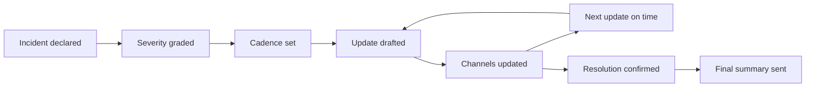

# Communication Under Pressure

> **Core skill:** Keeping stakeholders informed during incidents — on a cadence, with a structure, and without letting communication steal focus from the response.

## Why This Matters

During an incident, information is the organization's lifeline. Executives need to know whether to activate their own response; support needs to know what to tell angry customers; sales needs to know what to say to accounts. When communication fails, the damage compounds: stakeholders invent their own versions of events, support makes promises engineering cannot keep, and the team spends the aftermath undoing rumors instead of fixing the system.

Communication under pressure is a craft with a structure: a cadence matched to severity, a template that answers the questions people actually have, channels that match the audience, and the discipline to say what is known without inventing what is not. The tech lead or a designated comms lead owns this — and done well, it is almost invisible, because the right people hear the right things at the right times.

## Comms Cadence by Severity

| Severity | Update Cadence | Audience | Channel |
|----------|----------------|----------|---------|
| **SEV-1** | Every 30 minutes, or on any material change | Executives, support, status page | Dedicated exec channel, status page, incident channel |
| **SEV-2** | Hourly | Stakeholders, support | Status page, team channels |
| **SEV-3** | At resolution, or on escalation | Team and directly affected | Incident thread |
| **SEV-4** | At closure | Nobody external | Normal tracking |

Cadence is a promise. Missing an update at the promised time is itself a communication failure — stakeholders assume the worst when silence replaces the schedule.

## The Update Template

Every update answers the same five questions, in the same order:

| Field | What It Contains | Example |
|-------|------------------|---------|
| **Impact** | What is broken, who is affected, since when | Checkout is down; all web orders affected since 10:15 |
| **Status** | What phase: investigating, mitigating, monitoring | Mitigating: rolling back the deploy |
| **Action** | What is being done right now | Ops is rolling back to the previous version |
| **Next update** | The promised time of the next update | Next update: 10:45 |
| **ETA** | Only when knowable; otherwise the decision point | Rollback expected within 20 minutes |

```markdown
**Update 3 — 10:45 UTC**
Impact: Checkout unavailable; all web orders affected since 10:15.
Status: Mitigating.
Action: Rolling back the checkout deploy; verifying the previous version.
Next update: 11:15 UTC.
```

## Communication Channels

| Channel | Audience | Content | Cadence |
|---------|----------|---------|---------|
| **Status page** | Public and internal customers | Impact, status, next update | Every update |
| **Exec channel** | Leadership | Impact, decisions, escalation needs | Per severity cadence |
| **Support channel** | Support and CS | What to tell customers, known workarounds | As information changes |
| **Incident channel** | Responders | Everything, including the messy truth | Continuous |
| **Post-incident summary** | Everyone | What happened, why, what changes | Within 24-48 hours |

The rule of channels: **the status page gets the structured truth, the incident channel gets the messy truth, and support gets the customer-facing truth** — and the comms lead is the only person who translates between them.



## Saying What You Know and What You Do Not

| Known | Unknown | Good Update |
|-------|---------|-------------|
| What is broken | Why it is broken | "Payments are failing for all users since 10:15. We are investigating the cause." |
| Who is affected | How long it will last | "Affected users cannot complete purchases. We do not yet have an ETA." |
| What is being tried | What will work | "We are rolling back the latest deploy as the first mitigation." |

The discipline: **every update distinguishes facts from inferences.** "The database is slow" is a fact; "the database is the cause" is a hypothesis until proven. Stakeholders can handle uncertainty; they cannot handle certainty that turns out to be wrong.

## Avoiding Premature Cause Statements

The most damaging sentence in incident communication is the confident wrong cause. It looks like progress, spreads fast, and is hardest to retract.

| Premature Statement | Why It Hurts | Better Form |
|---------------------|--------------|-------------|
| "A deploy caused this" | Executives act on the wrong culprit; the real cause hides | "We are checking whether the recent deploy is involved" |
| "It is fixed" | Fixes that are not verified fail in public | "The symptom has cleared; we are monitoring to confirm" |
| "We know what happened" | The timeline is still being reconstructed | "Our current hypothesis is X; evidence so far supports it" |
| "This was preventable" | Blame starts before learning happens | "We will identify prevention in the postmortem" |

The comms lead's job is to slow cause-talk down: hypotheses go in the incident channel, verified facts go outward.

## Coordinating with Support and Sales

The support team is the incident's second front line — they take the calls engineering cannot hear. They must never be surprised by a customer.

| Practice | Why |
|----------|-----|
| Support gets updates before or with the public update | They answer calls; they need the script first |
| Workarounds are communicated the moment they exist | Every workaround a customer can use is a defused call |
| Sales gets an account-level line for critical accounts | They protect relationships; give them the words |
| Support's on-the-ground reports feed back into triage | They hear symptoms engineering cannot see |
| After the incident, support gets the summary first | They close the loop with the same people they calmed |

## Post-Incident Comms Follow-Through

The incident ends twice: when the system recovers, and when the communication about it ends.

1. **Final update** on the status page: impact summary, duration, current status.
2. **Stakeholder summary** within 24-48 hours: what happened, what changed, what is next.
3. **Support debrief**: what to tell customers who follow up, and what not to promise.
4. **Rumor sweep**: check that no outdated version of the story survives in public channels.
5. **Feedback**: ask the comms lead and stakeholders what communication missed — the next incident should communicate better than this one.

## Practical Applications

**Communication drill checklist:**

- [ ] Severity declared and cadence set in the first update
- [ ] Status page, exec channel, and support channel all assigned owners
- [ ] Every update distinguishes facts from hypotheses
- [ ] No cause statement made before verification
- [ ] Support briefed before the public update
- [ ] Final update and stakeholder summary both sent
- [ ] Post-incident: one lesson for the comms plan, recorded

**Update template to keep pinned:**

```markdown
**Update [N] — [timestamp]**
Impact: [what is broken, who is affected, since when]
Status: [Investigating / Mitigating / Monitoring / Resolved]
Action: [what is being done now]
Next update: [promised time]
```

## Common Pitfalls

| Pitfall | Why It Is a Problem | Better Approach |
|---------|---------------------|-----------------|
| **Silence during investigation** | Stakeholders invent their own story when updates stop | Cadence is a promise; miss it and you lose trust |
| **Premature cause statements** | Confident wrong causes spread and stick | Facts outward; hypotheses stay in the incident channel |
| **Support kept in the dark** | Customers hear one story from the company, another from support | Brief support before every public update |
| **Over-promising ETAs** | Unmet ETAs compound the trust damage | Give decision points, not guesses |
| **One channel for everything** | Responders drown in stakeholder noise | Separate channels: messy internally, structured outward |
| **Silence after resolution** | The story ends with rumors; no closure | Final update plus a stakeholder summary within 48 hours |

## Success Indicators

- Stakeholders know the cadence and receive updates on time
- Updates consistently separate facts from hypotheses
- Support never learns about an incident from a customer
- No premature cause statement survives into the final record
- The post-incident summary lands within 48 hours with real next steps
- The comms plan improves measurably after every incident

## Related Topics

- [[01_Incident_Command_Leadership]] — command owns communication; comms is a command function
- [[03_Blameless_Postmortem_Leadership]] — the summary that follows the firefight
- [[career-path/02_Senior_Software_Engineer/05_Quality_Reliability_Security/04_Incident_Response|Incident Response (Senior)]] — the personal escalation and status skills this builds on
- [[04_Team_Delivery_and_Execution_Leadership/00_overview|Delivery and Execution Leadership]] — stakeholder trust is carried across both domains

## Summary

Communication under pressure is structure, not heroics: a cadence matched to severity, a five-field update template, channels separated by audience, and the discipline to say what is known without asserting what is not. The comms lead keeps facts outward and hypotheses inward, briefs support before the public hears, and closes the loop after resolution — so that when the system recovers, the organization's understanding recovers with it.
