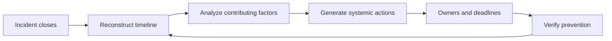

# Blameless Postmortem Leadership

> **Core skill:** Running learning reviews that fix systems, not people — reconstructing timelines, analyzing contributing factors, and generating actions that actually close.

## Why This Matters

Every incident is a paid lesson; the postmortem is where the team decides whether to keep it. A good postmortem converts an expensive failure into durable prevention — a system change, a process change, a training gap closed. A bad one does the opposite: it finds a scapegoat, teaches everyone to hide their mistakes, and guarantees the next incident follows the same script.

Blamelessness is not kindness; it is the only method that works. When people fear consequences, facts get soft: timelines get fuzzy, decisions get rationalized, and the contributing factors that would have prevented the incident stay buried. The tech lead's job is to run a review that is rigorous enough to find the truth and safe enough that the truth gets told — then to make sure the findings become finished work. This note covers blameless principles, timeline reconstruction, contributing-factor analysis, action generation, facilitation, and the postmortem document.

## Blameless Principles

| Principle | Meaning | In Practice |
|-----------|---------|-------------|
| **Assume good intent** | Everyone was doing their best with what they knew | Questions start with "what did you see," not "why did you" |
| **Systems, not people** | Failures are designed into the system that hosted them | The question is always "what allowed this?" |
| **No individual is the root cause** | Root causes live in processes, tooling, and gaps | The postmortem names conditions, not culprits |
| **Everyone tells the truth** | Safety is the price of accuracy | The scribe records what happened, not what flatters |
| **Learning beats blame** | The goal is prevention, not justice | Every finding ends in an action, not an apology |

## The Postmortem Loop



## Timeline Reconstruction

The timeline is the spine of the postmortem — everything else hangs off it. It is built from evidence, not memory:

| Source | What It Provides |
|--------|------------------|
| Incident channel archive | Who knew what, when, and what was decided |
| Monitoring and dashboards | The objective record: when symptoms began, when they cleared |
| Deployment logs | What changed right before the symptoms |
| Scribe notes | Decisions and their reasoning in the moment |
| Responder recollections | Context the logs cannot capture — labeled as memory, not fact |

Rules for the timeline: timestamps everywhere; facts separated from inferences; the gap between "first symptom" and "first alert" is always examined — it is where detection problems live.

## Contributing Factors Analysis

Single root causes are almost always wrong. Real incidents have multiple contributing factors — each one a condition that, if changed, would have made the failure less likely or less costly.

| Technique | How It Works | Use It When |
|-----------|--------------|-------------|
| **5 Whys** | Ask why repeatedly until the answer stops being personal | A clear failure chain needs depth |
| **Causal chain mapping** | Draw the events and the conditions that enabled each | Multiple teams or systems were involved |
| **Multiple causes** | List every contributing factor, not one winner | The review keeps circling one person |
| **Prevention framing** | For each factor, ask "what change makes this impossible or cheap?" | The team is stuck in blame or despair |

The discipline: **each contributing factor must be stated as a condition, not a character.** "The alert threshold was set too high" is a factor; "the on-call ignored the alert" is blame wearing a factor's clothes.

## Action Item Generation

| Property | Why |
|----------|-----|
| **Systemic** | The action changes a condition, not a person's vigilance | 
| **Owned** | One named owner, not "the team" |
| **Deadlined** | A date; undated actions evaporate |
| **Few** | Three to five strong actions beat fifteen weak ones |
| **Verifiable** | The action states how success will be observed |
| **Funded** | The owner has the capacity and authority to do it |

An action is systemic when it makes the failure impossible, harder, or cheaper to recover from — and it targets the highest-leverage contributing factors, not the ones easiest to write down.

## Facilitating the Review Meeting

| Practice | Why |
|----------|-----|
| Include the responders, not just the leads | The person who did the thing knows the most about it |
| Keep the timeline on the wall | The meeting argues against the record, not against each other |
| Invite adjacent teams when the failure crossed boundaries | Their contributing factors are in the room |
| Cut speculation with evidence | "What did we see?" beats "what do we think happened?" |
| End with actions, not feelings | The meeting's output is a funded prevention list |
| Watch the language | Intervene the moment a sentence starts with "he" or "she" as a cause |

## Writing the Postmortem Document

```markdown
# Postmortem: [Incident Title]

## Summary
- **Date:** [date]   **Severity:** [SEV]   **Duration:** [start to resolved]
- **Impact:** [users, systems, revenue, trust — quantified where possible]

## Timeline
| Time | Event | Source |
|------|-------|--------|
| [time] | First symptom observed | [dashboard / alert / report] |
| [time] | Alert fired; on-call acknowledged | [alert log] |
| [time] | Mitigation applied | [channel] |
| [time] | Symptom cleared | [dashboard] |
| [time] | Declared resolved | [channel] |

## Contributing Factors
| Factor | Evidence | Prevention Direction |
|--------|----------|----------------------|
| [condition that enabled the failure] | [what shows this] | [system change] |

## Actions
| Action | Owner | Due | Verification |
|--------|-------|-----|--------------|
| [systemic change] | [name] | [date] | [observable signal] |

## Lessons
- [What the team now knows that it did not know before]
- [What the incident proved about the system's design]
```

## Sharing Learnings Beyond the Team

| Audience | What They Get | How |
|----------|---------------|-----|
| **The team** | The full document | Review in the retro; actions tracked to closure |
| **Other teams** | The reusable lesson, sanitized of internal detail | A short "lessons learned" in the org's incident channel |
| **Stakeholders** | The business-facing summary | What happened, what changed, what it cost |
| **The organization** | The pattern, if it recurs | A pattern report: same contributing factor in multiple incidents |

The lead's test: did another team avoid an incident because they read ours? That is the postmortem's real output.

## Practical Applications

**Postmortem facilitation checklist:**

- [ ] Postmortem scheduled within 48 hours of resolution, responders invited
- [ ] Timeline reconstructed from evidence before the meeting
- [ ] Meeting runs against the record, with blame language called out
- [ ] Every contributing factor is a condition, not a person
- [ ] Actions are systemic, owned, deadlined, and verifiable
- [ ] Document published; learnings shared beyond the team
- [ ] Actions entered the tracking system with a review date

## Common Pitfalls

| Pitfall | Why It Is a Problem | Better Approach |
|---------|---------------------|-----------------|
| **Blame by outro** | One finding, one person; the next incident hides its causes | Every factor is a condition; no finding names an individual |
| **Single root cause** | The fix addresses one thread of a woven failure | Map all contributing factors; fix the highest-leverage ones |
| **Action theater** | Fifteen actions, all forgotten; the incident repeats | Few actions, owned, deadlined, and reviewed |
| **Postmortem without responders** | The write-up is management's version of events | Responders are in the room; their memory is the evidence |
| **Delayed postmortems** | Memory fades; the record becomes a story | Schedule within 48 hours; the incident channel preserves the rest |
| **Findings that never leave the doc** | Other teams repeat the same failure | Share sanitized lessons beyond the team |

## Success Indicators

- Postmortems run within 48 hours with responders in the room
- Timelines are evidence-based; blame language never survives the meeting
- Contributing factors are conditions, and actions target the highest leverage
- Actions close on time, and verification shows prevention
- Recurring incidents decline, and the same factor stops appearing
- Other teams reference this team's postmortems as lessons

## Related Topics

- [[01_Incident_Command_Leadership]] — the response that produces the evidence the postmortem needs
- [[04_Remediating_Systemic_Weaknesses]] — where postmortem actions become finished work
- [[02_Communication_Under_Pressure]] — the stakeholder story that must match the postmortem record
- [[career-path/02_Senior_Software_Engineer/05_Quality_Reliability_Security/04_Incident_Response|Incident Response (Senior)]] — the personal response discipline this review builds on
- [[career-path/07_SRE_and_Platform_Engineer/00_overview|SRE and Platform Engineer]] — the specialist path for reliability and learning systems at scale

## Summary

Blameless postmortem leadership turns failure into prevention: reconstruct the timeline from evidence, analyze contributing factors as conditions rather than culprits, generate few systemic actions with owners and deadlines, facilitate with responders in the room, and publish learnings beyond the team. The measure is not how well the document reads — it is whether the same failure ever gets the chance to happen again.
