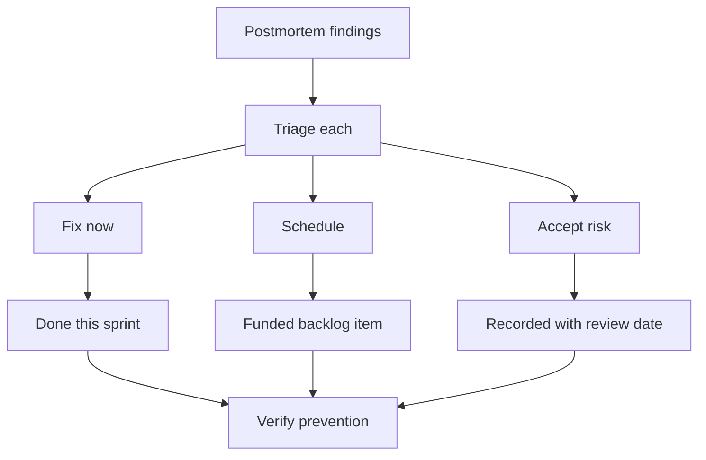

# Remediating Systemic Weaknesses

> **Core skill:** Converting postmortem findings into funded, finished work — triaging remediation, negotiating capacity, tracking to completion, and closing the loop with verification.

## Why This Matters

Most teams do not fail at writing postmortems; they fail at finishing them. Findings become tickets, tickets become backlog dust, and the same incident returns with a new date. Remediation is where learning becomes prevention — and it is the hardest part of the loop, because it competes with feature work, has no product owner championing it, and rarely feels urgent until the next outage makes it urgent.

The tech lead owns remediation as a portfolio: triage every finding honestly, fund the ones that matter through real capacity negotiation, track them to completion with the same discipline as feature work, and verify that the prevention actually prevented. This note covers triage, funding, tracking, pattern detection, the escalation to architectural work, and closing the loop.

## Remediation Triage

Every finding gets one of three verdicts — and the verdict is made on evidence, not on convenience:

| Verdict | When | Discipline |
|---------|------|------------|
| **Fix now** | The condition will likely recur and the fix is cheap | Do it in the same sprint; no ticket queue |
| **Schedule** | The fix matters but needs design or capacity | Enter the backlog with a date and an owner; it is funded work, not dust |
| **Accept risk** | The condition is unlikely, expensive to fix, or already mitigated | Record the decision, the reasoning, and the review date — accepted risk is a decision, not a shrug |



## Funding Remediation

Remediation has no product owner — so it needs a sponsor, and that sponsor is the tech lead.

| Technique | How It Works |
|-----------|--------------|
| **Risk-based case** | The case states the expected cost of the failure, its likelihood, and the cost of the fix — in the language of the person holding the budget |
| **Capacity negotiation** | A standing slice of team capacity for reliability work, negotiated quarterly, not per incident |
| **Incident currency** | The last incident is the best evidence; ask for the fix while the cost is fresh |
| **Bundling** | Group related findings into one funded initiative instead of ten orphan tickets |
| **Trade-off honesty** | State what feature work the remediation displaces; let the decision be explicit |

The case that works: "This condition contributed to two incidents this quarter, each costing about X. The fix costs Y and removes the condition. Here is the owner and the date."

## Tracking to Completion

| Mechanism | Practice |
|-----------|----------|
| **Remediation register** | One visible list of every open remediation: finding, owner, due date, status |
| **Named owners** | Every item has one person accountable, not "the reliability group" |
| **Review cadence** | A monthly reliability review where every open item is read aloud — status, blocker, date |
| **Capacity visibility** | Remediation is in the plan like any other work; it competes and it is seen competing |
| **Closure definition** | An item closes when its verification passes, not when the code merges |

The register is the anti-theater device: anything not on it does not exist, and anything on it past its date is a visible, nameable debt.

## Repeating-Pattern Detection

One incident is an event; the same contributing factor in two or three is a systemic weakness wearing a costume.

| Signal | Meaning | Action |
|--------|---------|--------|
| Same factor in two postmortems | A pattern is forming | Name the pattern; treat it as one initiative, not two tickets |
| Same system, different symptoms | The weakness is structural | Commission a focused review of that system's design |
| Same process gap, different teams | The weakness is organizational | Escalate to the process owner and the other leads |
| Same finding re-ticketed after closure | The fix did not take | Verify properly; the closure was premature |

The lead keeps a simple pattern log — contributing factor, incident count, trend. When a factor appears twice, it graduates from a finding to a named weakness with a dedicated remediation.

## When Remediation Becomes Architectural Work

Some findings cannot be fixed by a patch; they demand design change. Signs:

| Sign | Architectural Response |
|------|------------------------|
| The fix would be a new subsystem (retry layer, cache, queue) | Design review; RFC; the remediation becomes a real project |
| The weakness is in the system's shape, not its parts | Architecture-level initiative with its own plan and milestones |
| Multiple incidents trace to the same design decision | Revisit the decision; document the new one with its trade-offs |
| The team keeps adding guards around a fragile core | The core needs rework; guards are the symptom, not the fix |

The lead's judgment call: when the third guard around the same fragile component lands, the component is the problem. Escalating a finding to architectural work is a promotion, not a failure — it means the pattern was understood.

## Closing the Loop with Postmortem Verification

The loop closes only when prevention is verified:

1. **Verify the mechanism:** did the change remove the condition, or only reduce it?
2. **Watch the pattern log:** has the contributing factor appeared since the fix?
3. **Test the failure:** where cheap, a game day or drill exercises the new behavior.
4. **Close with evidence:** the register entry records what was observed, not just what was merged.
5. **Reopen on recurrence:** a verified pattern returning reopens the item at a higher level — the first fix was insufficient.

## Practical Applications

**Remediation review checklist (run monthly):**

- [ ] Every postmortem finding from the last 90 days is in the register with a verdict
- [ ] Every "schedule" item has an owner, a date, and visible capacity
- [ ] Every "accept risk" item has a recorded reason and a review date
- [ ] The pattern log has been read: any factor appearing twice?
- [ ] Items past their date are named aloud, with a new date or a kill decision
- [ ] At least one closed item shows verified prevention, not just merged code

**Remediation register template:**

```markdown
# Remediation Register

| ID | Finding | Source Incident | Verdict | Owner | Due | Status | Verification |
|----|---------|-----------------|---------|-------|-----|--------|--------------|
| R-01 | Alert threshold too high | INC-2026-08-12 | Fix now | [name] | [date] | Open | [signal to check] |
| R-02 | No canary for checkout | INC-2026-08-12 | Schedule | [name] | [date] | Open | [signal] |
| R-03 | Single owner for payment core | INC-2026-07-30 | Accept | [name] | [date] | Accepted | [review date] |

## Pattern Log
| Contributing Factor | Incidents | Trend | Initiative |
|---------------------|-----------|-------|------------|
| [factor] | [count] | [rising / flat / falling] | [initiative or none] |
```

## Common Pitfalls

| Pitfall | Why It Is a Problem | Better Approach |
|---------|---------------------|-----------------|
| **Findings to dust** | Tickets without funding and dates are theater | Every finding gets a verdict, an owner, and a date — or a recorded kill |
| **Fix-the-symptom triage** | The cheapest fix wins; the condition survives | Triage by leverage: what removes the condition entirely? |
| **Unfunded reliability work** | Remediation competes with features and loses silently | Negotiate a standing capacity slice; make displacement explicit |
| **Register without review** | Lists nobody reads are fiction | Monthly review where every open item is read aloud |
| **Premature closure** | Merged code is not verified prevention | Close on verification evidence, not on merge |
| **Pattern blindness** | Each incident is treated as new; the system weakness hides | Keep a pattern log; a factor appearing twice becomes an initiative |

## Success Indicators

- Every finding from the last 90 days has a verdict, an owner, and a date
- Remediation capacity is visible in the plan, negotiated, and defended
- The register is read aloud monthly and items move to closure
- The pattern log shows declining recurrence of named factors
- Architectural escalations happen deliberately, with design review
- The same incident does not return with a new date

## Related Topics

- [[03_Blameless_Postmortem_Leadership]] — the findings this portfolio turns into work
- [[01_Incident_Command_Leadership]] — the response whose evidence drives triage
- [[07_Production_Excellence_Culture]] — the culture that keeps remediation funded and honest
- [[06_Process_and_Quality_Stewardship/00_overview|Process and Quality Stewardship]] — the quality systems that prevent recurrence
- [[career-path/07_SRE_and_Platform_Engineer/00_overview|SRE and Platform Engineer]] — the specialist path for reliability programs at scale

## Summary

Remediating systemic weaknesses is the discipline of finishing: triage every finding into fix-now, schedule, or recorded accept-risk; fund remediation through risk-based cases and standing capacity; track it in a register that is read aloud; detect repeating patterns before they become culture; and close items only on verified prevention. The tech lead who closes the loop converts the team's most expensive moments into its most durable assets — and the next incident arrives smaller, or not at all.
