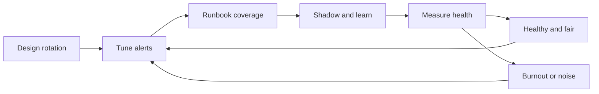

# On-Call Excellence

> **Core skill:** Designing humane, effective on-call — fair rotations, actionable pages, learning loops, and early intervention before burnout.

## Why This Matters

On-call is where reliability meets the humans who carry it. Done well, it is a rotation of calm professionals who get actionable alerts, resolve them with runbooks, and learn something every shift. Done badly, it is a lottery of 3 a.m. pages that nobody can act on, an uneven load that quietly burns out the willing, and a rotation that engineers dread — until the dread becomes attrition.

The tech lead designs on-call the way they design any system: with clear requirements, measured outcomes, and a feedback loop. The requirements are unusual, though — fairness and humanity are first-class constraints, not afterthoughts. This note covers rotation design, page quality, compensation, shadowing, learning, burnout signals, and the metrics that tell you whether the system is working.

## Rotation Design

| Design Element | Options | Guidance |
|----------------|---------|----------|
| **Primary / secondary** | One primary plus one secondary as backup | Always have a second pair of hands for escalations and handoffs |
| **Rotation length** | One week to two weeks | One week is intense but bounded; two weeks amortizes context — pick by load |
| **Handoff** | A structured brief between shifts | The outgoing person transfers active incidents, known issues, and context |
| **Escalation path** | Named ladder: primary, secondary, lead, manager | Every page has a defined next step when unanswered |
| **Rotation order** | Published, fair, and predictable | Surprises in the schedule are themselves a source of burnout |

The design goal: at any moment, the team can answer "who is carrying the pager, and who is their backup?" without checking anything but the calendar.

## Page Quality

The single biggest on-call quality lever is the alert itself. A page should be a complete instruction, not a puzzle.

| Property | Meaning | Test |
|----------|---------|------|
| **Actionable** | The alert implies a concrete response | Would a calm person know what to do? |
| **Runbook-linked** | Every alert points to a runbook | No alert without a doc is a valid alert |
| **Thresholded** | Fires on sustained problems, not blips | One-minute spikes are noise, not pages |
| **Deduplicated** | One incident, one page | Alert storms are a monitoring failure |
| **Severity-labeled** | The page says how urgent this is | 3 a.m. pages are for the things that cannot wait |

Tuning practice: every page that led to no action is a candidate for deletion; every incident discovered by users instead of alerts is a candidate for a new alert. The noise-to-signal ratio is a metric the lead tracks, not a feeling.

## Compensation and Load Balance

| Element | Practice |
|---------|----------|
| **Even load** | Rotation counts pages per shift; heavy shifts are rebalanced, not endured |
| **Compensation** | On-call is recognized — time off, pay, or equivalent — and the recognition is explicit |
| **Post-incident recovery** | A heavy night means a late start or a day off, arranged without asking |
| **Load visibility** | Page counts per shift are published; nobody carries the pager in secret |
| **Fairness guard** | Experts get the hard escalations, but the rotation itself stays even |

The fairness rule: on-call burden is a team resource, budgeted and balanced like any other — and the lead watches for the silent pattern where one person takes the hard pages because they are "better at it."

## Shadow On-Call for New Joiners

| Stage | What Happens |
|-------|--------------|
| **First shift: shadow** | New engineer rides with the primary, watches, asks questions, touches nothing |
| **Second shift: paired** | New engineer takes the pages with the primary watching the channel |
| **Third shift: solo with backup** | New engineer is primary; the secondary is explicitly briefed to be reachable |
| **After each shift** | A short debrief: what was unclear, which runbooks helped, which did not |

Shadowing is how runbook quality gets tested — the new joiner hits every gap the veterans have learned to step around. Their confusion is the best documentation audit the team will ever get.

## On-Call as Learning

On-call is the team's most intense learning environment — if it is structured as one:

- **Post-page learning:** after every significant page, a five-minute capture: what did we learn, what would have helped?
- **Runbook improvement:** every resolved page is an opportunity to make the runbook better; the fix is a pull request, not a note
- **Shift debrief:** the outgoing primary shares the shift's lessons at handoff
- **Incident connection:** pages that became incidents feed the postmortem; pages that were avoided by good monitoring are worth naming too
- **Skill growth:** rotating the secondary role grows a second expert per area instead of concentrating knowledge

## Burnout Signals and Intervention

| Signal | Early Warning | Intervention |
|--------|---------------|--------------|
| Dread of the rotation | Jokes about the pager stop being funny | Review page quality and load; fix the alerts, not the person |
| Uneven page counts | Same names on every hard escalation | Rebalance the rotation; grow expertise deliberately |
| Declining runbook updates | The team stopped improving the system | Reconnect on-call to learning; make improvement the expected outcome |
| Missed or late acknowledgements | The pager is being ignored | The system is failing the person; investigate alerts and load first |
| Turnover in the rotation | Engineers leave the team or the company | Treat on-call design as the top reliability priority until it is fixed |

The lead's stance: **the first suspect in every on-call failure is the system, not the engineer.** If a shift was horrible, the question is what the rotation, the alerts, or the runbooks did wrong.

## On-Call Health Metrics

| Metric | What It Tells You | Healthy Direction |
|--------|-------------------|-------------------|
| **Pages per shift** | Raw load and alert quality | Falling as alerts get tuned; stable per person |
| **Acknowledge time** | Is the pager being answered? | Fast and consistent |
| **False positive rate** | Alerts that needed no action | Below 30%; every false page trains people to ignore the pager |
| **Resolved-by-runbook rate** | Are runbooks carrying the load? | Rising; the team is not re-solving the same problem each time |
| **Escalation rate** | How often the primary needs backup | Stable; spikes mean gaps in the primary's knowledge |
| **Shift satisfaction** | The human metric | Tracked informally and in retros, and acted on |



## Practical Applications

**On-call design review (run quarterly):**

- [ ] Publish the rotation with primary, secondary, and escalation ladder
- [ ] Audit every alert: actionable, runbook-linked, thresholded, deduplicated
- [ ] Review page counts per shift for the last quarter; rebalance where uneven
- [ ] Check compensation and recovery: is a heavy night followed by rest, arranged without asking?
- [ ] Confirm every new joiner has a shadow, paired, then solo path
- [ ] Review the health metrics: pages per shift, ack time, false positive rate

**Handoff template:**

```markdown
# On-Call Handoff

- **Outgoing:** [name]   **Incoming:** [name]
- **Shift:** [dates]
- **Open incidents:** [each with status and owner]
- **Known issues:** [ongoing conditions to watch]
- **Recent changes:** [deploys or config changes that might surface]
- **Runbooks touched:** [improvements made this shift]
- **Lessons:** [what the outgoing shift learned]
```

## Common Pitfalls

| Pitfall | Why It Is a Problem | Better Approach |
|---------|---------------------|-----------------|
| **Noisy alerts** | The pager cries wolf; real pages get ignored | Every page must be actionable; tune relentlessly |
| **Uneven load** | The willing few carry it; the rotation is fiction | Publish page counts; rebalance by data |
| **On-call without runbooks** | Every page is a fresh investigation at 3 a.m. | No alert without a runbook; runbooks improve after every page |
| **No shadowing path** | New joiners are thrown to the pager | Shadow, paired, solo — with debriefs at each stage |
| **Uncompensated burden** | The cost is invisible until attrition | Explicit recognition and recovery; load is a budgeted resource |
| **Ignoring burnout signals** | The best engineers leave silently | The first suspect is the system; fix alerts and load before morale |

## Success Indicators

- Pages per shift are falling as alerts get tuned; false positives stay low
- Every alert links to a runbook that resolves the page
- Page counts are even across the rotation, with no secret heroes
- New joiners complete shadow, paired, and solo shifts without incidents
- Handoffs are structured; the incoming person starts with context
- On-call is discussed in retros as a source of learning, not a source of dread

## Related Topics

- [[01_Incident_Command_Leadership]] — what happens when a page becomes an incident
- [[06_Resilience_Engineering_Practices]] — the practices that make pages rare
- [[07_Production_Excellence_Culture]] — the culture that treats on-call as learning
- [[career-path/02_Senior_Software_Engineer/05_Quality_Reliability_Security/06_Production_Readiness|Production Readiness (Senior)]] — the readiness standards that keep on-call calm
- [[02_System_Ownership_and_Production_Responsibility/00_overview|System Ownership and Production Responsibility]] — the ownership that makes runbooks possible

## Summary

On-call excellence is a designed system, not a schedule: a fair rotation with a visible escalation ladder, alerts that are actionable and runbook-linked, compensation and recovery that keep the burden sustainable, a shadow-to-solo path that grows new responders safely, and health metrics that catch noise and burnout before they compound. The tech lead's test is simple — when the pager fires at 3 a.m., the person who answers has what they need to succeed, and the team can sustain that forever.
