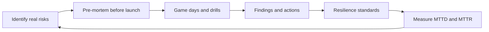

# Resilience Engineering Practices

> **Core skill:** Practicing failure before production supplies it — game days, failure-mode reviews, dependency drills, and resilience patterns adopted as team standards.

## Why This Matters

Reliability is not what the system does when everything works; it is what the system does when things fail. A team that has never practiced failure discovers its resilience gaps at the worst possible moment — during the real incident, with users waiting. Practice is how the team learns its failure modes cheaply, in a controlled room, where the lesson costs nothing but an hour.

The tech lead builds the practice program: game days that rehearse realistic failures, pre-mortems that find design flaws before launch, drills that exercise dependency failures, and resilience patterns — timeouts, retries, circuit breakers — adopted as standards rather than left to individual judgment. This note covers each practice, how to scope it safely, and how to measure whether the team's resilience is actually improving.

## Game Days

| Phase | What Happens | Key Discipline |
|-------|--------------|----------------|
| **Scenario design** | Pick a realistic failure: a dependency dies, a region degrades, a deploy goes wrong | The scenario comes from real risks, not imagination; name the specific system |
| **Preparation** | Define the start state, the observers, and the safety rails | Nobody is surprised; the game is contained and reversible |
| **Execution** | The team responds to the injected failure as if it were real | The on-call process is exercised; roles and runbooks are used, not improvised |
| **Debrief** | Review what happened: what worked, what broke, what was slow | The output is a finding list, exactly like a postmortem |

The goal is not for the team to win the game; it is for the team to learn where the system and the process are weakest — with the lesson costing a rehearsal hour instead of an incident.

## Scoping Failure Practice Safely

| Risk | Control |
|------|---------|
| The exercise hurts real users | Inject failures into staging or isolated environments first; production chaos only where blast radius is proven |
| The exercise is ignored | Tie it to real risks: the last incident, the last near-miss, the next launch |
| The exercise becomes theater | Measure the debrief: findings, actions, owners — same discipline as postmortems |
| The team is already stressed | Do not run games in a crisis week; practice when there is slack to learn |

The principle: **practice must be scoped so that the cost of the lesson never exceeds the lesson.** A game day that breaks production is not practice; it is an incident with extra steps.

## Failure-Mode Review (Pre-Mortems)

A pre-mortem is a postmortem held before the launch: the team imagines the launch failed in six months, then works backward to find how.

| Question | What It Surfaces |
|----------|------------------|
| "The launch failed. What killed it?" | The team's real anxieties, named before launch |
| "Which component is most likely to break?" | Risk concentration and weakest links |
| "What would we regret not testing?" | Coverage and validation gaps |
| "What does this depend on that we do not control?" | External dependencies and their failure modes |
| "What is the rollback story?" | Operability and recovery planning |

Pre-mortems are cheap, fast, and brutally effective — the failure is imagined, so nobody needs to be right about it, and the team's collective unease becomes a checklist instead of a haunting.

## Dependency Failure Drills

Systems die at their boundaries. Drills that exercise dependency failures teach the team what their system actually does when a neighbor fails:

| Drill | What It Tests | Pass Condition |
|-------|---------------|----------------|
| **Dependency outage** | Downstream service stops responding | Graceful degradation; clear alerts; no cascading failure |
| **Slow dependency** | Downstream service responds slowly | Timeouts fire; queues do not build; users see degraded but working behavior |
| **Network partition** | Connections drop unpredictably | Retries with backoff; no retry storms; state recovers after |
| **Database failover** | Primary database dies | Failover works; connections re-establish; no data loss |
| **Queue backlog** | Messages accumulate | Backpressure and alerting work; consumers recover the backlog |

Every drill's pass condition is written before the drill: the team agrees what "good" looks like, then watches whether the system delivers it.

## Resilience Patterns as Team Standards

| Pattern | What It Protects | Standard to Enforce |
|---------|------------------|---------------------|
| **Timeouts** | The caller waits forever on a dead dependency | Every outbound call has a timeout; no unbounded waits |
| **Retries with backoff** | Transient failures get a second chance | Retries are bounded, with backoff and jitter; no retry storms |
| **Circuit breakers** | A failing dependency does not cascade | Open the circuit on repeated failure; fail fast and recover |
| **Bulkheads** | One workload's failure does not starve another | Isolation between consumers; pools and quotas where they matter |
| **Graceful degradation** | Users get partial function, not errors | Every critical path has a degraded mode designed, not improvised |
| **Idempotency** | Retries do not duplicate effects | Mutating operations are safe to repeat |

These are adopted as reviewable standards — in the architecture review, the DoD, and the PR checklist — so resilience is a property of the team's defaults, not of its luckiest engineers.

## Measuring Resilience

| Metric | What It Tells You | Healthy Direction |
|--------|-------------------|-------------------|
| **MTTD (mean time to detect)** | How fast failures are noticed | Falling; detection is automated, not user-reported |
| **MTTR (mean time to resolve)** | How fast failures are contained | Falling; runbooks and practice are working |
| **Error budget** | The gap between reliability promise and reality | Budget tracked; burn is visible, not discovered |
| **Game-day finding closure** | Is practice becoming prevention? | Findings close like postmortem actions |
| **Cascade count** | Does one failure stay one failure? | Falling; bulkheads and breakers are doing their job |



## Practical Applications

**Resilience practice program checklist:**

- [ ] One pre-mortem run before the next significant launch
- [ ] One game day this quarter, scoped from the last incident or a real risk
- [ ] One dependency drill: pick a critical dependency and rehearse its failure
- [ ] Timeouts, retries, and circuit breakers named in the team's standards
- [ ] Every drill and game day ends with findings, owners, and dates
- [ ] MTTD and MTTR tracked and reviewed at the monthly reliability review

**Game day plan template:**

```markdown
# Game Day Plan

- **Scenario:** [the failure being injected, tied to a real risk]
- **Environment:** [staging or isolated; blast radius controls]
- **Start state:** [what is running, what is ready]
- **Observers:** [who watches, what they record]
- **Safety rails:** [how to stop the game instantly]
- **Pass conditions:** [what "good" looks like, written in advance]
- **Timeline:** [injection time, expected response windows]
- **Debrief:** [when, who attends, findings format]
- **Actions:** [each finding gets an owner and a date]
```

## Common Pitfalls

| Pitfall | Why It Is a Problem | Better Approach |
|---------|---------------------|-----------------|
| **Chaos for chaos' sake** | Exercises that do not map to real risks teach nothing | Every game day names the real risk it rehearses |
| **Unscoped practice** | The lesson costs more than it teaches | Inject into staging first; production exercises only with proven containment |
| **Theater drills** | The team knows it is fake and plays along | Pass conditions written in advance; debrief with findings and actions |
| **Patterns as opinions** | Timeouts and retries depend on who wrote the code | Adopt resilience patterns as team standards, reviewed like architecture |
| **Practice without follow-through** | Findings from games join postmortem dust | Same action discipline: owners, dates, review |
| **Measuring nothing** | No MTTD or MTTR trend; practice is unverifiable | Track the metrics; the trend is the evidence the program works |

## Success Indicators

- Game days and drills map to real risks and end with closed findings
- Pre-mortems run before significant launches and change the plan
- Timeouts, retries, breakers, and bulkheads are team standards, not luck
- MTTD and MTTR trend downward over the quarter
- Failures stay local: one dependency's trouble does not become the team's outage
- The team rehearses failure calmly, because it has done this before

## Related Topics

- [[05_On_Call_Excellence]] — the responders the practice program trains
- [[07_Production_Excellence_Culture]] — the culture that funds and values the practice
- [[career-path/02_Senior_Software_Engineer/05_Quality_Reliability_Security/07_Chaos_Engineering|Chaos Engineering (Senior)]] — the personal chaos engineering skills this program scales to the team
- [[career-path/02_Senior_Software_Engineer/05_Quality_Reliability_Security/06_Production_Readiness|Production Readiness (Senior)]] — the readiness bar the drills verify
- [[career-path/07_SRE_and_Platform_Engineer/00_overview|SRE and Platform Engineer]] — the specialist path for reliability engineering depth

## Summary

Resilience engineering practices turn failure from a surprise into a rehearsal: game days that inject realistic failures in controlled environments, pre-mortems that find design flaws before launch, dependency drills that test the boundaries where systems die, and resilience patterns — timeouts, retries, breakers, bulkheads, degradation — adopted as standards rather than accidents. Measured through MTTD, MTTR, and finding closure, practice compounds: the team that has rehearsed its failures meets the real one calm, because it has already been here.
