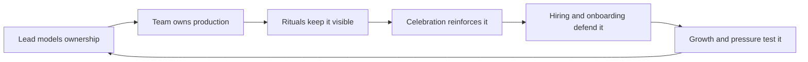

# Production Excellence Culture

> **Core skill:** Making operational excellence a team identity — every engineer owns production, rituals keep it visible, and the lead models the behavior.

## Why This Matters

Every team has a production culture; the question is only whether it is the one they chose. In a reactive culture, production is the on-call person's problem, incidents are blame events, and the team discovers its operational weaknesses the hard way, repeatedly. In an excellent culture, production is everyone's work, operational behavior is celebrated and learned from, and reliability is a source of pride rather than fear.

Culture is not a poster; it is the accumulated result of what the team does, celebrates, and tolerates — and the tech lead is its primary author. Not by decree, but by modeling: answering pages, joining incidents, reading dashboards, treating operational work as real engineering, and making the team's rituals teach the values. This note covers the production-first mindset, operational rituals, celebration, hiring, onboarding, the lead's modeling role, and sustaining the culture through growth and pressure.

## The Production-First Mindset

| Reactive Team Belief | Production-Excellent Team Belief |
|----------------------|----------------------------------|
| Production is the on-call's problem | Every engineer owns production, every day |
| Incidents are failures to be blamed | Incidents are system data, studied openly |
| Operations is unglamorous support work | Operations is engineering; runbooks are code |
| The team ships and forgets | The team ships, observes, and owns the outcome |
| Fix the symptom, move on | Find the condition, remove it |

The shift is structural, not motivational: ownership is assigned, not assumed. Every service has named owners; every change includes its operational impact; every feature carries its monitoring. The culture is the sum of those structures.

## Operational Review Rituals

Rituals are how a culture rehearses its values on a schedule:

| Ritual | Cadence | What It Teaches |
|--------|---------|-----------------|
| **Reliability review** | Monthly | Remediation and resilience are real work with real status |
| **Incident readout** | After every significant incident | Learning is public; the team owns the lesson together |
| **Dashboard walk** | Weekly or biweekly | Production is looked at, not just deployed to |
| **On-call debrief** | Per shift | The pager's lessons land with the whole team |
| **Retro integration** | Every retro | Operational topics are normal retro material, not special |

The rituals must be real: a reliability review with no open items is a ritual that has died and is being held anyway.

## Celebrating Good Operational Behavior

Culture is shaped most by what gets celebrated. Teams that only hear about production when something breaks learn that production is where bad news lives.

| Behavior Worth Celebrating | How to Celebrate |
|----------------------------|------------------|
| A runbook that saved a shift | Name it in the team channel; the author gets credit |
| An alert tuned into silence | Show the before-and-after noise numbers |
| A near-miss caught early | Tell the story; the catch becomes a lesson, not a secret |
| A postmortem that found a real pattern | Share the finding; the team that learns is celebrated |
| A first solo on-call shift | The milestone is marked, the debrief is positive |

A "catch of the month" or equivalent is not fluff — it is the team's way of saying out loud that operational excellence is the behavior that earns recognition here.

## Hiring for Production Mindset

Culture is defended at the hiring door. The lead asks questions that reveal how candidates think about operations:

| Question | What It Reveals |
|----------|-----------------|
| "Tell me about the worst incident you helped resolve" | Do they understand systems, or blame people? |
| "What does a good alert look like to you?" | Do they think about noise and actionability? |
| "How do you know your code works in production?" | Do they think past the merge? |
| "What is a runbook to you?" | Is operations work real work to them? |
| "When was the last time you read your own dashboards?" | Is production curiosity habitual? |

The bar is not "has done on-call" — it is the orientation: does this person treat production as something they own?

## Production Excellence in Onboarding

| Onboarding Element | What It Builds |
|--------------------|----------------|
| **First-week dashboard tour** | New engineers see the system live before they touch code |
| **Runbook reading as first tasks** | Operational knowledge is entry-level, not advanced |
| **Shadow on-call in month one** | The pager is demystified early |
| **A small production change owned** | Ownership is practiced, not preached |
| **Deploying their first change themselves** | Shipping is part of the job from the start |

The onboarding message is explicit: "In this team, everyone owns production." The structures then prove it within the first month.

## The Lead's Modeling Role

Culture is caught more than taught — and the lead is the most visible person on the team. The modeling is specific and daily:

| The Lead Does | What It Signals |
|---------------|-----------------|
| Answers pages, takes a rotation | On-call is not beneath anyone |
| Joins incidents as a responder, not a supervisor | Command is earned by doing |
| Reads dashboards in the open | Production awareness is normal behavior |
| Writes and updates runbooks | Operational documentation is engineering work |
| Says "I do not know yet" in an incident | Honest uncertainty is safe |
| Thanks the person who found the problem | Surfacing problems is rewarded, not punished |

## Sustaining Culture Through Growth and Pressure

| Pressure | Erosion Risk | Sustaining Move |
|----------|--------------|-----------------|
| Rapid hiring | New people absorb the old reactive culture elsewhere | Onboarding with explicit production values; buddies who model them |
| Deadline pressure | Operational work is deferred "just this once" | Protect the reliability slice; defer visibly and deliberately |
| Growth into multiple teams | Standards fragment; each team drifts | Shared reliability standards and cross-team rituals |
| A blameful incident moment | One public blame erases months of culture | The lead defends blamelessness publicly, even when it is hard |
| Success and calm | The team forgets why the rituals exist | Keep the rituals on the calendar; keep the metrics on the wall |

The sustaining rule: **the culture is tested in the bad moments, and the lead's job is to be more visible and more consistent precisely then.**



## Practical Applications

**Culture-building checklist:**

- [ ] Every service has a named owner, and ownership is documented
- [ ] The reliability review is on the calendar with real status, every month
- [ ] One operational behavior was celebrated publicly this week
- [ ] Interview questions include the production-mindset set
- [ ] Onboarding includes the dashboard tour and a shadow shift in month one
- [ ] The lead has answered pages, joined incidents, and read dashboards visibly this month

**Operational celebration template:**

```markdown
# Operational Catch of the Week

- **Who:** [name]
- **What they did:** [the catch, the runbook, the tuning]
- **Why it matters:** [the failure or noise it prevented]
- **Lesson for the team:** [what others can apply]
- **Thank you:** [posted in the team channel, credit explicit]
```

## Common Pitfalls

| Pitfall | Why It Is a Problem | Better Approach |
|---------|---------------------|-----------------|
| **Production as a specialism** | The team outsources ownership to on-call and SRE | Ownership is assigned per service; everyone carries a shift |
| **Rituals without content** | Meetings run on empty; culture quietly dies | Every ritual has real status, real findings, real decisions |
| **Silence on good work** | Only failures are discussed; production becomes bad news | Celebrate catches, runbooks, and tuned alerts out loud |
| **Preaching without modeling** | The lead's words and calendar disagree | The lead pages in, joins incidents, reads dashboards |
| **Culture at the door only** | Hiring checks values; onboarding ignores them | Onboarding structures prove the values in month one |
| **Blame in a bad moment** | One incident undoes years of trust | The lead defends blamelessness publicly, hardest when it is hardest |

## Success Indicators

- Every engineer can name the services they own and how they observe them
- Incidents are discussed as system data, with zero blame language
- Operational wins are celebrated as visibly as feature launches
- New joiners own a production change within their first month
- The lead's calendar shows the model: pages, incidents, dashboards
- The culture survives growth and pressure — measured by how people talk about failure

## Related Topics

- [[05_On_Call_Excellence]] — the rotation that turns ownership into daily practice
- [[06_Resilience_Engineering_Practices]] — the rehearsal program the culture funds
- [[01_Incident_Command_Leadership]] — the moments that test what the culture is made of
- [[02_System_Ownership_and_Production_Responsibility/00_overview|System Ownership and Production Responsibility]] — the ownership foundation this culture builds on
- [[career-path/07_SRE_and_Platform_Engineer/00_overview|SRE and Platform Engineer]] — the specialist path that shares this culture's values

## Summary

Production excellence culture is built deliberately: ownership assigned to every engineer, rituals that keep operational reality visible, celebration that makes reliability the behavior the team rewards, hiring and onboarding that defend the values at the door, and a lead who models the culture daily — answering pages, joining incidents, reading dashboards, and staying visibly consistent in the bad moments. Culture is what the team does when nobody is watching; the tech lead makes sure that what it does is what it would choose.
